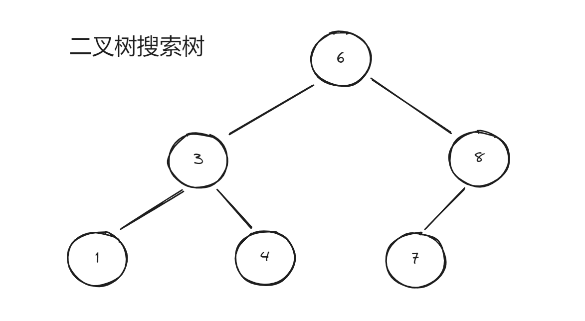

### 01. 二叉树的理论基础

------

#### 1.1 二叉树的种类

1. **满二叉树**：除了叶子节点以外，每个节点都有两个子节点，整个树是被完全填满的
2. **完全二叉树**：除了底层以外，其他部分是满的，底部可以不是满的但是必须是从左到右连续的


1. **二叉搜索树**：节点是有顺序的，可查找的
2. **平衡二叉搜索树**：左子树和右子树的高度值不能超过 1



比如上面的树，比 6 大的在左边，小的在右边，且每个节点都是这样的，有顺序的，查询时间复杂度为 `logn`

很显然我们中间节点的选择会影响左子树和右子树的高度，左子树和右子树高度不超过 1 的被称为平衡二叉搜索树。


#### 1.2 二叉树的存储方式

链式存储：顺序存储即采用链表的方式来存储，是我们常用的存储方式，即使用链表的方式来存储：一个树节点分别有它的左节点和右节点，他们的左节点和右节点又连接着其他的树节点。

顺序存储（了解即可）：


我们给每个节点编号，节点的左节点就是 `2n` 右节点就是 `2n - 1`


#### 1.3 遍历方式

深度优先搜索：即先一路搜索到最底部再递归返回，我们常见的前序、中序、后序遍历都是深度优先搜索。

可以使用递归的方式和**非递归**的方式，迭代的方式有可能在面试中会考察

广度优先搜索：一层一层的去遍历，使用队列先进先出的特性实现广度优先搜索。


#### 1.4 定义方式

```java
class TreeNode {
	int val;
	TreeNode rightNode;
	TreeNode leftNode;
}
```

和我们上面说的相同，和链表的定义方式相同，但分为左子树和右子树。


### 02. 二叉树的递归遍历

------

​	这一部分应该是很多朋友一开始学算法十分困惑的一个点，总是想不明白递归的题也看不明白递归的解法，我大一刚开始刷算法的时候也是这样，当时真是一入递归深似海，之后有一篇文章启发了我

[东哥带你刷二叉树（纲领篇）](https://labuladong.github.io/algo/di-ling-zh-bfe1b/dong-ge-da-334dd/)

拉不拉东老师的这篇关于二叉树文章。

我来借用一下里面的思维方式

我们之所以无法理解递归是因为我们还是利用之前读代码和写代码的方式：“将自己的脑子当作计算机来执行一遍代码”，这在前面那些简单的顺序结构的题目中当然是可行而且有效的，但当我们解决的题目复杂起来，就比如现在的二叉树遍历的题目，我们的脑子能装下几个栈呢？能跑几层递归呢？


所谓理解和读懂递归就是要将它当作自己编写代码、解决问题的一种工具，而不是尝试去用脑子执行它，弄懂它的执行步骤，我们先来看一段二叉树 **前序** 遍历的代码

```java
class Solution {
    List<Integer> res = new ArrayList();
    public List<Integer> preorderTraversal(TreeNode root) {
        reverse(root);
        return res;
    }

    public void reverse(TreeNode root) {
        if (root == null) {
            return;
        }
        res.add(root.val);
        reverse(root.left);
        reverse(root.right);
    }
}
```

我们将重点放在第二段的代码上，如果单单的问你我不看递归，我这一次做了什么？

1. 首先我先判断当前的节点是否为空节点，这就是我们常说的递归的出口
2. 然后我们将当前节点的值放到了 `res` 的 `list` 中作为结果
3. 然后我们去递归遍历左子树
4. 然后我们去递归遍历右子树


看我们上面的图是不是非常熟悉，这不就是前序遍历的遍历顺序吗？先中间再左边再右边，前序遍历无非就是对每个节点执行如上的相同的操作，那如何对每个节点操作呢？


>  递归的作用就是 **帮助我们为每一个节点做相同的操作**


我们只需要关注一个节点做的事情然后写到递归中，让递归帮我们去执行即可。


所有的递归都可以套用二叉树的模型来理解，我们知道，二叉树除了前序遍历，还有后序遍历和中序遍历：


我们每次进入一个节点都可以分为三个位置：

1. 前序位置
2. 中序位置
3. 后序位置

对应着上图中的 `1` `2` `3` 三个部分

前序中的操作即是我们进入这个节点后立马执行的操作，这不就是我们上面的前序遍历吗？进入节点后立马输出

中序就是在节点中执行的结果，即上图中的 `2` ，这不就是左子树返回东西的地方吗？

那中序遍历的代码该怎么写？

```java
    public void reverse(TreeNode root) {
        if (root == null) {
            return;
        }
        reverse(root.left);
        
        res.add(root.val);
        
        reverse(root.right);
    }
}
```

到这里是不是对递归主键的清晰起来了？

后序遍历的代码我们也可以很轻松的写出来

```java
    public void reverse(TreeNode root) {
        if (root == null) {
            return;
        }
        reverse(root.left);
        
        res.add(root.val);
        
        reverse(root.right);
    }
}
```

如果上面的内容都能看懂，那么恭喜你已经解决了力扣上的三道题目：

[No.144 二叉树的前序遍历](https://leetcode.cn/problems/binary-tree-preorder-traversal/description/)

[No.94 二叉树的中序遍历](https://leetcode.cn/problems/binary-tree-inorder-traversal/description/)

[No.145 二叉树的后序遍历](https://leetcode.cn/problems/binary-tree-postorder-traversal/description/)

这里我们来看一个小小的问题：使用递归实现链表的倒序输出


如果将上面的部分看懂，那这道题相信对你来说很简单了

链表就是简化的二叉树，上面的每一个节点就可以通过上面的思路来处理


链表没有中序位置，只有前序和后序，既然要倒序输出链表，那我们要考虑的是我们的输出语句放在哪里

非常简单的二选一题目，肯定是放在后序的位置，呈现在代码中就是这样的：

```java
public void reverse(ListNode head) {
	if (head == null) {
		return;
	}
	reverse(head.next);
	System.out.println(head.val);
}
```