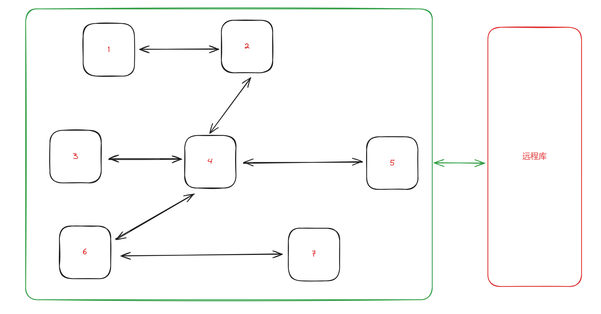
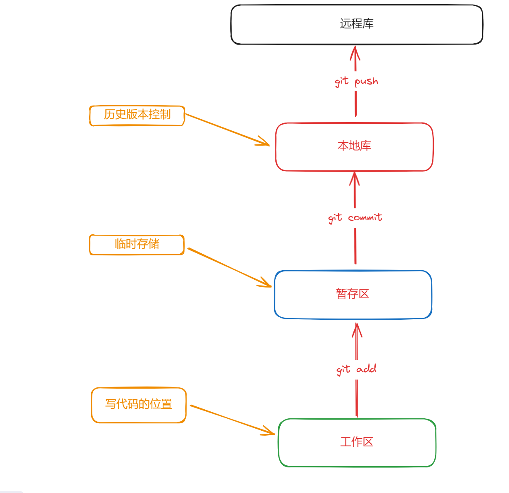
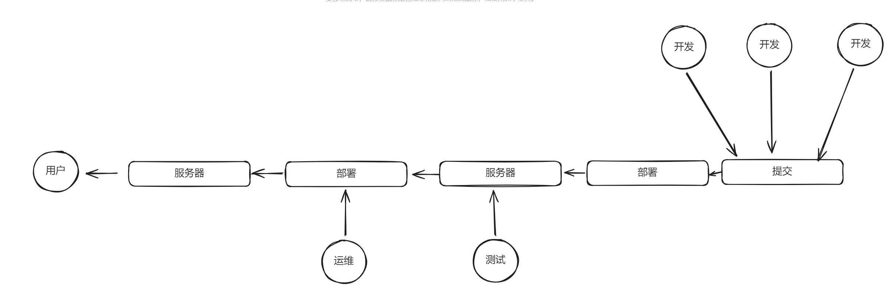
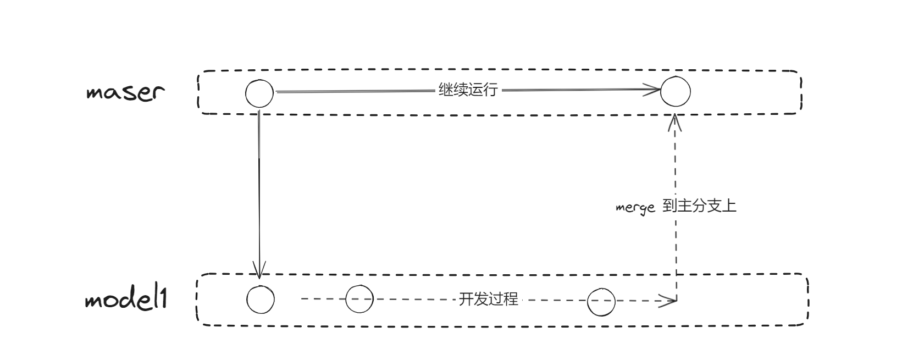
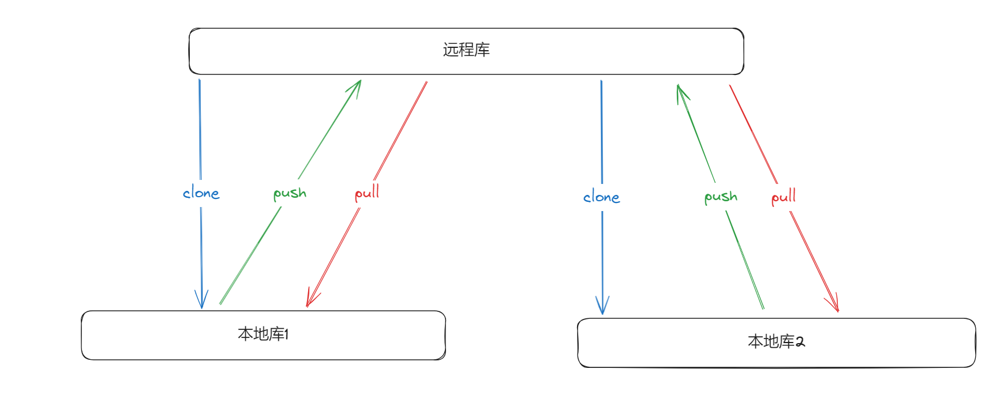
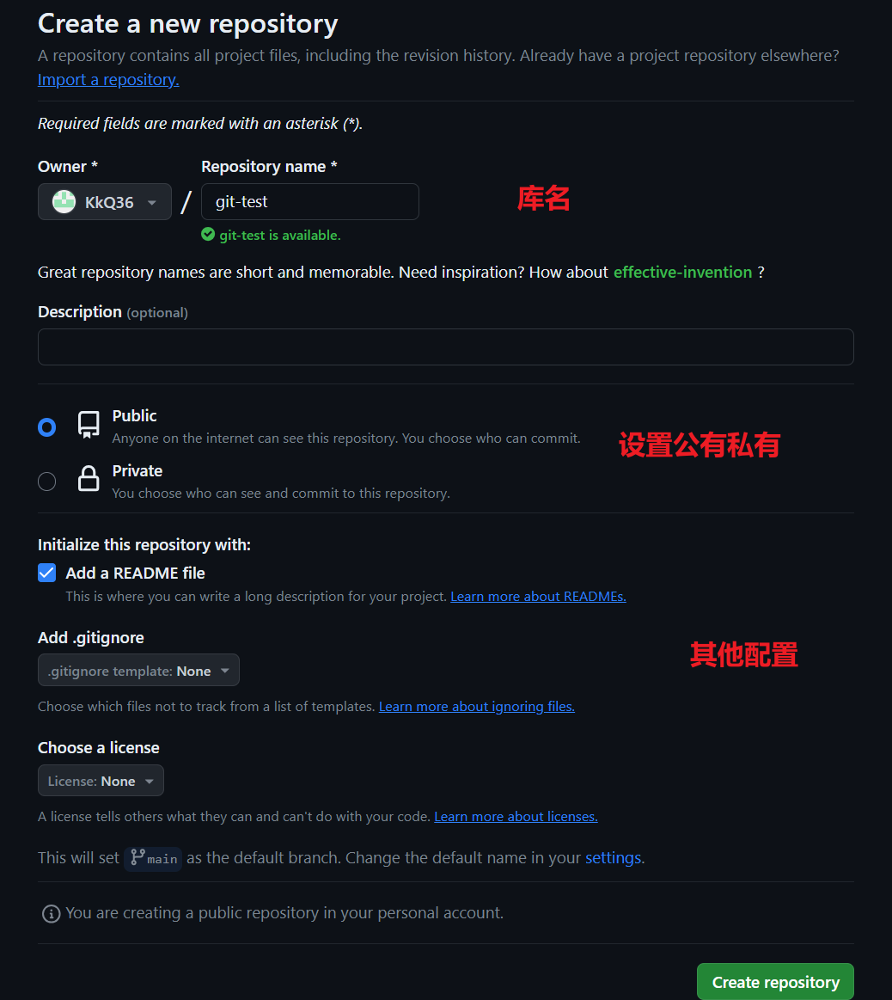
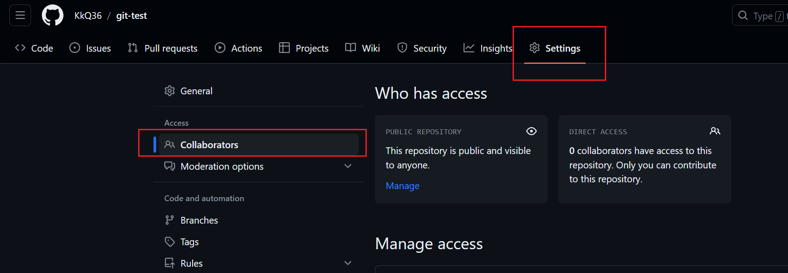
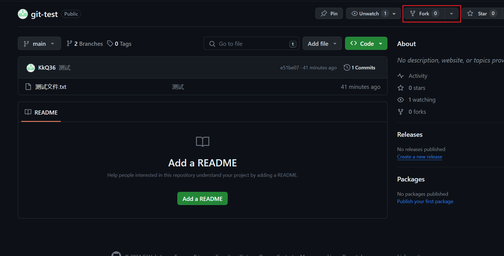
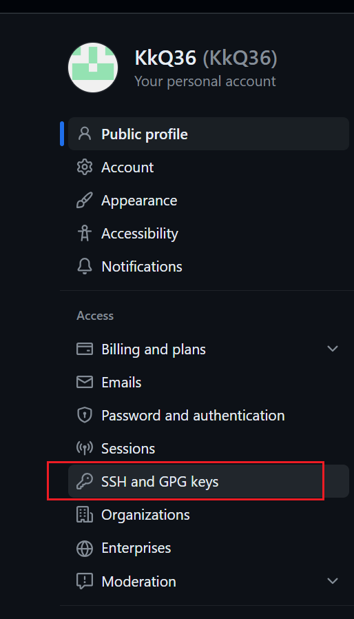

## 01. Git 概述

> [Git 官网](https://git-scm.com/)
>
> Git 是一个免费的、开源的**分布式版本控制系统**，可以高效的处理各种规模的项目。


### 1.1 版本控制

> 版本控制是一种 **记录文件内容变化**，方便查阅 **特定的版本修改情况** 的系统。
>
> 版本控制可以记录文件的修改的历史记录，从而方便直观的查看历史版本，而且方便版本切换。


我们平时保存文件多副本的行为也是一种版本控制，但是当我们处于团队开发环境的时候，保存副本的方式显然就不起作用了，所以我们需要借助版本控制工具来进行。


### 1.2 版本控制工具

#### 1.2.1 集中式版本控制工具

集中式版本控制工具是一种软件工具，用于协调和管理软件开发团队对项目代码的版本控制。

在集中式版本控制系统中，所有的项目文件和版本信息都存储在 **中央服务器** 上，团队成员通过与该服务器进行交互来获取最新的代码或提交他们的修改。

其中一个典型的集中式版本控制工具是 `CVS（Concurrent Versions System）`。在这样的系统中，开发者在本地工作副本上进行修改，并在完成任务后将其提交到中央仓库。其他开发者可以通过更新本地副本来获取最新的代码变更。这种模型有助于团队成员协同工作，但也存在一些潜在的问题，如 **对中央服务器的依赖性** 和 **可能的并发冲突**。

因为所有的信息都存储在中央服务器上，所以当中央服务器出现问题的时候就会出现进度停滞的情况。


#### 1.2.2 分布式版本控制工具

分布式版本控制（Distributed Version Control，DVC）是一种软件开发中用于协调和管理代码版本的系统。与集中式版本控制系统不同，分布式版本控制系统 **将完整的代码仓库复制到每个开发者的本地**，使每个开发者都拥有一个 **完整的项目副本**，包括整个版本历史记录。

在分布式版本控制系统中，开发者可以在 **本地进行工作**，包括提交、分支、合并等操作，而不必依赖于中央服务器。这种模型的一个关键特点是每个开发者的本地仓库都是完整的，**因此在没有网络连接的情况下，开发者仍然可以进行版本控制操作**。

这样就避免了对中央服务器的依赖性。




### 1.3 Git 的工作机制



当我们提交到本地库的时候就已经是生成了历史版本了，在其他暂存区和工作区的时候是临时存储，可以删除的。

## 02. Git 的常用命令

| 命令名称                               | 作用                                 |
| -------------------------------------- | ------------------------------------ |
| `git config --global user.name 用户名` | 设置用户签名                         |
| `git config --global user.email 邮箱`  | 设置用户签名                         |
| `git init`                             | 初始化本地库                         |
| `git status`                           | 查看本地库状态                       |
| `git add 文件名`                       | 添加到暂存区                         |
| `git commit -m 日志信息 文件名`        | 添加到本地库，不加文件名默认提交全部 |
| `git reflog`                           | 查看历史记录                         |
| `git reset --hard 版本号`              | 实现版本穿梭                         |


#### 2.1 设置用户签名

1. 打开 git 客户端

2. 输入上面的内容

   ```bash
   git config --global user.name 用户名
   
   git confit --global user.email 邮箱
   ```

签名的作用是为了区分不同的操作者身份，用户的签名信息在每次提交中能够看到，Git 的首次安装必须设置用户签名。

> 需要注意的是，这里设置的用户签名和将来登录代码托管中心的账号是没有任何关系的，只作为一个身份的标识。


#### 2.2 初始化本地仓库

```bash
git init 
```

是为了赋予 `git` 管理本地目录的权限，在你需要创建仓库的位置打开 `git bash`，输入以上的命令

```bash
lenovo@LAPTOP-A6PJT8GA MINGW64 /e/Code/git
$ git init
Initialized empty Git repository in E:/Code/git/.git/
```


### 2.3 查看本地库状态和添加到暂存区

```bash
git status

git add 文件名
```

我们通过 `git status` 可以看到当前我们文件中内容的状态

`git add` 可以将未添加到本地库中的文件去加入暂存区，也就是将这个文件去交给 `git` 管理


### 2.4 提交到本地库

```bash
git commit -m 日志信息
```

添加文件到本地库，也就是创建了一个历史版本，后面注意要加上日志信息


### 2.5 版本穿梭

```bash
git reflog # 查看日志

git log # 查看详细的日志

git reset --hard 版本号 # 版本穿梭
```

通过 `git reflog` 就可以看到每个版本的版本号，通过上面的命令可以回退到选定的版本。


## 03. Git 的分支操作




### 3.1 什么是分支？

在版本控制的过程中，为每个任务，我们可以就为其创建单独的分支，比如某个开发人员需要开发某一个模块，他就可以单独开一个分支去在这个分支上编写代码，从而不影响主线的进行，一个分支可以看作一个单独的副本。




### 3.2 分支的操作

| 命令名称              | 作用                         |
| --------------------- | ---------------------------- |
| `git branch 分支名`   | 创建分支                     |
| `git branch -v`       | 查看分支                     |
| `git checkout 分支名` | 切换分支                     |
| `git merge 分支名`    | 把指定的分支合并到当前分支上 |


#### 3.2.1 查看当前分支并且添加新的分支

```bash
git branch -v

git branch 分支名
```

一般第一次使用的时候会发现只有 `master` 分支

我们通过第二个指令再创建一个分支


#### 3.2.2 切换分支

```bash
git checkout 分支名	
```

通过这个命令可以实现切换到我们创建的分支上


#### 3.2.3 合并分支（正常合并）

```bash
git merge 分支名
```

当我们内容没有任何冲突的时候，就可以直接合并到当前分支上


#### 3.2.4 合并分支（冲突合并）

合并分支的时候，对同一个文件的同一个位置有了两种完全不同的修改的时候，`Git` 无法直接替我们决定使用哪一种修改方式，必须 **人为的去决定新代码** 的内容。

我们使用 `git merge` 之后会生成一个新的文件，我们需要人为的的去修改其中的内容，然后再次通过 `git add` 等指令实现手动合并。


## 04. Git 团队协作机制




## 05. GitHub

[GitHub 官方网站](https://github.com/)

### 5.1 创建远程仓库



### 5.2 远程仓库操作

| 命令名称                           | 作用                                                   |
| ---------------------------------- | ------------------------------------------------------ |
| `git remote -v`                    | 查看当前所有远程地址的别名                             |
| `git remote add 别名 远程地址`     | 给远程地址起别名                                       |
| `git push 别名 分支`               | 推送本地当前分支的内容到远程仓库                       |
| `git clone 远程地址`               | 将远程仓库的内容克隆到本地                             |
| `git pull 远程仓库别名 远程分支名` | 将远程仓库对于分支的最新内容拉去下来与本地分支直接合并 |

#### 5.2.1 创建远程仓库别名

```bash
git remote add 别名 远程地址
```

这样就可以给仓库取一个名字，这个别名是在我们本地有效的，目的是为了简化传输和拉取代码时候的步骤


#### 5.2.2 推送本地分支到远程仓库

```bash
git push 别名 分支		
```

实现推送本地的某一个 **分支** 到别名为上面写的名称的仓库


#### 5.2.3 克隆远程仓库到本地

```bash
git clone 远程地址
```

完成 `clone` 后会有三步操作：

1. 拉取代码
2. 初始化本地仓库
3. 创建别名


#### 5.2.4 邀请加入团队	




#### 5.2.5 跨团队协作

通过 `fork` 可以实现不加入团队的前提下去修改代码



### 5.3 SSH 免密登录

先将 `C` 盘用户文件下的 `.ssh ` 文件夹中的文件都删除，然后在 `git bash` 中运行如下的代码

```bash
$ssh-keygen -t rsa -C 邮箱
```

将生成的 `id_rsa.pub` 文件中的内容复制到 `Setting` 中的这个部分



通过 SSH 密钥，你可以执行 Git 操作，如克隆仓库、推送更改等，而无需使用 HTTPS 方式下的用户名和密码。