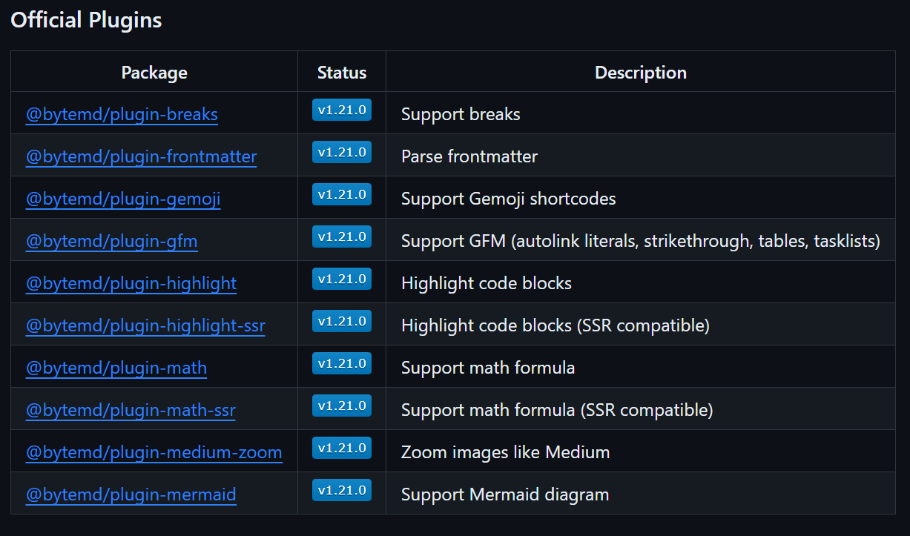

# OJ 判题系统项目笔记

## P3 纯前端页面开发

### 01 导入 MarkDown 编辑器

#### 1.1 引入插件

[bytemd GitHub 网址](https://github.com/bytedance/bytemd)

```bash
npm i @bytemd/vue-next
```


#### 1.2 使用步骤

在 `main.ts` 全局引入 `css` 样式

```javascript
import 'bytemd/dist/index.css'
```


创建 `component`

```javascript
<template>
  <Editor :value="value" :plugins="plugins" @change="handleChange" />
</template>

<script>
import gfm from '@bytemd/plugin-gfm'
import { Editor, Viewer } from '@bytemd/vue'

const plugins = [
  gfm(),
  // Add more plugins here
]

export default {
  components: { Editor },
  data() {
    return { value: '', plugins }
  },
  methods: {
    handleChange(v) {
      this.value = v
    },
  },
}
</script>
```


#### 1.3 插件管理



通过文档中的内容指定的来引入插件

`MdEditor.vue`

```javascript
<template>
  <Editor
    :value="props.value"
    :plugins="plugins"
    @change="props.handleChange"
  />
</template>

<script setup lang="ts">
import gfm from "@bytemd/plugin-gfm";
import { Editor } from "@bytemd/vue-next";
import { withDefaults, defineProps } from "vue";
import highlight from "@bytemd/plugin-highlight-ssr";
import "highlight.js/styles/default.css";
/**
 * 管理文本编辑器的插件
 */
const plugins = [gfm(), highlight()];
/**
 * 当前插件的 Props
 */
interface Props {
  value: string;
  handleChange: (v: string) => void;
}
const props = withDefaults(defineProps<Props>(), {
  value: "",
  handleChange: (v: string) => {
    console.log(v);
  },
});
</script>

<style>
.markdown-body p {
  font-size: 0.8em !important;
  font-weight: 400;
}
.bytemd {
  height: 700px !important;
}
</style> 
```

`CreateView.vue`

```javascript
<template>
  <div class="about">
    <MdEditor :value="value" :handle-change="handleChange" />
  </div>
</template>
<script setup lang="ts">
import MdEditor from "@/components/MdEditer.vue";
import { ref } from "vue";
const value = ref();
const handleChange = (v: string) => {
  value.value = v;
};
</script>
<style scoped></style>
```

> 要点:
>
> - 在父组件中去声明 `value` 和 `handleChange` 便于与服务器的通信
> - `props` 组件通信


### 02. 导入 Monaco 代码编辑器

[monaco Github 网址](https://github.com/microsoft/monaco-editor)

#### 2.1 引入插件

```bash
 npm install monaco-editor
```


#### 2.2 配置使用

初始化 `monaco` 编辑器

```javascript
import * as monaco from 'monaco-editor'
 
this.editor = monaco.editor.create(document.getElementById('monoco-editor'), {
  value: '',
  language: 'sql',
  automaticLayout: true
})
```

`vue.config.js`

```javascript
// vue.config.js
const MonacoWebpackPlugin = require("monaco-editor-webpack-plugin");
const { defineConfig } = require("@vue/cli-service");

module.exports = defineConfig({
  transpileDependencies: true,
  chainWebpack(config) {
    config.plugin("monaco").use(new MonacoWebpackPlugin());
  },
});
```

