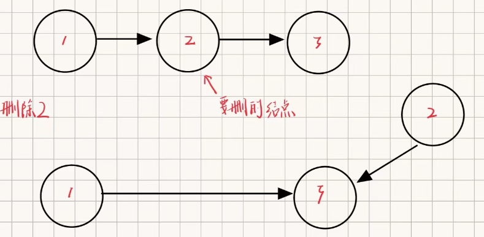
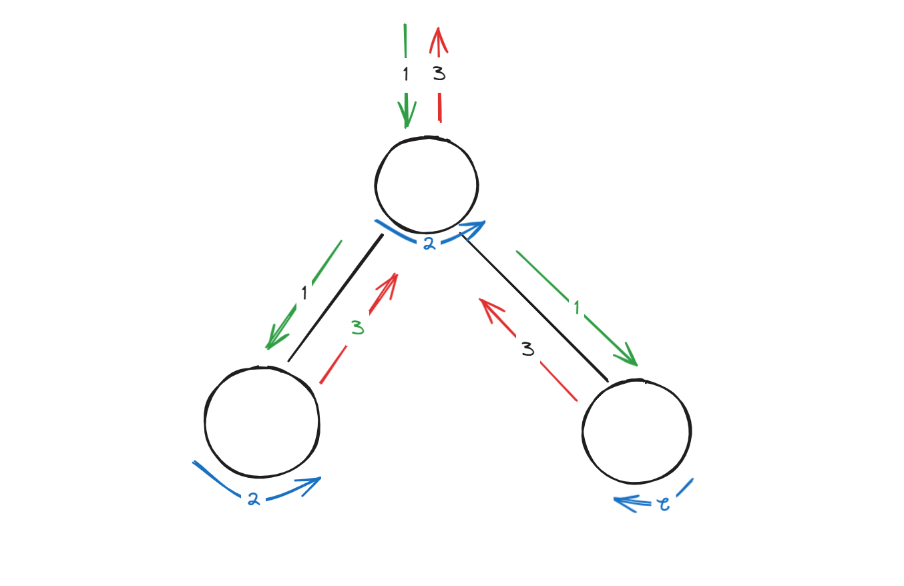
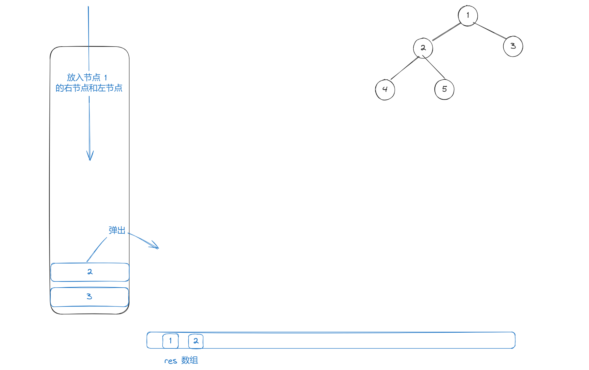

# 代码随想录训练营

## Day 1

### 01. 二分查找 （No. 704）

给定一个 `n` 个元素有序的（升序）整型数组 `nums` 和一个目标值 `target` ，写一个函数搜索 `nums` 中的 `target`，如果目标值存在返回下标，否则返回 `-1`。

#### 1.1 笔记

> 二分法基本上每个学过算法的人都遇到过这个问题，它的思路和代码都很简单但是写的时候经常出错，主要是因为下面两点：
>
> 1. 外层的 while 的区间是多少？
> 2. 我检测完 middle 的值之后，更新区间是否应该包含这个 middle？
>
> 我们在代码提交通过后可能就没有考虑过这个问题，或者说随便改改通过了也扔一边了，今天来具体的解决一下这个问题。

首先我们要清楚搜索区间，很多朋友会感觉很简单，这不就是一开始定义的 `left` 和 `right` 吗？其实，我们还要考虑这两个数的区间，是左闭右闭、左闭右开亦或是左开右闭，这才是影响我们上面两个问题的关键因素。

按照比较好理解的左闭右闭举例：`[right, left]`，也就是我们的搜索区间是左闭右闭的，举个例子，[1, 1] 是有意义的，所以 `while` 中 `right` 和 `left` 是可以取到相等的，因为在左闭右闭的前提下，这样取是有意义的。

那来解决第二个问题，新的区间是否应该包含 middle？同样来检验这个区间的合理性，如果包含 `middle `的话，比如说，我们通过计算发现`nums[mid]` 的值要大于`target`这时候就需要往左边去遍历，也就是比 `nums[mid]` 小的部分，但这时候有如果按照左闭右闭的区间，其实是包含了这个 `nums[mid] ` 的元素的，这就违背了我们去比它小的部分查找的初衷，所以在这种情况下要取 `mid + 1`

#### 1.2 代码

```java
class Solution {
    public int search(int[] nums, int target) {
        int left = 0;
        int right = nums.length - 1;
        // 左闭右闭的情况
        while(left <= right) {
            int mid = left + right;
            if (nums[mid] > target) {
                // 向左边查找元素
                right = mid - 1;
            } else if (nums[mid] < target) {
                left = mid + 1;
            } else {
                return mid;
            }
        }
        return -1;
    }
}

```

 #### 1.3 其他情况

剩下的还有左闭右开和左开右闭的情况，这时候我们仍然考虑区间的准确性，比如这时候 `[1, 1)` 就没有数学意义了，所以我们的 `while` 中不能再取等于。

以左闭右开为例子来看这个问题：这时候如果说 `nums[mid]` 比目标值要大的话，向左边查找，这时候写出区间来就是
 `[left, mid)` 还是上面的那个考虑，这时候因为搜索的区间不包含 `mid` 所以是可以加等于号的。

看到这里兴致冲冲的去写代码，提交发现报错了，这是什么问题呢？

```java
 		while(left < right) {
            int mid = (int)((left + right) / 2.0 + 0.5);
            if (nums[mid] > target) {
                // 向左边查找元素
                right = mid;
            } else if (nums[mid] < target) {
                left = mid + 1;
            } else {
                return mid;
            }
        }
```

因为这时候你的眼里只有这个 `while` 函数，没有注意到当是开区间的时候 `right` 是可以等于 `nums[length] - 1` 的，修改后的代码就是这样的

```java
class Solution {
    public int search(int[] nums, int target) {
        int left = 0;
        int right = nums.length;
        while(left < right) {
            int mid = (left + right) / 2;
            if (nums[mid] > target) {
                // 向左边查找元素
                right = mid;
            } else if (nums[mid] < target) {
                left = mid + 1;
            } else {
                return mid;
            }
        }
        return -1;
    }
}

```

写到这里又有顿悟的感觉，自己去试了试左开右闭的情况，不就是把 `left = -1` 如何把下面的 `+1` 去掉就好了。

一提交，又报错了。。。

这又是什么原因呢？为什么上面两种情况没有出现问题呢？

首先出现了时间超时肯定是这个 `left` 卡在了 `mid` 每次继续都卡在这个位置

这时候关注到这个 `mid` 的计算方法，很容易发现是向下取整的，在左闭右闭的情况下，左右都不会取到这个 `mid` 所以不用考虑卡住的情况，左开右闭的情况下，虽然右区间可以取到 `mid` 但向下取整是保证这个右边界是一直向左靠拢的，但如果是左区间向下取整的话，就有可能会出现卡住的情况：

举个例子：


那为了保证不卡住，解决方法就是更改这个 `mid` 为向上取整，这样就能保证左区间是持续向右的了。

```java
class Solution {
    public int search(int[] nums, int target) {
        int left = -1;
        int right = nums.length - 1;
        // 左闭右闭的情况
        while(left < right) {
            int mid = (int)((left + right) / 2.0 + 0.5);
            if (nums[mid] > target) {
                // 向左边查找元素
                right = mid - 1;
            } else if (nums[mid] < target) {
                left = mid;
            } else {
                return mid;
            }
        }
        return -1;
    }
}

```

OK！通过

### 02. 移除元素 （No. 27）

给你一个数组 `nums` 和一个值 `val`，你需要 **[原地](https://baike.baidu.com/item/原地算法)** 移除所有数值等于 `val` 的元素，并返回移除后数组的新长度。

不要使用额外的数组空间，你必须仅使用 `O(1)` 额外空间并 **[原地 ](https://baike.baidu.com/item/原地算法)修改输入数组**。

元素的顺序可以改变。你不需要考虑数组中超出新长度后面的元素。

#### 2.1 笔记

这个题目主要考察我们对数组结构的理解，暴力的解法也很容易想出来，就是我们遇到了等于 `val` 的元素的话，就将这个数组整体向前移动一位，这时候最后一个元素就变为我们不需要的元素，**所以遍历的结尾要减去 1**，同时还需要注意的问题就是如果两个连续都是不需要的元素的话，要将 `i` 仍然保留在当前位置左相同的操作，否则就会漏删元素。

#### 2.2 代码

```java
class Solution {
    public int removeElement(int[] nums, int val) {
        int len = nums.length;
        int N = nums.length;
        for (int i = 0; i < N; i++) {
            // 循环遍历数组
            if (nums[i] == val) {
                len--;
                N--;
                for (int j = i; j < nums.length - 1; j++) {
                    nums[j] = nums[j + 1];
                }             
            }
            if (nums[i] == val) {
                i--;
            }
        }
        return len;
    }
}
```

#### 2.3 拓展 —— 双指针法

这道题可以通过双指针思想来解决这个问题，设置一个快慢指针，快指针去遍历这个数组，取到不为 `val` 的元素后将快指针的内容赋值给慢指针，然后将慢指针加一，这样一直循环直到数组结尾，快指针中取到的元素的个数就是结果数组的元素总数，当快指针遍历完数组后，慢指针指向的最后一个元素就是结果数组的最后一个元素，所以我们返回慢指针的索引也是最终的结果。

```java
class Solution {
    public int removeElement(int[] nums, int val) {
        int len = 0;
        int slow = 0;
        for (int fast = 0; fast < nums.length; fast++) {
            if (nums[fast] != val) {
                len++;
                nums[slow] = nums[fast];
                slow++;
            }
        }
        return len; // return slow;
    }
}
```

## Day 2

### 01. 有序数组的平方（No. 977）

给你一个按 **非递减顺序** 排序的整数数组 `nums`，返回 **每个数字的平方** 组成的新数组，要求也按 **非递减顺序** 排序。

**示例 1：**

> 输入：nums = [-4,-1,0,3,10]
> 输出：[0,1,9,16,100]
> 解释：平方后，数组变为 [16,1,0,9,100]
> 排序后，数组变为 [0,1,9,16,100]

**示例 2：**

> 输入：nums = [-7,-3,2,3,11]
> 输出：[4,9,9,49,121]

#### 1.1 笔记

这道题我一开始是准备使用比较器根据绝对值排序来实现的，但是 `Comparator<Integer>` 是无法作用于 `int[]` 的，小小踩坑

然后回想起昨天的双指针思想，这道题可以通过两个分别指向负数和正数的，因为是非递减排序的，所以负数是按照绝对值**非递增**排序的，也就是前一个负数的绝对值一定大于后一个负数的绝对值，平方也同理。

所以不妨设置一个新数组来存储这些元素，利用 `left` 指针去遍历小于零的元素，`right` 指针去遍历大于零的元素，当遍历结束后（**如果有**）剩余的元素，也就是正数和负数个数不相等的情况，就按照绝对值的顺序继续放入新数组。

### 1.2 代码

```java
class Solution {
    public int[] sortedSquares(int[] nums) {
        int left = 0;
        int right = nums.length - 1;
        int[] resArr = new int[nums.length]; // 存储结果的新数组
        int index = resArr.length - 1; // 从后往前循环赋值新数组
        // 正数组直接返回结果
        if (nums[left] >= 0) {
            for (int i = 0; i < nums.length; i++) {
                nums[i] = nums[i] * nums[i];
            }
            return nums;
        }
        // left 索引负数部分，right 索引整数部分
        while (nums[left] < 0 && nums[right] >= 0) {
            if (Math.abs(nums[left]) > nums[right]) {
                resArr[index] = nums[left] * nums[left];
                index--;
                left++;
            } else if (Math.abs(nums[left]) < nums[right]) {
                resArr[index] = nums[right] * nums[right];
                index--;
                right--;
            } else {
                // 相等的情况，赋值两次
                resArr[index] = nums[left] * nums[left];
                index--;
                resArr[index] = nums[left] * nums[left];
                index--;
                left++;
                right--;
            }
        }
        if (nums[left] >= 0) {
            // 负数部分已经遍历完，处理正数部分
            for (int i = index; i >= 0; i--) {
                resArr[i] = nums[right] * nums[right];
                right--;
            }
        } else if (nums[right] < 0) {
            // 说明正数部分已经遍历完了
            for (int i = index; i >= 0; i--) {
                resArr[i] = nums[left] * nums[left];
                left++;
            }
        }
        return resArr;
    }
}

```

### 02. 长度最小的子数组（No. 209）

给定一个含有 `n` 个正整数的数组和一个正整数 `target` **。**

找出该数组中满足其总和大于等于 `target` 的长度最小的 **连续子数组** `[numsl, numsl+1, ..., numsr-1, numsr]` ，并返回其长度。如果不存在符合条件的子数组，返回 `0` 。

 

**示例 1：**

>输入：target = 7, nums = [2,3,1,2,4,3]
>输出：2
>解释：子数组 [4,3] 是该条件下的长度最小的子数组。

**示例 2：**

> 输入：target = 4, nums = [1,4,4]
> 输出：1

**示例 3：**

>输入：target = 11, nums = [1,1,1,1,1,1,1,1]
>输出：0

#### 2.1 笔记

这道题采用的是滚动数组的方法，所谓滚动数组就是不断的调节子序列的起始和终止的位置，从而得出我们想要的结果，首先要考虑的是我们遍历的是数组的起始位置还是终止位置，如果遍历的是起始位置的话那终止位置该如何确定？通过 `for` 循环继续向后遍历，来确定以每个元素为起始元素所得到的所有的子数组，这样就是暴力解法，显然时间复杂度是不符合题目要求的。

所以我们采用 `for` 循环遍历终止位置，那要考虑的就是，我们的起始位置该什么时候更新呢？很明显，当我们循环遍历直到这个数组的 `sum` 和大于等于题目中的 `target` 起始位置向后移动缩小范围，这样就避免了暴力解法中我们每到一个起始位置都要从头开始加和：通过起始位置的向后递增，这时候我们的 `sum` 应该等于原本的 `sum` 减去每次的 `nums[i]` **直到 **我们发现 `sum < target` 就再去更新终止位置的值，这样就实现了数组滚动前进的效果，遍历以 `nums` 中的每个元素作为结尾的所有子数组。

#### 2.2 代码

```java
class Solution {
    public int minSubArrayLen(int target, int[] nums) {
        int i = 0; // 起点
        int minLen = Integer.MAX_VALUE;
        int sum = 0;
        for (int j = 0; j < nums.length; j++) {
            // 外层去循环遍历滑动窗口的终点，起点在找到符合的区间再更新
            sum += nums[j];
            // 一直使起始位置向后移动直到 sum < target 为止
            while (sum >= target) {
                // 更新最短的值
                minLen = Math.min(minLen, (j - i + 1));
                // 移动起始位置
                sum -= nums[i];
                i++;
            }
        }
        return minLen == Integer.MAX_VALUE ? 0 : minLen;
    }
}
```

### 03. 螺旋矩阵 II（No. 59）

给你一个正整数 `n` ，生成一个包含 `1` 到 `n2` 所有元素，且元素按顺时针顺序螺旋排列的 `n x n` 正方形矩阵 `matrix` 。

示例 1：

 

> 输入：n = 3
> 输出：[[1,2,3],[8,9,4],[7,6,5]]

**示例 2：**

> 输入：n = 1
> 输出：[[1]]

#### 3.1 笔记

这道题的难点是每条边的边界处理的方法，比如最后一个节点要不要取，如果盲目的写的话很容易出现错误，下面我们来引入循环不变量的思想：

> 在计算机科学中，**循环不变性**（loop invariant，或“循环不变量”），是一组在循环体内、每次迭代均保持为真的性质，通常被用来证明[程式](https://baike.baidu.com/item/程式/0?fromModule=lemma_inlink)或[伪码](https://baike.baidu.com/item/伪码/0?fromModule=lemma_inlink)的正确性（有时但较少情况下用以证明[算法](https://baike.baidu.com/item/算法/0?fromModule=lemma_inlink)的正确性）。简单说来，“循环不变性”是指在循环开始和循环中，每一次迭代时为真的性质。这意味着，一个正确的循环体，在循环结束时“循环不变性”和“循环终止条件”必须同时成立。
>
> 由于[循环](https://baike.baidu.com/item/循环/0?fromModule=lemma_inlink)和递归的相通，证明带有不变性的循环的部分正确性和证明通过归纳的递归程序的正确性极其相似。 

在这道题中，我们对每条边的处理方法必须是相同的，也就是我处理到哪个节点之后下一个节点再交给下一条边取处理，这道题我们遵循每次处理第一个节点和最后一个节点的前一个节点，最后一个节点交给吓一条边来处理。

那处理一个 `n` 阶矩阵需要多少层呢？我们来看上下两个边，每次循环上下两个边未处理的部分会减少二，这样总共需要 `n / 2` 次就可以完全遍历完，但是如果是奇数的话会剩下中间那个未处理，因为我们是向下取整，这时候就在末尾再加一条语句来处理这个值。

所以我们外层写一个 `while` 循环控制遍历的圈数，总共遍历 `n / 2` 次内层写遍历的逻辑，每次循环四条边。

每次循环需要往里缩短一层，所以我们循环的起点和终点肯定不会写死的，这里构建一个 `start` 变量，和一个 `end` 变量，每次循环结束对这两个变量处理使得遍历的边向内移动。

我们先来写第一层遍历：

第一条边：起点设置为 `start` 中点为 `n - end`（倒数第二个节点），这是遍历的第 `start` 行的元素，设置循环变量为 `j` 遍历到倒数第二个节点。

第二条边：遍历的是一列，这里需要用到上面的 `j` ，这个 `j` 停止的地方就是我们下一次循环要遍历的列，这里设置一个 `i ` 作为循环变量，一样是从 `start` 开始（每次向内推一层），同样遍历到 `n - end` 结束。

第三条边：这时候需要 `i ` 的值，遍历的是第 `i` 行，遍历到 `start + 1` 也就是第二个元素

第四条边：同理，遍历的是第 `j` 列，遍历的终点仍然是 `start + 1`。

一层循环结束，更新 `start` 和 `end` 的值。

#### 3.2 代码

```java
class Solution {
    public int[][] generateMatrix(int n) {
        int index = 0;
        int loop = 0; // 控制循环次数，总共需要遍历 n / 2 次
        // n 阶矩阵
        int[][] res = new int[n][n];
        int start = 0;
        int i, j; // 因为遍历另一条边的时候需要前一条边的结束位置，需要保存
        int count = 1; // 这是每次填充的数字
        while(loop++ < n / 2) {
            for (j = start; j < n - loop; j++) {
                // 区间是左闭右开的不遍历最后一个元素
                res[start][j] = count++;
            }
            for (i = start; i < n - loop; i++) {
                res[i][j] = count++;
            }
            for (; j >= loop; j--) {
                res[i][j] = count++;
            }
            for (; i >= loop; i--) {
                res[i][j] = count++;
            }
            start++;
        }
        if (n % 2 == 1) {
            res[start][start] = count;
        }

        return res;
    }
}
```

#### 3.3 简化

上面那个代码是我看了卡尔老师的代码更改的，上面舍弃了 `end` 的值，改为用 `n - loop` 也就是控制循环层数的那个值，因为这个值每次循环是进行了自增的，作用和 `end` 相同。

还有在第三条和第四条边那部分，没有采用 `start + 1` 的形式而是采用了 `loop` 原因也是每次循环中 `loop` 都会更新，而且更新是在 `start` 之前的，恰好满足了 `start + 1` 的需求（其实我感觉写 `start + 1` 更好理解）

然后就是最后这个更新操作，其实更新的就是中间的那个元素，写成 `n / 2` 也是对的，但我们发现出循环的时候，`start` 执行了自增，所以它处于的位置也是我们要处理的这个位置。

## DAY 3

### 01.  移除链表元素（No. 203）

题目链接：https://leetcode.cn/problems/remove-linked-list-elements/description/

代码随想录题解：https://programmercarl.com/0203.%E7%A7%BB%E9%99%A4%E9%93%BE%E8%A1%A8%E5%85%83%E7%B4%A0.html

#### 1.1 题目

给你一个链表的头节点 `head` 和一个整数 `val` ，请你删除链表中所有满足 `Node.val == val` 的节点，并返回新的头节点 。

示例 1：


> 输入：head = [1,2,6,3,4,5,6], val = 6
> 输出：[1,2,3,4,5]

示例 2：

> 输入：head = [], val = 1
> 输出：[ ]

示例 3：

> 输入：head = [7,7,7,7], val = 7
> 输出：[ ]

#### 1.2 笔记

 我们要删除一个节点就是让这个节点的上一个节点指向这个节点的下一个节点，如下图所示：

 

但我们的链表是一个单向链表，我们无法使得这个节点找到它的上一个节点，所以这里我们只能去寻找这个节点的下一个节点是不是要去除的，然后将这个节点的的 `next` 指向它的下下个节点，同时我们要保证这个节点绝对不能是要去删除的节点，那应该如何保证呢？

如果头节点是要删除的节点，我们直接让头节点向前移动即可，如果是其他节点，我们要保证它的下一个节点不能是要删除的节点，才进行 `p = p.next` 的操作，这是为了避免连续出现删除元素的情况，如果我们不判断就会出现漏删的情况：

 

也就是我们节点指向的绝对不能是要删除的节点。

另外要注意的是保证本身和 `next` 不为空即可，`next.next` 为空是有意义的。

#### 1.3 代码

```java
/**
 * Definition for singly-linked list.
 * public class ListNode {
 *     int val;
 *     ListNode next;
 *     ListNode() {}
 *     ListNode(int val) { this.val = val; }
 *     ListNode(int val, ListNode next) { this.val = val; this.next = next; }
 * }
 */
class Solution {
    public ListNode removeElements(ListNode head, int val) {
        // 先去处理头节点的情况，保证 p 一开始指向的不是要删除的元素
        while (head != null && head.val == val ) {
            head = head.next;
        }
        if (head == null) {
            return null;
        }
        ListNode p = head; // 指向头节点的指针
        while (p.next != null) { // 隐式的包含了 p != null
            if (p.next.val == val) {
                // 删除节点的逻辑
                p.next = p.next.next;
            } else {
                // 保证 p.next 不是要删除的元素才能执行这个操作
                p = p.next;
            }            
        }
        return head;
    }
}
```

#### 1.4 拓展 —— 虚拟头节点

虚拟头节点是思想很简单，就是多加一个头节点，这样让我们对头节点的处理和对正常节点的处理是相同的，唯一需要注意的就是返回值应该是虚拟头节点的 **下一个** 节点。

代码：

```java
/**
 * Definition for singly-linked list.
 * public class ListNode {
 *     int val;
 *     ListNode next;
 *     ListNode() {}
 *     ListNode(int val) { this.val = val; }
 *     ListNode(int val, ListNode next) { this.val = val; this.next = next; }
 * }
 */
class Solution {
    public ListNode removeElements(ListNode head, int val) {
        ListNode listNode = new ListNode(); // 虚拟头节点
        listNode.next = head;
//        while (head != null && head.val == val ) {
//            head = head.next;
//        }
//        if (head == null) {
//            return null;
//        }
        ListNode p = listNode; //指向头节点的指针
        while (p.next != null) {
            if (p.next.val == val) {
                p.next = p.next.next;
            } else {
                p = p.next;
            }
        }
        return listNode.next;
    }
}
```

### 02. 设计链表（No. 707）

题目链接：https://leetcode.cn/problems/design-linked-list/description/

代码随想录题解：https://programmercarl.com/0707.%E8%AE%BE%E8%AE%A1%E9%93%BE%E8%A1%A8.html

#### 1.1 题目

你可以选择使用单链表或者双链表，设计并实现自己的链表。

单链表中的节点应该具备两个属性：`val` 和 `next` 。`val` 是当前节点的值，`next` 是指向下一个节点的指针/引用。

如果是双向链表，则还需要属性 `prev` 以指示链表中的上一个节点。假设链表中的所有节点下标从 **0** 开始。

实现 `MyLinkedList` 类：

- `MyLinkedList()` 初始化 `MyLinkedList` 对象。
- `int get(int index)` 获取链表中下标为 `index` 的节点的值。如果下标无效，则返回 `-1` 。
- `void addAtHead(int val)` 将一个值为 `val` 的节点插入到链表中第一个元素之前。在插入完成后，新节点会成为链表的第一个节点。
- `void addAtTail(int val)` 将一个值为 `val` 的节点追加到链表中作为链表的最后一个元素。
- `void addAtIndex(int index, int val)` 将一个值为 `val` 的节点插入到链表中下标为 `index` 的节点之前。如果 `index` 等于链表的长度，那么该节点会被追加到链表的末尾。如果 `index` 比长度更大，该节点将 **不会插入** 到链表中。
- `void deleteAtIndex(int index)` 如果下标有效，则删除链表中下标为 `index` 的节点。


#### 1.2 笔记

这里采用上面的虚拟头节点进行设计，这样设计对我们修改真正的头节点来说非常便利

先来设计一个节点类

```java
class ListNode {
    int val;
    ListNode next;
    ListNode(){}
    ListNode(int val) {
        this.val=val;
    }
   ListNode(int val,ListNode next) {
       this.val=val;
       this.next = next;
   }
}
```

这里引进一个 `	size` 变量，当指定的 `index` 值没有意义的时候可以很快的返回，先来确定 `index` 错误的时机：`index < 0 ` 或者 `index >= size` （下标从 0 开始），每次执行和 `index` 有关的操作的时候都先判断一次。

这里比较重点的是 `get()` 方法和 `addAtIndex() `方法，因为上面 `size` 的约束，不用在考虑越界的问题，那思考一下，从虚拟头节点到我们需要处理的下标的前一个元素需要走多少个 `.next` 呢？需要 `size - 1` 步，这样就写出了我们的方法：

```java
public void addAtIndex(int index, int val) {
    if (index > size || index < 0) {
        return;
    }
    size++;
    //找到要插入节点的前驱
    ListNode pred = virtualHeadNode;
    for (int i = 0; i < index; i++) {
        pred = pred.next;
    }
    ListNode toAdd = new ListNode(val);
    toAdd.next = pred.next;
    pred.next = toAdd;
}
```

注意这里的边界条件要放宽成 `index > size` 因为题目告诉我们可以设置最后一个元素的后一个元素的值。

接下来是 `get()`  方法的实现：

```java
public int get(int index) {
    if (index < 0 || index >= size) {
        return -1;
    }
    ListNode currentNode = virtualHeadNode;
    //包含一个虚拟头节点，所以查找第 index+1 个节点
    for (int i = 0; i <= index; i++) {
        currentNode = currentNode.next;
    }
    return currentNode.val;
}
```

这里需要注意的还是需要前进的步数。

#### 1.3 代码

```java
class MyLinkedList {
    ListNode virtualHeadNode = new ListNode(); // 虚拟头节点
    int size;
    public MyLinkedList() {
    }

    public int get(int index) {
        if (index < 0 || index >= size) {
            return -1;
        }
        ListNode currentNode = virtualHeadNode;
        //包含一个虚拟头节点，所以查找第 index+1 个节点
        for (int i = 0; i <= index; i++) {
            currentNode = currentNode.next;
        }
        return currentNode.val;
    }

    public void addAtHead(int val) {
        addAtIndex(0, val);
    }

    public void addAtTail(int val) {
        addAtIndex(size, val);
    }

    public void addAtIndex(int index, int val) {
        if (index > size || index < 0) {
            return;
        }
        size++;
        //找到要插入节点的前驱
        ListNode pred = virtualHeadNode;
        for (int i = 0; i < index; i++) {
            pred = pred.next;
        }
        ListNode toAdd = new ListNode(val);
        toAdd.next = pred.next;
        pred.next = toAdd;
    }

    public void deleteAtIndex(int index) {
        if (index < 0 || index >= size) {
            return;
        }
        size--;
        if (index == 0) {
            virtualHeadNode = virtualHeadNode.next;
	    return;
        }
        ListNode pred = virtualHeadNode;
        for (int i = 0; i < index ; i++) {
            pred = pred.next;
        }
        pred.next = pred.next.next;
    }
    public ListNode getNodeByIndex(int index) {
        ListNode p = virtualHeadNode.next;
        while (index-- > 0 && p != null) {
            p = p.next;
        }
        return p;
    }
}

class ListNode {
    int val;
    ListNode next;
    ListNode() {}
    ListNode(int val) { this.val = val; }
    ListNode(int val, ListNode next) { this.val = val; this.next = next; }
}
```

### 03. 反转链表（No. 206）

题目链接：https://leetcode.cn/problems/reverse-linked-list/description/

代码随想录题解：https://programmercarl.com/0206.%E7%BF%BB%E8%BD%AC%E9%93%BE%E8%A1%A8.html#%E7%AE%97%E6%B3%95%E5%85%AC%E5%BC%80%E8%AF%BE

#### 3.1 题目

给你单链表的头节点 `head` ，请你反转链表，并返回反转后的链表。

**示例 1：**


```
输入：head = [1,2,3,4,5]
输出：[5,4,3,2,1]
```

**示例 2：**


```
输入：head = [1,2]
输出：[2,1]
```

**示例 3：**

```
输入：head = []
输出：[]
```

#### 3.2 笔记

第一种是使用双指针来做这个题，很容易想到用 `cur` 指针指向需要改变的节点，用 `pre` 指针指向前一个节点，再循环更新 `cur` 和 `pre` 指向的节点

这时候遇到一个问题就是 `cur` 的 `next` 这时候已经写给了 `pre` 节点，那再怎么找到原本的 `next` 呢？所以这里也需要定义一个 `tempNode` 来协助更新 `cur`

下面来考虑初始化，`pre` 初始化为 `null` ，`cur` 初始化为 `head`，`temp` 也初始化为 `null`

最重要的是 `while` 循环的终点，容易犯的错误是在 `cur` 指向最后一个节点时返回 `cur` 的值，这时候返回的是只有最后一个元素的链表，因为最后一个元素还未更新，应该再进行一次循环，也就是 `cur` 指向 `null` 的时候，我们返回的是 `pre`。

#### 3.3 代码

```java
/**
 * Definition for singly-linked list.
 * public class ListNode {
 *     int val;
 *     ListNode next;
 *     ListNode() {}
 *     ListNode(int val) { this.val = val; }
 *     ListNode(int val, ListNode next) { this.val = val; this.next = next; }
 * }
 */
class Solution {
    public ListNode reverseList(ListNode head) {
        // 如果只有一个元素直接返回
        if (head == null || head.next == null) {
            return head;
        }
        // 初始化
        ListNode currentNode = head;
        ListNode preNode = null;
        ListNode tempNode = null;
        
        while (currentNode != null) { 
            tempNode = currentNode.next;          
            currentNode.next = preNode;
            preNode = currentNode;
            currentNode = tempNode;           
        }
        return preNode;
    }
}
```

## Day 4

### 01. 两两交换链表中的节点（No. 24）

[题目链接](https://leetcode.cn/problems/swap-nodes-in-pairs/description/)

[代码随想录题解](https://programmercarl.com/0024.%E4%B8%A4%E4%B8%A4%E4%BA%A4%E6%8D%A2%E9%93%BE%E8%A1%A8%E4%B8%AD%E7%9A%84%E8%8A%82%E7%82%B9.html)

#### 1.1 题目

给你一个链表，两两交换其中相邻的节点，并返回交换后链表的头节点。你必须在不修改节点内部的值的情况下完成本题（即，只能进行节点交换）。

**示例 1：**


> 输入：head = [1,2,3,4]
> 输出：[2,1,4,3]

**示例 2：**

> 输入：head = []
> 输出：[]

**示例 3：**

> 输入：head = [1]
> 输出：[1]

#### 1.2 笔记

先来分析需不需要虚拟头节点，虚拟头节点是为了让处理头节点的方式和处理其他节点的方式相同，不用再单独写出来，所以先考虑头节点和其他节点的处理方式是否一样：

交换一个中间的节点需要哪些操作呢？


需要将前一个节点，也就是上图第一个点指向第三个点，但是头节点并没有前一个节点，所以我们得出头节点和其他节点的处理方式是不同的，所以引入虚拟头节点。（上图是要进行的操作，标号不代表顺序）

也很容易能看出，要交换两个节点需要前一个节点和后一个节点，所以我们的 `cur` 要定义在前一个节点：


这里我们先给上个图加上序号

1. 先让 `cur` 指向它的下下个节点（3 节点），但这时我们发现 `cur`  的下一个节点（2 节点）是不可达的，定义 `temp1` 指向这个节点


2. 使得 `temp1` （节点 2 ）的下一个节点指向 （节点 4）


3. 让 （节点 3）再指向 （节点2）这样拉直后就实现了反转


接下来我们来看循环遍历的出口，如果是偶数个元素的话我们要保证 `cur` 后面有一个元素（有一个元素就代表后面还有一组元素，还需要循环交换），奇数个元素的话则需要保证 `cur` 的后面有两个个元素就结束（有两个元素才需要交换，一个的话不需要交换直接结束），先尝试写出循环遍历的出口

```java
while(cur.next.next != null)
while(cur.next != null)
```

很明显看出这两个是包含关系，则可以写出

```java
while(cur.next != null && cur.next.next != null)
```

#### 1.3 代码

```java
/**
 * Definition for singly-linked list.
 * public class ListNode {
 *     int val;
 *     ListNode next;
 *     ListNode() {}
 *     ListNode(int val) { this.val = val; }
 *     ListNode(int val, ListNode next) { this.val = val; this.next = next; }
 * }
 */
class Solution {
    public ListNode swapPairs(ListNode head) {
        ListNode dummyHead = new ListNode(0, head); // 虚拟头节点
        ListNode cur = dummyHead;
        ListNode temp1; // 临时节点
        ListNode temp2;
        while (cur.next != null && cur.next.next != null) {
            temp1 = cur.next;
            cur.next = cur.next.next;
            temp1.next = cur.next.next;
            cur.next.next = temp1;
            cur = cur.next.next;
        }
        return dummyHead.next;
    }
}
```

### 02. 删除链表的倒数第 N 个结点（No. 19）

[题目链接](https://leetcode.cn/problems/remove-nth-node-from-end-of-list/description/)

[代码随想录题解](https://programmercarl.com/0019.%E5%88%A0%E9%99%A4%E9%93%BE%E8%A1%A8%E7%9A%84%E5%80%92%E6%95%B0%E7%AC%ACN%E4%B8%AA%E8%8A%82%E7%82%B9.html)

#### 1.1 题目

给你一个链表，两两交换其中相邻的节点，并返回交换后链表的头节点。你必须在不修改节点内部的值的情况下完成本题（即，只能进行节点交换）。

 

**示例 1：**


> 输入：head = [1,2,3,4]
> 输出：[2,1,4,3]

**示例 2：**

> 输入：head = []
> 输出：[]

**示例 3：**

> 输入：head = [1]
> 输出：[1]

#### 1.2 笔记

这道题的关键是如何找到删除节点的前一个节点，然后我们只需要让 `node.next = node.next.next` 就完成了删除操作，下面来思考如何找到这个节点呢？

因为题目里面给的是倒数第 N 个节点，所以很容易想到倒序遍历链表，回顾一下如何倒序遍历链表呢？

```java
public void backtracking(ListNode head) {
	if (head.next == null) {
        // 到了最后一个节点
        return head;
    }
    ListNode node = head; // 记录当前栈中的 head
    backtracking(head.next);
    System.sout.println(node); // 实现倒叙输出
}
```

这道题的思路就变得清晰起来了，递归遍历到最后一个节点然后我们开始计数，直到倒数第 N 个节点的前一个节点，就比如 `1` 的话需要在倒数第二个栈执行操作，可以写出

```java
        if (--N == 0) {
            // 要删除的节点的前一个节点
            node.next = node.next.next;
            return;
        }
```

下面给出完整的代码

#### 1.3 代码

```java
/**
 * Definition for singly-linked list.
 * public class ListNode {
 *     int val;
 *     ListNode next;
 *     ListNode() {}
 *     ListNode(int val) { this.val = val; }
 *     ListNode(int val, ListNode next) { this.val = val; this.next = next; }
 * }
 */
class Solution {
    int N = 0;
    ListNode dummyNode = new ListNode();
    public ListNode removeNthFromEnd(ListNode head, int n) {
        N = n;
        dummyNode.next = head;
        backtracking(dummyNode);
        return dummyNode.next;
    }
    public void backtracking(ListNode head) {
        if (head.next == null) {
            // 最后一个节点
            return;
        }
        backtracking(head.next);// 递归遍历节点
        ListNode node = head;
        if (--N == 0) {
            // 要删除的节点的前一个节点
            node.next = node.next.next;
            return;
        }
        return;
    }
}
```


### 03. 环形链表 II（No. 142）

[题目链接](https://leetcode.cn/problems/linked-list-cycle-ii/description/)

[代码随想录题解](https://programmercarl.com/0142.%E7%8E%AF%E5%BD%A2%E9%93%BE%E8%A1%A8II.html)

#### 3.1 题目

给定一个链表的头节点  `head` ，返回链表开始入环的第一个节点。 *如果链表无环，则返回 `null`。*

如果链表中有某个节点，可以通过连续跟踪 `next` 指针再次到达，则链表中存在环。 为了表示给定链表中的环，评测系统内部使用整数 `pos` 来表示链表尾连接到链表中的位置（**索引从 0 开始**）。如果 `pos` 是 `-1`，则在该链表中没有环。**注意：`pos` 不作为参数进行传递**，仅仅是为了标识链表的实际情况。

**不允许修改** 链表。

 

**示例 1：**


```
输入：head = [3,2,0,-4], pos = 1
输出：返回索引为 1 的链表节点
解释：链表中有一个环，其尾部连接到第二个节点。
```

**示例 2：**


```
输入：head = [1,2], pos = 0
输出：返回索引为 0 的链表节点
解释：链表中有一个环，其尾部连接到第一个节点。
```

**示例 3：**


```
输入：head = [1], pos = -1
输出：返回 null
解释：链表中没有环。
```

#### 3.2 笔记

这道题的解法重点是数学推导过程，首先我们先解决如何确定有没有环：

设定一个快指针和一个慢指针，使得他们以两个节点和一个节点的速度向前移动，最后一定会相遇。

可以想象跑步时候被人套圈的场景，如果在一个圈中一个速度比另一个人快，最后一定会相遇，这是在现实的世界中，我们观察这两个人相遇的那个点不一定是整数点，因为最小单位不是一个整数。

但是在链表的圈内可以看作一个个往前跳动的，最小单位是一个个点，如果这两个指针相差的速度不是链表中两个点相差的最小单位的话，就有可能出现遇不到的情况，导致误判。

然后我们来确定相遇的位置：


我们从圈的入口到相遇处为 `y`，从相遇处到入口为 `z` 从起点到入口为 `x`，快节点首先进入环内，慢节点进入环的第一圈就被快节点追上（后面详细解释），写出公式经过推导可以得到最后一个公式，这个公式代表着什么意思呢？

就是从一个节点从起点出发，一个节点从 `z` 出发，他们最终会在 **入口处** 相遇。

为什么慢节点第一圈就会被追上呢？

因为慢节点走一圈，快节点就走了两圈，很明显可以发现快节点已经走过了慢节点走的路程，所以相遇一定是慢节点的第一圈。


#### 3.3 代码

```java
/**
 * Definition for singly-linked list.
 * class ListNode {
 *     int val;
 *     ListNode next;
 *     ListNode(int x) {
 *         val = x;
 *         next = null;
 *     }
 * }
 */
public class Solution {   
    public ListNode detectCycle(ListNode head) {
        ListNode fast = head;
        ListNode slow = head;
        // 如果没有环一定是快指针先到终点
        while (fast != null && fast.next != null) {
            fast = fast.next.next;
            slow = slow.next;
            if (fast == slow) {
                // 说明快慢指针相遇了
                ListNode index1 = fast;
                ListNode index2 = head;
                while (index1 != index2) {
                    index1 = index1.next;
                    index2 = index2.next;
                }
                return index1;
            }
        }
        return null;
    }
}
```

## Day 6

### 01. 有效的字母异位词（No. 242）

[题目链接](https://leetcode.cn/problems/valid-anagram/description/)

[代码随想录题解](https://programmercarl.com/0349.%E4%B8%A4%E4%B8%AA%E6%95%B0%E7%BB%84%E7%9A%84%E4%BA%A4%E9%9B%86.html#%E7%AE%97%E6%B3%95%E5%85%AC%E5%BC%80%E8%AF%BE)

#### 1.1 题目

给定两个字符串 `s` 和 `t` ，编写一个函数来判断 `t` 是否是 `s` 的字母异位词。

**注意：**若 `s` 和 `t `中每个字符出现的次数都相同，则称 `s` 和 `t` 互为字母异位词。

 

**示例 1:**

> 输入: s = "anagram", t = "nagaram"
> 输出: true

**示例 2:**

> 输入: s = "rat", t = "car"
> 输出: false

#### 1.2 笔记

> 哈希表（Hash Table）是一种数据结构，用于实现字典（Dictionary）和映射（Map）等抽象数据类型。它通过哈希函数将键（key）映射到哈希表中的特定位置，以便快速定位和检索值（value）。哈希表的主要思想是将键转换为索引，使得在理想情况下可以在常量时间内（O(1) 的时间复杂度）查找或插入元素。
>
> 哈希表的核心组成部分包括：
>
> 1. **哈希函数（Hash Function）：** 这是哈希表的关键部分，它将键转换为哈希码或哈希值。理想的哈希函数应该将不同的键映射到不同的哈希值，尽可能避免冲突（多个键映射到同一个位置）。
> 2. **哈希表或哈希桶（Hash Table / Hash Bucket）：** 这是存储实际数据的地方。哈希表由一个数组构成，每个位置通常被称为“桶”，存储着键值对或者指向键值对的指针。
> 3. **解决冲突的方法：** 当不同的键经过哈希函数映射到相同的位置时，就会发生冲突。解决冲突的方法有很多种，常见的包括开放定址法（如线性探测和二次探测）和链表法（或者更高效的形式，如使用红黑树）。

哈希表一般用于快速的判断一个元素是否出现在集合里。

对于上面的题目暴力解法就是两层 `for` 循环，记录字符是否重复出现，时间复杂度为 O(n^2)

这道题可以通过哈希表的方式解题，因为上面提到，哈希表可以快速的判断一个元素是否出现在集合里，所以如果两个字符串的长度相同，且各个字母的出现次数也相同就说明他们两个互为字母异位词。

我们知道，小写字母的 ASCII 码值是相邻的，一个长度为 26 的数组就可以存储这些字母出现的频率，将数组的下标作为索引，将数组元素值作为值就可以快速的查找。

首先判断两个字符串的长度是否相同，如果不同直接返回 `false` 之后同时循环遍历两个数组，如果字符串 1 中出现了就将索引加一，字符串 2 中出现则减一，最后我们去检查这个数组，如果出现了非 0 的值，说明这两个字符串不是互为异位词。

#### 1.3 代码

```java
class Solution {
    public boolean isAnagram(String s, String t) {
        // 将字符串转化为字符数组
        char[] charArray1 = s.toCharArray();
        char[] charArray2 = t.toCharArray();
        int length = charArray1.length;
        // 检测长度
        if (charArray2.length != length) {
            return false;
        }
        int[] hash = new int[26]; // 哈希数组
        
        for (int i = 0; i < length; i++) {
            hash[charArray1[i] - 'a']++;
            hash[charArray2[i] - 'a']--;
        }
        for (int i = 0; i < hash.length; i++) {
            if (hash[i] != 0) {
                return false;
            }
        }
        return true;
    }
}
```

### 02. 两个数组的交集（No. 349）

[题目链接](https://leetcode.cn/problems/intersection-of-two-arrays/description/)

[代码随想录题解](https://programmercarl.com/0349.%E4%B8%A4%E4%B8%AA%E6%95%B0%E7%BB%84%E7%9A%84%E4%BA%A4%E9%9B%86.html#%E7%AE%97%E6%B3%95%E5%85%AC%E5%BC%80%E8%AF%BE)

#### 2.1 题目

[349. 两个数组的交集](https://leetcode.cn/problems/intersection-of-two-arrays/)

给定两个数组 `nums1` 和 `nums2` ，返回 *它们的交集* 。输出结果中的每个元素一定是 **唯一** 的。我们可以 **不考虑输出结果的顺序** 。

**示例 1：**

> 输入：nums1 = [1,2,2,1], nums2 = [2,2]
> 输出：[2]

**示例 2：**

> 输入：nums1 = [4,9,5], nums2 = [9,4,9,8,4]
> 输出：[9,4]
> 解释：[4,9] 也是可通过的

**提示：**

- `1 <= nums1.length, nums2.length <= 1000`
- `0 <= nums1[i], nums2[i] <= 1000`

#### 2.2 笔记

也是一道非常简单的问题，和上面题目的思想相同，我们先来看数组的解法，之后再通过集合去简化。

题目中已经限定了数组中元素的大小，所以我们直接将哈希数组声明为长度为 `1000` 的数组即可，这道题易错点是是否考虑了去重，所以我们遍历第一个数组，将出现的数字作为索引，值我们统一设为 `1`，再去遍历第二个数组，这时候就要注意了，我们必须保证结果集中只添加了一次，所以给出如下的判断语句：

```java
if (hash[nums2[i]] == 1 && ++hash[nums2[i]] == 2) {
	list.add(nums2[i]);
}
```

只能是 `2` 的时候再接收，如果后续为 `3` 或者其他数字说明我们加重了。

#### 2.3 代码

```java
class Solution {
    int[] hash = new int[1000]; // 哈希数组
    public int[] intersection(int[] nums1, int[] nums2) {
        List<Integer> list = new ArrayList<>(); // 结果列表
        for (int i = 0; i < nums1.length; i++) {
            hash[nums1[i]] = 1;
        }
        for (int i = 0; i < nums2.length; i++) {
            // 保证不会重复
            if (hash[nums2[i]] == 1 && ++hash[nums2[i]] == 2) {
                list.add(nums2[i]);
            }
        }
        // 将结果转化为数组
        int index = 0;
        int res[] = new int[list.size()];
        for(int i : list)
            res[index++] = i;
        return res;        
    }
}
```

#### 2.4 拓展 —— 利用 Set 解题

```java
import java.util.HashSet;
import java.util.Set;

class Solution {
    public int[] intersection(int[] nums1, int[] nums2) {
        if (nums1 == null || nums1.length == 0 || nums2 == null || nums2.length == 0) {
            return new int[0];
        }
        Set<Integer> set1 = new HashSet<>();
        Set<Integer> resSet = new HashSet<>();
        //遍历数组1
        for (int i : nums1) {
            set1.add(i);
        }
        //遍历数组2的过程中判断哈希表中是否存在该元素
        for (int i : nums2) {
            if (set1.contains(i)) {
                resSet.add(i);
            }
        }
      
        //方法1：将结果集合转为数组

        return resSet.stream().mapToInt(x -> x).toArray();
        
        //方法2：另外申请一个数组存放setRes中的元素,最后返回数组
        int[] arr = new int[resSet.size()];
        int j = 0;
        for(int i : resSet){
            arr[j++] = i;
        }
        
        return arr;
    }
}
```

和上面数组的解法时间是略高于前面的方法的，因为题目中限制了数字的大小，但如果很大的话，集合解法是优于数组的。

### 03. 快乐数（No. 202）

[题目链接](https://leetcode.cn/problems/happy-number/description/)

[代码随想录题解](https://programmercarl.com/0202.%E5%BF%AB%E4%B9%90%E6%95%B0.html#%E6%80%9D%E8%B7%AF)

#### 3.1 题目

编写一个算法来判断一个数 `n` 是不是快乐数。

**「快乐数」** 定义为：

- 对于一个正整数，每一次将该数替换为它每个位置上的数字的平方和。
- 然后重复这个过程直到这个数变为 1，也可能是 **无限循环** 但始终变不到 1。
- 如果这个过程 **结果为** 1，那么这个数就是快乐数。

如果 `n` 是 *快乐数* 就返回 `true` ；不是，则返回 `false` 。 

**示例 1：**

> 输入：n = 19
> 输出：true
> 解释：
> 12 + 92 = 82
> 82 + 22 = 68
> 62 + 82 = 100
> 12 + 02 + 02 = 1

**示例 2：**

> 输入：n = 2
> 输出：false

#### 3.2 笔记

也是一道比较简单的题目，唯一的难点可能就是如何求各位置上的平方和

我们来分析一下这道题目，一个数字只有两种情况：1. 经过有限次的平方加和变为了 `1` 2. 陷入循环，那我们如何判断是否陷入了循环呢？

就看一个和是否出现过，如果出现过两次则说明一定陷入了循环。

理解了这些，代码就非常好写了

#### 3.3 代码

```java
class Solution {
    public boolean isHappy(int n) {
        Set<Integer> record = new HashSet<>();
        int x = 0; // 每一位上的数字
        int sum = 0; // 每一次循环的和
        // 检测是否重复或者为 1
        while (sum != 1 && !record.contains(n)) {
            x = 0;
            sum = 0;
            record.add(n); // 放入集合中
            while (n > 0) {
                x = n % 10; 
                sum += x * x; 
                n = n / 10;               
            }
            n = sum;
        }
        return sum == 1;
    }
}
```

### 04. 两数相加（No. 01）

[题目链接](https://leetcode.cn/problems/two-sum/description/)

[代码随想录题解](https://programmercarl.com/0001.%E4%B8%A4%E6%95%B0%E4%B9%8B%E5%92%8C.html#%E7%AE%97%E6%B3%95%E5%85%AC%E5%BC%80%E8%AF%BE)

#### 4.1 题目

给定一个整数数组 `nums` 和一个整数目标值 `target`，请你在该数组中找出 **和为目标值** *`target`* 的那 **两个** 整数，并返回它们的数组下标。

你可以假设每种输入只会对应一个答案。但是，数组中同一个元素在答案里不能重复出现。

你可以按任意顺序返回答案。

**示例 1：**

> 输入：nums = [2,7,11,15], target = 9
> 输出：[0,1]
> 解释：因为 nums[0] + nums[1] == 9 ，返回 [0, 1] 。

**示例 2：**

> 输入：nums = [3,2,4], target = 6
> 输出：[1,2]

**示例 3：**

> 输入：nums = [3,3], target = 6
> 输出：[0,1]

#### 4.2 笔记

又是这道经典的梦开始的地方,这里我们来介绍这道题的哈希解法.

回顾一下,什么时候用哈希表?就是我们判断一个数在之前有没有出现过,在这道题里面,我们要判断的就是`target - nums[i]` 在我们之前的遍历中是否出现过,如果出现过就表明我们找到了这个组合,将这两个下标直接返回即可

我们可以通过 `Map` 来同时存储数字的下标和数值,也可以直接从头开始遍历求解.

#### 4.3 代码

```java
class Solution {
	public int[] twoSum(int[] nums, int target) {
    int[] res = new int[2];
    if(nums == null || nums.length == 0){
        return res;
    }
    Map<Integer, Integer> map = new HashMap<>();
    for(int i = 0; i < nums.length; i++){
        int temp = target - nums[i];   // 遍历当前元素，并在map中寻找是否有匹配的key
        if(map.containsKey(temp)){
            res[1] = i;
            res[0] = map.get(temp);
            break;
        }
        map.put(nums[i], i);    // 如果没找到匹配对，就把访问过的元素和下标加入到map中
    }
    return res;
	}
}
```

## Day 7

### 01. 四数相加 II（No. 454）

[题目链接](https://leetcode.cn/problems/4sum-ii/description/)

[代码随想录题解](https://programmercarl.com/0454.%E5%9B%9B%E6%95%B0%E7%9B%B8%E5%8A%A0II.html)

#### 1.1 题目

给你四个整数数组 `nums1`、`nums2`、`nums3` 和 `nums4` ，数组长度都是 `n` ，请你计算有多少个元组 `(i, j, k, l)` 能满足：

- `0 <= i, j, k, l < n`
- `nums1[i] + nums2[j] + nums3[k] + nums4[l] == 0` 

**示例 1：**

> 输入：nums1 = [1,2], nums2 = [-2,-1], nums3 = [-1,2], nums4 = [0,2]
> 输出：2
> 解释：
> 两个元组如下：
> 1. (0, 0, 0, 1) -> nums1[0] + nums2[0] + nums3[0] + nums4[1] = 1 + (-2) + (-1) + 2 = 0
> 2. (1, 1, 0, 0) -> nums1[1] + nums2[1] + nums3[0] + nums4[0] = 2 + (-1) + (-1) + 0 = 0

**示例 2：**

> 输入：nums1 = [0], nums2 = [0], nums3 = [0], nums4 = [0]
> 输出：1

#### 1.2 笔记

和前面说的一样，我们在考虑一个题能不能用哈希法解决的时候首先要想：

我们需不需要知道某一个数字在之前有没有出现过。

求和，很容易想到 `target - 现在遍历到的数字` 是否在之前遍历的数字中出现过


我们先将 `nums1` 和 `nums2` 中的数据求和放到 `map` 中，然后当我们去便利 `nums3` 和 `nums4` 的时候就可以检查需要的数据是否出现过

出现了之后应该使得 `resNum` 加上多少呢？

很多人可能想当然的是 1（比如我），但是因为这道题不需要去重，我们需要知道是多少 **种** 组合，所以加的是这个值出现的次数。

#### 1.3 代码

```java
class Solution {
    public int fourSumCount(int[] nums1, int[] nums2, int[] nums3, int[] nums4) {
        Map<Integer, Integer> oneAddTwo = new HashMap<>();
        List<Integer> threeAddFour = new ArrayList<>();
        int length = nums1.length;
        int resNum = 0;
        // 存储 nums1 和 nums2 的和
        for (int i = 0; i < length; i++) {
            for (int j = 0; j < length; j++) {
                int sum1 = nums1[i] + nums2[j];//求前两个数组的和
                if (oneAddTwo.containsKey(sum1)) {
                    oneAddTwo.put(sum1, oneAddTwo.get(sum1) + 1);
                } else {
                    oneAddTwo.put(sum1, 1);
                }
            }         
        }
        for (int i : nums3) {
            for (int j : nums4) {
                if (oneAddTwo.containsKey(0 - i - j)) {
                    resNum += oneAddTwo.get(0 - i - j);
                }
            }
        }
        return resNum;
    }
}
```


### 02. 赎金信（No. 383）

[题目链接](https://leetcode.cn/problems/ransom-note/description/)

[代码随想录题解](https://programmercarl.com/0383.%E8%B5%8E%E9%87%91%E4%BF%A1.html)

#### 2.1 题目

给你两个字符串：`ransomNote` 和 `magazine` ，判断 `ransomNote` 能不能由 `magazine` 里面的字符构成。

如果可以，返回 `true` ；否则返回 `false` 。

`magazine` 中的每个字符只能在 `ransomNote` 中使用一次。

**示例 1：**

> 输入：ransomNote = "a", magazine = "b"
> 输出：false

**示例 2：**

> 输入：ransomNote = "aa", magazine = "ab"
> 输出：false

**示例 3：**

> 输入：ransomNote = "aa", magazine = "aab"
> 输出：true

**提示：**

- `1 <= ransomNote.length, magazine.length <= 105`
- `ransomNote` 和 `magazine` 由小写英文字母组成


#### 2.2 笔记

非常经典的哈希法可以解决的题目，检测 `ransomNote` 中的数字是否在 `magazine` 中出现过且数量足够（每个字母只能用一次）

这道题目比较简单，直接上代码了

#### 2.3 代码


```java
class Solution {
    public boolean canConstruct(String ransomNote, String magazine) {
        // 转化为字符串数组
        char[] m = magazine.toCharArray();
        char[] r = ransomNote.toCharArray();
        int[] hash = new int[26];
        for(int i = 0; i < m.length; i++) {
            hash[m[i] - 'a']++;
        }
        for (int i = 0; i < r.length; i++) {
            // 检测是否出现负数
            if (--hash[r[i] - 'a'] < 0) {
                // 出现负数直接返回 false
                return false;
            }
        }
        return true;
    }
}
```

### 03. 三数之和

[题目链接](https://leetcode.cn/problems/3sum/description/)

[代码随想录题解](https://programmercarl.com/0015.%E4%B8%89%E6%95%B0%E4%B9%8B%E5%92%8C.html#%E5%85%B6%E4%BB%96%E8%AF%AD%E8%A8%80%E7%89%88%E6%9C%AC)

#### 3.1 题目

给你一个整数数组 `nums` ，判断是否存在三元组 `[nums[i], nums[j], nums[k]]` 满足 `i != j`、`i != k` 且 `j != k` ，同时还满足 `nums[i] + nums[j] + nums[k] == 0` 。请

你返回所有和为 `0` 且不重复的三元组。

**注意：**答案中不可以包含重复的三元组。

**示例 1：**

> 输入：nums = [-1,0,1,2,-1,-4]
> 输出：[[-1,-1,2],[-1,0,1]]
> 解释：
> nums[0] + nums[1] + nums[2] = (-1) + 0 + 1 = 0 。
> nums[1] + nums[2] + nums[4] = 0 + 1 + (-1) = 0 。
> nums[0] + nums[3] + nums[4] = (-1) + 2 + (-1) = 0 。
> 不同的三元组是 [-1,0,1] 和 [-1,-1,2] 。
> 注意，输出的顺序和三元组的顺序并不重要。

**示例 2：**

> 输入：nums = [0,1,1]
> 输出：[]
> 解释：唯一可能的三元组和不为 0 。

**示例 3：**

> 输入：nums = [0,0,0]
> 输出：[[0,0,0]]
> 解释：唯一可能的三元组和为 0 。

**提示：**

- `3 <= nums.length <= 3000`
- `-105 <= nums[i] <= 105`

#### 3.2 笔记

因为前面一直在做哈希表的题目，我下意识的想用哈希表法来解这道题目（也算是分模块刷题的一种弊端吧）

但是我们会发现，这道题目要去重的点太多了，三个位置都需要去重，哈希法解题限制条件非常多。

这里给出一种思路，利用双指针的方法去做。

我们先将数组排好序，这也是为了 **去重** 做准备的，排序之后相同大小的数据会排列在一起。

具体的思路是这样的：我们定义一个左指针和一个右指针，循环遍历整个数组，循环变量为 `i` ，左指针指向 `i+1`，右指针指向数组的最后一个元素，我们来确定这三个变量的和是否大于我们的 `target` 也就是 `0`

1. 如果是大于零的情况，说明我们的和需要缩小，也就是右指针要向前移动

2. 如果是小于零的情况，说明我们的和需要变大，也就是左指针要向前移动

3. 当我们结果等于零的时候，就直接保存下来 吗？

   当然不是，我们要针对做指针和右指针进行去重，这个去重的目的是为了避免同一种情况的多次出现
   
   比如上面的这种情况，如果我们不进行去重的话，会得到三个 [-1, 0, 1]

对于 `i` 的去重也是相同的原理，但是我们要考虑``left` 的情况

比如我们的数组是 [-1, -1, -1 ………..] 的话，我们遍历到第二个 `-1` 的时候其实在第一个 `-1` 已经包含了全部的情况，比如说 `nums[left = i]` 的情况，所以当我们发现正在遍历的 `nums[i]` 和 `nums[i - 1]` 相同的时候就可以直接跳过了。

现在三个数字的去重都已经考虑好了，参考一下我的代码

#### 3.3 代码

```java
class Solution {
    List<List<Integer>> resList = new ArrayList<>();
    public List<List<Integer>> threeSum(int[] nums) {
        Arrays.sort(nums); // 排序
        for (int i = 0; i < nums.length; i++) {

            if (nums[i] > 0) {
                return resList;
            }

            if (i > 0 && nums[i] == nums[i - 1]) {
                continue;
            }

            int left = i + 1;
            int right = nums.length - 1;

            while (right > left) {
                int sum = nums[i] + nums[left] + nums[right];
                if (sum > 0) {
                    right--;
                } else if (sum < 0) {
                    left++;
                } else {
                    resList.add(Arrays.asList(nums[i], nums[left], nums[right]));
		    // 去重逻辑应该放在找到一个三元组之后，对b 和 c去重
                    while (right > left && nums[right] == nums[right - 1]) {
                        right--;
                    } 
                    while (right > left && nums[left] == nums[left + 1]) {
                        left++;
                    } 
                    
                    right--; 
                    left++;
                }
        }
    }
        return resList;
    }
}
```


## Day 8

### 01. 反转字符串（No. 344）

[题目链接](https://leetcode.cn/problems/reverse-string/description/)

[代码随想录题解](https://programmercarl.com/0344.%E5%8F%8D%E8%BD%AC%E5%AD%97%E7%AC%A6%E4%B8%B2.html#%E7%AE%97%E6%B3%95%E5%85%AC%E5%BC%80%E8%AF%BE)

#### 1.1 题目

编写一个函数，其作用是将输入的字符串反转过来。输入字符串以字符数组 `s` 的形式给出。

不要给另外的数组分配额外的空间，你必须**[原地](https://baike.baidu.com/item/原地算法)修改输入数组**、使用 O(1) 的额外空间解决这一问题。

**示例 1：**

> 输入：s = ["h","e","l","l","o"]
> 输出：["o","l","l","e","h"]

**示例 2：**

> 输入：s = ["H","a","n","n","a","h"]
> 输出：["h","a","n","n","a","H"]

**提示：**

- `1 <= s.length <= 105`
- `s[i]` 都是 [ASCII](https://baike.baidu.com/item/ASCII) 码表中的可打印字符

#### 1.2 笔记

非常简单的一道题目，而且题目给的就是一个 `char` 数组，简单的回顾一下反转的写法

```java
char temp = s[left];
s[left] = s[right];
s[right] = temp;
```

反转的次数为 `s.length / 2` 向下取整，写出代码

#### 1.3 代码

```java
class Solution {
    public void reverseString(char[] s) {
        int n = s.length / 2;
        int left = 0;
        int right = s.length - 1;
        while (n-- > 0) {
            char temp = s[left];
            s[left] = s[right];
            s[right] = temp;
            left++;
            right--;
        }
    }
}
```


### 02. 反转字符串 II（No. 541）

[题目链接](https://leetcode.cn/problems/reverse-string-ii/description/)

[代码随想录题解](https://programmercarl.com/0541.%E5%8F%8D%E8%BD%AC%E5%AD%97%E7%AC%A6%E4%B8%B2II.html)

#### 2.1 题目

给定一个字符串 `s` 和一个整数 `k`，从字符串开头算起，每计数至 `2k` 个字符，就反转这 `2k` 字符中的前 `k` 个字符。

- 如果剩余字符少于 `k` 个，则将剩余字符全部反转。
- 如果剩余字符小于 `2k` 但大于或等于 `k` 个，则反转前 `k` 个字符，其余字符保持原样。

**示例 1：**

> 输入：s = "abcdefg", k = 2
> 输出："bacdfeg"

**示例 2：**

> 输入：s = "abcd", k = 2
> 输出："bacd"

**提示：**

- `1 <= s.length <= 104`
- `s` 仅由小写英文组成
- `1 <= k <= 104`

#### 2.2 笔记

这道题比前面那个复杂的多，有很多条件需要考虑，我们先来尝试读懂题意：

我们可以声明两个指针，这两个指针表明一个 [nk, n2k] 的范围，这个范围不断向后移动，每次出现一次这个范围我们就将前 k 个元素反转。

比如第一次反转的是 `[0, k]` 第二次是 `[2k + 1, 3k]`


前面的都很好理解，就是当最后一个 `2k` 跃出数组的时候（比如上图的 `8k`），对于这一组的 `7k` 就要分两种情况了

- 如果 `7k` 也在数组外的话，我们就将 `6k + 1` 到数组结尾的内容全部反转
- 否则就只反转 `[6k + 1, 7k]`的部分。

看了上面的步骤，我们需要一个函数，能够将我们指定起点到指定终点的内容执行反转，有了上题的经验，这个应该很容易写出来

```java
    public void reverseCharArrayByIndex(int indexLeft, int indexRight) {
        // 反转在范围内的下标
        int length = (indexRight - indexLeft + 1) / 2;
        while (length-- > 0) {
            char temp = x[indexLeft];
            x[indexLeft] = x[indexRight];
            x[indexRight] = temp;
            indexLeft++;
            indexRight--;
        }
    }
```

接下来，就要用两个指针去遍历了，第一个指针`right`每次移动 `2k` 的距离，第二个指针指向的是 `right - 2k + 1` 的位置这个 `+1` 就是我们上面比如 `2k + 1` 中要加的这个 `1`，是为了更新范围的。

循环结束的时间就是当我们发现 `right` 跃出数组的时候，这时候我们就可以对上面出现的两种情况来分别求解了

#### 2.3 代码

```java
class Solution {
    char[] x;
    public String reverseStr(String s, int k) {
        x = s.toCharArray();
        int left = 0; // k 处的下标
        int right = (2 * k - 1); // 2k 处的下标
        int n = 1;// 记录是第几个 2k
        while (true) {
            // 表示遍历到终点了
            if (right >= x.length - 1) {
                // 最后一次处理放在循环结束后做
                break;
            }
            reverseCharArrayByIndex(left, left + k - 1);
            n++; // 表明下一次
            right = n * 2 * k - 1;
            left = right - 2 * k + 1;            
        }
        if (x.length - left > k) {
            reverseCharArrayByIndex(left, left + k - 1);
        } else {
            reverseCharArrayByIndex(left, x.length - 1);
        }
        return String.valueOf(x);
    }
    public void reverseCharArrayByIndex(int indexLeft, int indexRight) {
        // 反转在范围内的下标
        int length = (indexRight - indexLeft + 1) / 2;
        while (length-- > 0) {
            char temp = x[indexLeft];
            x[indexLeft] = x[indexRight];
            x[indexRight] = temp;
            indexLeft++;
            indexRight--;
        }
    }
}
```

 ### 03. 反转字符串中的单词

[题目链接](https://leetcode.cn/problems/reverse-words-in-a-string/description/)

[代码随想录题解](https://programmercarl.com/0151.%E7%BF%BB%E8%BD%AC%E5%AD%97%E7%AC%A6%E4%B8%B2%E9%87%8C%E7%9A%84%E5%8D%95%E8%AF%8D.html)

#### 3.1 题目

给你一个字符串 `s` ，请你反转字符串中 **单词** 的顺序。

**单词** 是由非空格字符组成的字符串。`s` 中使用至少一个空格将字符串中的 **单词** 分隔开。

返回 **单词** 顺序颠倒且 **单词** 之间用单个空格连接的结果字符串。

**注意：**输入字符串 `s`中可能会存在前导空格、尾随空格或者单词间的多个空格。返回的结果字符串中，单词间应当仅用单个空格分隔，且不包含任何额外的空格。 

**示例 1：**

> 输入：s = "the sky is blue"
> 输出："blue is sky the"

**示例 2：**

> 输入：s = "  hello world  "
> 输出："world hello"
> 解释：反转后的字符串中不能存在前导空格和尾随空格。

**示例 3：**

> 输入：s = "a good   example"
> 输出："example good a"
> 解释：如果两个单词间有多余的空格，反转后的字符串需要将单词间的空格减少到仅有一个。

**提示：**

- `1 <= s.length <= 104`
- `s` 包含英文大小写字母、数字和空格 `' '`
- `s` 中 **至少存在一个** 单词

#### 3.2 笔记

这道题目目前只是做出了一个解法，时间复杂度很高，我这里先将这个方法讲述一下，后面学到新方法会补上。

我们先利用 `split` 函数将字符串按照空格分割，得到一个数组，然后我们会得到一个新的数组，这个数组中可能包含空字符串。

我们对这个新的字符串数组进行反转，


这时可能会有疑惑，这里面不相干的元素不会影响我们反转吗？

我们假想一个数组，在里面随意添加好多不相干的元素，将这个数组反转之后把不相干的元素去掉，结果和直接反转数组效果是一样的。

反转后依次取出元素，如果里面的不是 `“”` 空字符串我们就将它前面加上空格，再拼接到结果字符串中

为什么是前面呢？

因为可以规避最后一个元素后面多加一个空格的情况，转化为处理第一位多加空格的情况，只需要返回一个 `res.substring(1);` 即可，而不是要写 `res.substring(0, res.length - 1);`

#### 3.3 代码

```java
class Solution {
    public String reverseWords(String s) {
        String[] words = s.split(" ");
        int n = words.length / 2;
        int left = 0;
        int right = words.length - 1;
        String res = "";
        while (n-- > 0) {
            String temp = words[left];
            words[left] = words[right];
            words[right] = temp;
            left++;
            right--;
        }
        for (int i = 0; i < words.length; i++) {
            if (words[i] != "") {
                res += " " + words[i];
            }            
        }
        return res.substring(1);
    }
}
```


## Day 10

### 01. 用栈实现队列（No. 232）

[题目链接](https://leetcode.cn/problems/implement-queue-using-stacks/description/)

[代码随想录题解](https://programmercarl.com/0232.%E7%94%A8%E6%A0%88%E5%AE%9E%E7%8E%B0%E9%98%9F%E5%88%97.html)

#### 1.1 题目

请你仅使用两个栈实现先入先出队列。队列应当支持一般队列支持的所有操作（`push`、`pop`、`peek`、`empty`）：

实现 `MyQueue` 类：

- `void push(int x)` 将元素 x 推到队列的末尾
- `int pop()` 从队列的开头移除并返回元素
- `int peek()` 返回队列开头的元素
- `boolean empty()` 如果队列为空，返回 `true` ；否则，返回 `false`

**说明：**

- 你 **只能** 使用标准的栈操作 —— 也就是只有 `push to top`, `peek/pop from top`, `size`, 和 `is empty` 操作是合法的。
- 你所使用的语言也许不支持栈。你可以使用 list 或者 deque（双端队列）来模拟一个栈，只要是标准的栈操作即可。

 

**示例 1：**

> 输入：
> ["MyQueue", "push", "push", "peek", "pop", "empty"]
> [[], [1], [2], [], [], []]
> 输出：
> [null, null, null, 1, 1, false]
>
> 解释：
> MyQueue myQueue = new MyQueue();
> myQueue.push(1); // queue is: [1]
> myQueue.push(2); // queue is: [1, 2] (leftmost is front of the queue)
> myQueue.peek(); // return 1
> myQueue.pop(); // return 1, queue is [2]
> myQueue.empty(); // return false

 

**提示：**

- `1 <= x <= 9`
- 最多调用 `100` 次 `push`、`pop`、`peek` 和 `empty`
- 假设所有操作都是有效的 （例如，一个空的队列不会调用 `pop` 或者 `peek` 操作）


#### 1.2 笔记

非常经典的题目，考察了对这两个数据结构的理解。栈实现了“先进后出”而队列则是“先进先出”，所以如果我们想要借助栈来实现队列的话，很容易就想到我们在输出的时候将栈中的数据反转即可，那反转如何实现呢？

这就需要用到两个栈：


即将 `Stack1` 视作一个 **中转站**，当我们需要输出的时候，就将 `Stack1` 中的元素 `pop()` 到 `Stack2` 中，然后从 `Stack2` 中取元素。

注意 `push()` 的时候要判断 `Stack2` 是否为空，如果不为空就会出现顺序问题，因为此时的 `Stack2` 中即将弹出的第一个元素是我们构造的队列的第一个元素，如果我们在 `Stack2` 还未空的时候就 `push()` 新元素进来，就打破了确定的顺序。


#### 1.3 代码

```java
class MyQueue {
    Stack<Integer> s1;
    Stack<Integer> s2;

    public MyQueue() {
        // 初始化
        s1 = new Stack<>();
        s2 = new Stack<>();
    }

    public void push(int x) {
        // 每次放入新元素的时候都暂存到 s1
        s1.push(x);
    }

    public int pop() {
        if (s2.empty()) {
            while (!s1.empty()) {
                s2.push(s1.pop());
            }
        }
        return s2.pop();
    }

    public int peek() {
        // 判断 s2 是否为空
        if (s2.empty()) {
            while (!s1.empty()) {
                s2.push(s1.pop());
            }
        }
        return s2.peek();
    }

    public boolean empty() {
        return s1.empty() && s2.empty();
    }
}
```


### 02. 用队列实现栈

[题目链接](https://leetcode.cn/problems/implement-stack-using-queues/description/)

[代码随想录题解](https://programmercarl.com/0225.%E7%94%A8%E9%98%9F%E5%88%97%E5%AE%9E%E7%8E%B0%E6%A0%88.html#%E5%85%B6%E4%BB%96%E8%AF%AD%E8%A8%80%E7%89%88%E6%9C%AC)

#### 2.1 题目

请你仅使用两个队列实现一个后入先出（LIFO）的栈，并支持普通栈的全部四种操作（`push`、`top`、`pop` 和 `empty`）。

实现 `MyStack` 类：

- `void push(int x)` 将元素 x 压入栈顶。
- `int pop()` 移除并返回栈顶元素。
- `int top()` 返回栈顶元素。
- `boolean empty()` 如果栈是空的，返回 `true` ；否则，返回 `false` 。

 

**注意：**

- 你只能使用队列的基本操作 —— 也就是 `push to back`、`peek/pop from front`、`size` 和 `is empty` 这些操作。
- 你所使用的语言也许不支持队列。 你可以使用 list （列表）或者 deque（双端队列）来模拟一个队列 , 只要是标准的队列操作即可。

**示例：**

> 输入：
> ["MyStack", "push", "push", "top", "pop", "empty"]
> [[], [1], [2], [], [], []]
> 输出：
> [null, null, null, 2, 2, false]
>
> 解释：
> MyStack myStack = new MyStack();
> myStack.push(1);
> myStack.push(2);
> myStack.top(); // 返回 2
> myStack.pop(); // 返回 2
> myStack.empty(); // 返回 False

**提示：**

- `1 <= x <= 9`
- 最多调用`100` 次 `push`、`pop`、`top` 和 `empty`
- 每次调用 `pop` 和 `top` 都保证栈不为空

#### 2.2 笔记

有了上面那道题的经验，很多朋友拿到这道题就想着想上面那道题一样倒过来就行了，那怎样倒过来呢？

简单，在创建一个队列然后从第一个队列推入就行了。

但是提交发现题目还是错了，这是为什么呢？

队列是**先进先出**的数据结构，我们把一个队列一个个取出放入另一个队列，顺序是不会改变的，就像正数乘以一个整数还是整数，栈能够倒置原因就是它是先进后出，负数乘以负数结果就是正数，这样类比起来就比较好理解。

这道题目可以使用一个队列来实现，队列的队尾元素是栈的栈顶元素：


那如果想要删除这个队尾的元素，我们可以从队头开始遍历，然后将队头的元素依次放到队尾，直到最开始的队尾元素（栈顶）是队列的队头的时候停止，也就是需要遍历 `size - 1` 次，这时候将队头元素弹出得到的就是需要的元素了。

那如何获取队尾元素呢？

我们可以按照上面的方法循环 `size- 1` 然后得到队头的元素但不删除。但其实我们可以设置一个变量 `lastNum` 当我们需要队尾元素的时候就直接将这个返回。

如果没有删除元素的话那这个 `lastNum` 的值就很好确定，我们每次 `add()` 添加新元素的时候就将 `lastNum` 重置为这个值即可，那如果执行了删除的话，这时候原本的倒数第二个元素就成了新的 `lastNum` 我们只需要在遍历到倒数第二个元素的时候将其赋值即可。

#### 2.3 代码

```java
class MyStack {
    Queue<Integer> q1;
    int lastNum; // 记录最后一个元素的值

    public MyStack() {
        q1 = new ArrayDeque<>();
    }

    public void push(int x) {
        q1.add(x);
        lastNum = x;
    }

    public int pop() {
        int size = q1.size();
        size = size - 1;
        while (size-- > 0) {
            int temp = q1.remove(); // 记录此时弹出的元素
            q1.add(temp);
            // 当循环结束的时候就将其赋值成倒数第二个元素了，其实等价于 if (size == 0) {lastNum = temp; }
            lastNum = temp; 
        }
        return q1.remove();
    }

    public int top() {
        return lastNum;
    }

    public boolean empty() {
        return q1.isEmpty();
    }
}
```

## Day 11

### 01. 有效的括号（No. 20）

[题目链接](https://leetcode.cn/problems/valid-parentheses/description/)

[代码随想录题解](https://programmercarl.com/0020.%E6%9C%89%E6%95%88%E7%9A%84%E6%8B%AC%E5%8F%B7.html)

#### 1.1 题目

给定一个只包括 `'('`，`')'`，`'{'`，`'}'`，`'['`，`']'` 的字符串 `s` ，判断字符串是否有效。

有效字符串需满足：

1. 左括号必须用相同类型的右括号闭合。
2. 左括号必须以正确的顺序闭合。
3. 每个右括号都有一个对应的相同类型的左括号。

 

**示例 1：**

> 输入：s = "()"
> 输出：true

**示例 2：**

> 输入：s = "()[]{}"
> 输出：true

**示例 3：**

> 输入：s = "(]"
> 输出：false

**提示：**

- `1 <= s.length <= 104`
- `s` 仅由括号 `'()[]{}'` 组成

#### 1.2 笔记

还记得刚开始刷力扣的时候看到这个题一点思路没有，现在学习了栈的知识，发现这道题通过栈可以很轻松的解决。

为什么会想到用栈呢？

栈是“先进后出”的数据结构，并且可以方便的弹出，在这种验证匹配的题目非常好用，这道题先来单独看一个右括号，如果在后面立刻找到了对应的左括号那就可以直接弹出，但如果碰到的是另一个右括号，

**如果存在对应的话，那这第二个右括号肯定要比第一个先找到它的左括号即先弹出。**

> 比如：`{{}}` 在遍历过程中第一个 `{` 要比第二个 `{` 晚找到它对应的 `}`

这正好符合了先进后出的特点。

所以想到了一个思路：我们将这个 `String` 转化为 `char[]` 从前向后依次遍历这个数组，如果遇到 **右括号** 就将其存到栈里，遇到左括号我们就检查栈中的 **栈顶元素** 是否和这个括号匹配，按照上面的规律，栈顶元素一定是 **最先** 找到对应的左括号的。

由此引出了三个错误的情况：

1. 我们遍历到左括号的时候发现栈中没有元素，即左括号多出来了。
2. 发现栈顶元素和左括号中的元素不对应
3. 遍历完成栈中仍有元素，右括号多出来了

只要在循环中去处理这几个问题，这道题就解决了。

#### 1.3 代码

```java
class Solution {
    Stack<Character> s = new Stack<>(); // 存放左括号的栈
    HashMap<Character, Integer> left = new HashMap<>(); // 左括号
    HashMap<Character, Integer> right = new HashMap<>(); // 右括号
    public boolean isValid(String s) {
        // 初始化 Map，key 为括号，value 为给它的分组
        left.put('(', 1);
        left.put('{', 2);
        left.put('[', 3);
        right.put(')', 1);
        right.put('}', 2);
        right.put(']', 3);
        char[] charArray = s.toCharArray();
        return check(charArray);
    }
    public boolean check(char[] charArray) {
        for (char c : charArray) {
            if (left.containsKey(c)) {
                // 右括号直接放入栈中
                s.push(c);
            } else {
                Integer key = right.get(c); // 得到它的组号
                // 错误情况二：左括号多了
                if (s.empty()) {
                    return false;
                }
                // 错误情况一：左右不匹配
                if (!left.get(s.pop()).equals(key)) {
                    return false;
                }
            }
        }
        // 错误情况三：右括号多了
        if (!s.empty()) {
            return false;
        }
        return true;
    }
}
```

### 02. 删除字符串中所有相邻的重复项

[题目链接](https://leetcode.cn/problems/remove-all-adjacent-duplicates-in-string/description/)

[代码随想录题解](https://programmercarl.com/1047.%E5%88%A0%E9%99%A4%E5%AD%97%E7%AC%A6%E4%B8%B2%E4%B8%AD%E7%9A%84%E6%89%80%E6%9C%89%E7%9B%B8%E9%82%BB%E9%87%8D%E5%A4%8D%E9%A1%B9.html)

#### 2.1 题目

给出由小写字母组成的字符串 `S`，**重复项删除操作**会选择两个相邻且相同的字母，并删除它们。

在 S 上反复执行重复项删除操作，直到无法继续删除。

在完成所有重复项删除操作后返回最终的字符串。答案保证唯一。

 

**示例：**

> 输入："abbaca"
> 输出："ca"
> 解释：
> 例如，在 "abbaca" 中，我们可以删除 "bb" 由于两字母相邻且相同，这是此时唯一可以执行删除操作的重复项。之后我们得到字符串 "aaca"，其中又只有 "aa" 可以执行重复项删除操作，所以最后的字符串为 "ca"。

 

**提示：**

1. `1 <= S.length <= 20000`
2. `S` 仅由小写英文字母组成。

#### 2.2 笔记

在刷章节性的题目的时候，最重要的是总结什么时候要使用这种方法求解，因为我们已经知道这道题一定可以用这类方法作答。

栈的题目我们要检查求解的内容是否可以通过先进后出的特质来求解，这道题和上面那题一样是找对应，我们仍然可以得到：

**先入栈的肯定比后入栈的后找到对应**

接下来就是处理删除的情况了，我首先想到的是和上一道题那样把 **遍历过** 的存到栈中，遇到相邻的就删除，但删除字符串的时间复杂度很高，而且比较难以操作。

所以换一个想法，可以用栈来存储最终的结果，我们遍历字符串的时候依次将元素存入栈中，如果遇到了相同的元素代表可以删除，就将这个元素弹出，完成遍历后栈中存储的就是需要的结果字符串：

 

但注意栈的弹出顺序和输入顺序相反，我们最后要处理这个顺序问题。

#### 2.3 代码

```java
class Solution {
    // 初始化使用的队列
    Stack<Character> stack =  new Stack<>();
    public String removeDuplicates(String s) {
        char[] charArray = s.toCharArray();
        for (char c : charArray) {
            if (stack.isEmpty()) {
                // 为空则直接放入
                stack.push(c); 
            } else {
                if (stack.peek() == c) {
                    // 如果相同则弹出栈内的元素再进行下一个循环
                    stack.pop();
                } else {
                    stack.push(c);
                }
            }
        }
        char[] res = new char[stack.size()];
        int length = stack.size() - 1;
        // 倒序填充结果数组，处理逆序情况
        while (!stack.empty()) {
            res[length] = stack.pop();
            length--;
        }
        return String.valueOf(res);       
    }
}
```

### 03. 逆波兰表达式（No. 150）

[题目链接](https://leetcode.cn/problems/evaluate-reverse-polish-notation/description/)

[代码随想录题解](https://programmercarl.com/0150.%E9%80%86%E6%B3%A2%E5%85%B0%E8%A1%A8%E8%BE%BE%E5%BC%8F%E6%B1%82%E5%80%BC.html#%E7%AE%97%E6%B3%95%E5%85%AC%E5%BC%80%E8%AF%BE)

#### 3.1 题目

给你一个字符串数组 `tokens` ，表示一个根据 [逆波兰表示法](https://baike.baidu.com/item/逆波兰式/128437) 表示的算术表达式。

请你计算该表达式。返回一个表示表达式值的整数。

**注意：**

- 有效的算符为 `'+'`、`'-'`、`'*'` 和 `'/'` 。
- 每个操作数（运算对象）都可以是一个整数或者另一个表达式。
- 两个整数之间的除法总是 **向零截断** 。
- 表达式中不含除零运算。
- 输入是一个根据逆波兰表示法表示的算术表达式。
- 答案及所有中间计算结果可以用 **32 位** 整数表示。

 

**示例 1：**

> 输入：tokens = ["2","1","+","3","*"]
> 输出：9
> 解释：该算式转化为常见的中缀算术表达式为：((2 + 1) * 3) = 9

**示例 2：**

> 输入：tokens = ["4","13","5","/","+"]
> 输出：6
> 解释：该算式转化为常见的中缀算术表达式为：(4 + (13 / 5)) = 6

**示例 3：**

> 输入：tokens = ["10","6","9","3","+","-11","*","/","*","17","+","5","+"]
> 输出：22
> 解释：该算式转化为常见的中缀算术表达式为：
>   ((10 * (6 / ((9 + 3) * -11))) + 17) + 5
> = ((10 * (6 / (12 * -11))) + 17) + 5
> = ((10 * (6 / -132)) + 17) + 5
> = ((10 * 0) + 17) + 5
> = (0 + 17) + 5
> = 17 + 5
> = 22

 

**提示：**

- `1 <= tokens.length <= 104`
- `tokens[i]` 是一个算符（`"+"`、`"-"`、`"*"` 或 `"/"`），或是在范围 `[-200, 200]` 内的一个整数

 

**逆波兰表达式：**

逆波兰表达式是一种后缀表达式，所谓后缀就是指算符写在后面。

- 平常使用的算式则是一种中缀表达式，如 `( 1 + 2 ) * ( 3 + 4 )` 。
- 该算式的逆波兰表达式写法为 `( ( 1 2 + ) ( 3 4 + ) * )` 。

逆波兰表达式主要有以下两个优点：

- 去掉括号后表达式无歧义，上式即便写成 `1 2 + 3 4 + * `也可以依据次序计算出正确结果。
- 适合用栈操作运算：遇到数字则入栈；遇到算符则取出栈顶两个数字进行计算，并将结果压入栈中

#### 3.2 笔记

这道题相信曾经做过用栈实现计算器的朋友肯定不陌生，这道题相当于用栈实现计算器的简化版本，因为不用考虑运算符的优先级，逆波兰表达式的顺序就代表了计算的次序。

如何通过栈来实现计算呢？

将数字一个一个压入栈，当遇到运算符的时候从栈中弹出数字，**计算完成后再压入栈**，代替原本的两个数字去参与运算，之后再去寻找下一个运算符。

因为传入的是字符串，所以我们要考虑如何判断是数字还是运算符，判断是否是数字要分为三种情况：

1. 仅有一位的数字
2. 多位的数字
3. 负数

仅有一位的数字可以通过 `s.charAt(0)` 来判断是否属于`0 - 9` 负数和多位的数字 `s.charAt(1)` 来判断

#### 3.3 代码

```java
class Solution {
    Stack<Integer> stack = new Stack<>();
    ArrayList<String> num = new ArrayList<>();
    public int evalRPN(String[] tokens) {
        // 用来判断是否为数字
        num.add("0");
        num.add("1");
        num.add("2");
        num.add("3");
        num.add("4");
        num.add("5");
        num.add("6");
        num.add("7");
        num.add("8");
        num.add("9");
        return doCount(tokens);
    }
    public int doCount(String[] tokens) {
        for (String s : tokens) {
            if (isNum(s)) {
                stack.push(Integer.valueOf(s));
            } else {
                Integer b = stack.pop();
                Integer a = stack.pop();
                stack.add(doOperator(a, b, s));
            }
        }
        return stack.pop();
    }
    public int doOperator(Integer a, Integer b, String operator) {
        // 对取出来的内容进行计算
        return switch (operator) {
            case "+" -> a + b;
            case "-" -> a - b;
            case "*" -> a * b;
            default -> a / b;
        };
    }
    // 判断是否是数字
    public boolean isNum(String s) {
        if (s.length() == 1) {
            return num.contains(String.valueOf(s.charAt(0)));
        } else if (s.length() >= 2) {
            return num.contains(String.valueOf(s.charAt(0))) ||
                    num.contains(String.valueOf(s.charAt(1)));
        } else {
            return false;
        }      
    }
}
```


## Day 12

### 01. 二叉树的理论基础

------

#### 1.1 二叉树的种类

1. **满二叉树**：除了叶子节点以外，每个节点都有两个子节点，整个树是被完全填满的
2. **完全二叉树**：除了底层以外，其他部分是满的，底部可以不是满的但是必须是从左到右连续的

                    


1. **二叉搜索树**：节点是有顺序的，可查找的
2. **平衡二叉搜索树**：左子树和右子树的高度值不能超过 1


比如上面的树，比 6 大的在左边，小的在右边，且每个节点都是这样的，有顺序的，查询时间复杂度为 `logn`

很显然我们中间节点的选择会影响左子树和右子树的高度，左子树和右子树高度不超过 1 的被称为平衡二叉搜索树。


#### 1.2 二叉树的存储方式

链式存储：顺序存储即采用链表的方式来存储，是我们常用的存储方式，即使用链表的方式来存储：一个树节点分别有它的左节点和右节点，他们的左节点和右节点又连接着其他的树节点。

顺序存储（了解即可）：


我们给每个节点编号，节点的左节点就是 `2n` 右节点就是 `2n - 1`


#### 1.3 遍历方式

深度优先搜索：即先一路搜索到最底部再递归返回，我们常见的前序、中序、后序遍历都是深度优先搜索。

可以使用递归的方式和**非递归**的方式，迭代的方式有可能在面试中会考察

广度优先搜索：一层一层的去遍历，使用队列先进先出的特性实现广度优先搜索。


#### 1.4 定义方式

```java
class TreeNode {
	int val;
	TreeNode rightNode;
	TreeNode leftNode;
}
```

和我们上面说的相同，和链表的定义方式相同，但分为左子树和右子树。


### 02. 二叉树的递归遍历

------

​	这一部分应该是很多朋友一开始学算法十分困惑的一个点，总是想不明白递归的题也看不明白递归的解法，我大一刚开始刷算法的时候也是这样，当时真是一入递归深似海，之后有一篇文章启发了我

[东哥带你刷二叉树（纲领篇）](https://labuladong.github.io/algo/di-ling-zh-bfe1b/dong-ge-da-334dd/)

拉不拉东老师的这篇关于二叉树文章。

我来借用一下里面的思维方式

我们之所以无法理解递归是因为我们还是利用之前读代码和写代码的方式：“将自己的脑子当作计算机来执行一遍代码”，这在前面那些简单的顺序结构的题目中当然是可行而且有效的，但当我们解决的题目复杂起来，就比如现在的二叉树遍历的题目，我们的脑子能装下几个栈呢？能跑几层递归呢？


所谓理解和读懂递归就是要将它当作自己编写代码、解决问题的一种工具，而不是尝试去用脑子执行它，弄懂它的执行步骤，我们先来看一段二叉树 **前序** 遍历的代码

```java
class Solution {
    List<Integer> res = new ArrayList();
    public List<Integer> preorderTraversal(TreeNode root) {
        reverse(root);
        return res;
    }

    public void reverse(TreeNode root) {
        if (root == null) {
            return;
        }
        res.add(root.val);
        reverse(root.left);
        reverse(root.right);
    }
}
```

我们将重点放在第二段的代码上，如果单单的问你我不看递归，我这一次做了什么？

1. 首先我先判断当前的节点是否为空节点，这就是我们常说的递归的出口
2. 然后我们将当前节点的值放到了 `res` 的 `list` 中作为结果
3. 然后我们去递归遍历左子树
4. 然后我们去递归遍历右子树


看我们上面的图是不是非常熟悉，这不就是前序遍历的遍历顺序吗？先中间再左边再右边，前序遍历无非就是对每个节点执行如上的相同的操作，那如何对每个节点操作呢？


>  递归的作用就是 **帮助我们为每一个节点做相同的操作**


我们只需要关注一个节点做的事情然后写到递归中，让递归帮我们去执行即可。


所有的递归都可以套用二叉树的模型来理解，我们知道，二叉树除了前序遍历，还有后序遍历和中序遍历：



我们每次进入一个节点都可以分为三个位置：

1. 前序位置
2. 中序位置
3. 后序位置

对应着上图中的 `1` `2` `3` 三个部分

前序中的操作即是我们进入这个节点后立马执行的操作，这不就是我们上面的前序遍历吗？进入节点后立马输出

中序就是在节点中执行的结果，即上图中的 `2` ，这不就是左子树返回东西的地方吗？

那中序遍历的代码该怎么写？

```java
    public void reverse(TreeNode root) {
        if (root == null) {
            return;
        }
        reverse(root.left);
        
        res.add(root.val);
        
        reverse(root.right);
    }
}
```

到这里是不是对递归主键的清晰起来了？

后序遍历的代码我们也可以很轻松的写出来

```java
    public void reverse(TreeNode root) {
        if (root == null) {
            return;
        }
        reverse(root.left);
        
        res.add(root.val);
        
        reverse(root.right);
    }
}
```

如果上面的内容都能看懂，那么恭喜你已经解决了力扣上的三道题目：

[No.144 二叉树的前序遍历](https://leetcode.cn/problems/binary-tree-preorder-traversal/description/)

[No.94 二叉树的中序遍历](https://leetcode.cn/problems/binary-tree-inorder-traversal/description/)

[No.145 二叉树的后序遍历](https://leetcode.cn/problems/binary-tree-postorder-traversal/description/)

这里我们来看一个小小的问题：使用递归实现链表的倒序输出


如果将上面的部分看懂，那这道题相信对你来说很简单了

链表就是简化的二叉树，上面的每一个节点就可以通过上面的思路来处理


链表没有中序位置，只有前序和后序，既然要倒序输出链表，那我们要考虑的是我们的输出语句放在哪里

非常简单的二选一题目，肯定是放在后序的位置，呈现在代码中就是这样的：

```java
public void reverse(ListNode head) {
	if (head == null) {
		return;
	}
	reverse(head.next);
	System.out.println(head.val);
}
```


### 03. 二叉树的非递归遍历


#### 3.1 非递归实现前序遍历

二叉树的递归遍历上面已经提到过了，代码实现也非常容易，但如果让我们使用非递归的方式来模拟前序遍历就比较困难了。

递归的实现是通过栈来完成的，所以我们自然的去想使用栈来模拟前序遍历，之前刷关于栈的题目的时候总结过，一道题能否用栈去解决关键在于能否满足先进后出的特点。

前序遍历是对 **每个节点** 进行 **中 左 右** 顺序的遍历，我们要对每个节点都进行这种操作，就会出现将节点放入又取出来，就会有先进后出的特性。

比如我们来模拟一下对这个二叉树的遍历


**step 1**


**step2**




**step3**


**step4**


和上面提到的一样，我们不用去模拟整个遍历的过程，我们只需要对每个节点进行的操作熟悉即可，再来总结一下上面的步骤：

1. 将节点放入栈中
2. 取出节点，存入结果数组
3. 将节点的左节点放入栈中
4. 将节点的右节点放入栈中

这样我们就用 **非递归** 的方式实现了前序遍历


这边给出代码，题目还是

[No.144 二叉树的前序遍历](https://leetcode.cn/problems/binary-tree-preorder-traversal/description/)

```java
/**
 * Definition for a binary tree node.
 * public class TreeNode {
 *     int val;
 *     TreeNode left;
 *     TreeNode right;
 *     TreeNode() {}
 *     TreeNode(int val) { this.val = val; }
 *     TreeNode(int val, TreeNode left, TreeNode right) {
 *         this.val = val;
 *         this.left = left;
 *         this.right = right;
 *     }
 * }
 */
class Solution {
    Stack<TreeNode> stack = new Stack<>(); // 栈
    List<Integer> res = new ArrayList<>(); // 结果数组

    public List<Integer> preorderTraversal(TreeNode root) {
        stack.push(root);
        // 在 while 中持续执行上面提到的顺序
        while(!stack.isEmpty()) {
            TreeNode node = stack.pop();
            if (node != null) {
                res.add(node.val); 
                stack.push(node.right);
                stack.push(node.left);
            }
        }
        return res;
    }
}
```


#### 3.2 非递归实现二叉树的后序遍历

后序遍历的顺序是 **左 右 中**，而我们上面前序遍历的顺序是 **中 左 右**，如果我们入栈的时候先放入 左节点，也就是让右节点先弹出，遍历的顺序就变成了 **中 右 左**，这不就是后序遍历的逆序吗？

对入栈的元素进行上述处理后，再反转数组就可以实现后序遍历的效果

[No.145 二叉树的后序遍历](https://leetcode.cn/problems/binary-tree-postorder-traversal/description/)

```java
/**
 * Definition for a binary tree node.
 * public class TreeNode {
 *     int val;
 *     TreeNode left;
 *     TreeNode right;
 *     TreeNode() {}
 *     TreeNode(int val) { this.val = val; }
 *     TreeNode(int val, TreeNode left, TreeNode right) {
 *         this.val = val;
 *         this.left = left;
 *         this.right = right;
 *     }
 * }
 */
class Solution {
    Stack<TreeNode> stack = new Stack<>(); // 栈
    List<Integer> res = new ArrayList<>(); // 结果数组

    public List<Integer> postorderTraversal(TreeNode root) {
        stack.push(root);
        // 在 while 中持续执行上面提到的顺序
        while(!stack.isEmpty()) {
            TreeNode node = stack.pop();
            if (node != null) {
                res.add(node.val); 
                stack.push(node.left);  // 先放入右节点
                stack.push(node.right);
            }
        }
        Collections.reverse(res);
        return res;
    }
}
```


#### 3.3 非递归实现中序遍历

中序遍历的顺序是 **右 中 左**，但这不像上面的后序遍历可以通过调整顺序再倒置的方式解出。

对于这种遍历顺序和输出次序不同的方式，给出另一个思路，可以通过指针加栈的方式

因为中序遍历是深度优先遍历，我们输出的第一个元素是遍历到左边最底部再输出的，所以我们指定一个指针一直持续向左遍历，直到 `current.left` 指向 `null` 的时候，也就是所有的左节点全都遍历完，这就是我们要输出的第一个元素，此时将栈中的元素弹出放入数组中。

然后我们来单独看 `current` 此时指向这个节点，这是我们要 **输出** 的第一个节点，再次来回顾一下中序遍历的过程

1. 进入节点一直向左遍历
2. 左边没有元素的时候直接输出当前节点
3. 向右边遍历，对右边的节点执行相同的操作

当我们将当前的节点放入结果数组的时候，就已经执行完了前两个步骤，接下来就是去遍历右节点，并且对右节点执行相同的操作。

这道题的重点仍然是将中心放在某一个节点上，因为我们用栈记录了遍历的节点，通过弹栈就可以实现对每个节点实现相同的操作，接下来只需要将思路翻译成代码即可。

```java
/**
 * Definition for a binary tree node.
 * public class TreeNode {
 *     int val;
 *     TreeNode left;
 *     TreeNode right;
 *     TreeNode() {}
 *     TreeNode(int val) { this.val = val; }
 *     TreeNode(int val, TreeNode left, TreeNode right) {
 *         this.val = val;
 *         this.left = left;
 *         this.right = right;
 *     }
 * }
 */
class Solution {
    List<Integer> res = new ArrayList();
    TreeNode current;
    Stack<TreeNode> stack = new Stack<>();

    public List<Integer> inorderTraversal(TreeNode root) {
        if (root == null){
            return res;
        }
        current = root;
        while (current != null || !stack.isEmpty()) {
            if (current != null) {
                stack.push(current);
                current = current.left;
            } else {
                current = stack.pop();
                res.add(current.val);   
                current = current.right;           
            }  
        }
        return res;
    }
}
```


### 04. 二叉树的广度优先搜索

层序遍历需要借助队列来实现，我们将每一层的元素一个个放到队列中，再逐一输出即可


重要的就是要区分每一层有哪些元素，因为下一层元素的 `add` 是可以通过上一层元素弹出后再将其左右节点加入来实现的，所以我们需要一个变量 `size` 来记录每一层的元素个数。

利用 `for` 循环来输出每层的元素，此时 **栈内剩下的元素** 便是下一层的所有元素，此时更新我们的 `size `，比如上图中的第二层中的元素遍历完后，栈内剩余的元素就是第三层的元素

[No.102 二叉树的层序遍历](https://leetcode.cn/problems/binary-tree-level-order-traversal/description/)

```java
/**
 * Definition for a binary tree node.
 * public class TreeNode {
 *     int val;
 *     TreeNode left;
 *     TreeNode right;
 *     TreeNode() {}
 *     TreeNode(int val) { this.val = val; }
 *     TreeNode(int val, TreeNode left, TreeNode right) {
 *         this.val = val;
 *         this.left = left;
 *         this.right = right;
 *     }
 * }
 */
class Solution {
    Queue<TreeNode> queue = new LinkedList<>();
    List<List<Integer>> res = new ArrayList<>();
    public List<List<Integer>> levelOrder(TreeNode root) {
        if (root == null) {
            return res;
        }
        int size = 1; // 记录每层的元素个数
        queue.add(root);
        while (!queue.isEmpty()) {
            List<Integer> tempList = new ArrayList<>();
            // 对每一层进行遍历
            for (int i = size; i > 0; i--) {
                TreeNode tempNode = queue.poll();// 弹出队列中的元素
                if (tempNode != null) {
                    tempList.add(tempNode.val);
                    queue.add(tempNode.left);
                    queue.add(tempNode.right);
                }       
            }
            if (!tempList.isEmpty()){
                res.add(new ArrayList(tempList));
            }
            size = queue.size();// 更新 size 的长度
        }
        return res;
    }
}
```


