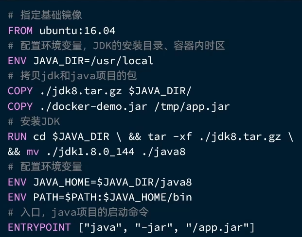

# Docker

> 快速构建、运行、管理应用的工具

[在 centos 上下载 docker](https://docs.docker.com/engine/install/centos/)

## 01. 安装 Docker

### 卸载旧版本 Docker

```bash
sudo yum remove docker \
                  docker-client \
                  docker-client-latest \
                  docker-common \
                  docker-latest \
                  docker-latest-logrotate \
                  docker-logrotate \
                  docker-engine
```


### 配置 `Docker `的 `yum `库

首先要安装一个 `yum `工具

```bash
sudo yum install -y yum-utils
```

安装成功后，配置 `Docker `的 `yum `源头

```bash
sudo yum-config-manager --add-repo https://download.docker.com/linux/centos/docker-ce.repo
```


### 安装 `Docker`

```bash
sudo yum install docker-ce docker-ce-cli containerd.io docker-buildx-plugin docker-compose-plugin
```


### 检验

```bash
docker -v # 检验是否安装完成

docker images # 检验是否启动
```


### 启动 `Docker`

```bash
sudo systemctl start docker
```


### 配置镜像服务（如果有企业版服务器的话）


## 02. 快速实践 —— 利用 Docker 部署 MySQL

### 2.1 理解 Docker

当我们使用 Docker 去安装应用的时候，它会自动的搜索并且下载应用 **镜像**（`image`），镜像不仅包含应用本身，还包含应用运行所需要的环境、配置、系统函数库。

Docker 会在运行镜像时创建一个隔离环境，称为 **容器**（`container`）。

这些镜像是从 **镜像仓库** 中下载下来的，`Docker` 官方维护了一个公共的仓库 [DockerHub](https://hub.docker.com/)

 给出 Docker 部署并且运行 MySQL 的例子


```bash
docker run -d \
--name mysql \
-p 3306:3306 \
-e TZ=Asia/Shanghai \
-e MYSQL_ROOT_PASSWORD=123 \
mysql
```


### 2.2 指令解读

```bash
docker run -d \
--name mysql \
-p 3306:3306 \
-e TZ=Asia/Shanghai \
-e MYSQL_ROOT_PASSWORD=123 \
mysql
```

`docker run`：创建并且运行一个 **容器**，`-d` 是让容器在后台运行


``--name mysql`：给 **容器** 起一个名字，必须唯一


`-p 3306:3306`：设置端口映射


> 为什么要设置端口映射？
>
> ​	Docker 中的容器我们可以浅显的理解为在服务器中又开了一台服务器，它有自己独立的 `ip` 地址，但这个 `ip` 地址在外部是无法访问的，所以需要设置端口映射，即通过我们的服务器的端口去映射容器中的端口，即使用服务器的 `3306` 端口去访问 **该容器** 的 `3306` 端口，实现间接访问。
>
> ​	前一个 `3306` 是我们服务器的端口，后一个是容器的 `3306` 端口，前一个是我们可以随意指定的，后面的端口是容器内部的 `MySQL` 默认端口。


`-e KEY=VALUE` 设置环境变量，不同的镜像环境变量会不同

> 我们可以在 `DockerHub` 中去查询到需要的环境变量，比如下图是 `MySQL` 的部分环境变量
>
> 


`mysql`：指定运行的镜像的名字

> 镜像名称由两部分组成：[repository]:[tag]
>
> 也就是镜像名称和镜像版本，当没有指定 `tag` 的时候，默认是 `latest` ，也就最新版本的镜像


## 03. Docker 基础

> Docker 最常见的命令就是操作镜像、容器的命令。 [官方文档](https://docs.docker.com/)


### 3.1 案例 —— 部署 Nginx 容器

> 上面总结了常见的命令，让我们来做一个实践
>
> - 拉取 Nginx 镜像，打包 nginx
> - 创建并运行 Nginx 容器
> - 查看容器
> - 停止容器
> - 再次启动容器
> - 进入容器
> - 删除容器

打开官方仓库 [DockerHub](https://hub.docker.com/)

搜索 Nginx


拉取 `nginx`

```bash
$docker pull nginx
```


查看是否拉取成功

```bash
$docker images
```


打包 `nginx`

```bash
$ docker save [OPENTIONS] IMAGE [IMAGE...]

$ docker save -o nginx.tar nginx:latest
```


删除镜像

```bash
$ docker rmi nginx:latest # rmi - remove image
```


利用压缩包重新加载镜像

```bash
$ docker load -i nginx.tar
```


运行容器

```bash
$ docker run -d --name nginx -p 80:80 nginx
```


查看容器运行状态

```bash
$ docker ps # 查看运行中的容器
```


停止容器

```bash
$ docker stop nginx # 停止容器

$ docker ps -a ## 查看所有容器，包括运行中的
```


开启容器

```bash
$ docker start nginx
```


进入容器的内部

```bash
$ docker exec -it nginx bash # -it 添加一个可输入的终端

exit # 退出容器
```


删除容器

```bash
$ docker rm mysql # 删除，需要停止容器

$ docker rm myusql -f # 强制删除
```


### 3.2 数据卷

> 需求
>
> - 创建 Nginx 容器，修改 nginx 容器内目录下的 `index.html` 文件，查看变化
> - 将静态资源部署到 `nginx` 的 `html` 目录

参照官方文档中的命令找到静态资源的目录

```bash
$ docker run --name some-nginx -v /some/content:/usr/share/nginx/html:ro -d nginx
```

#### 3.2.1 数据卷挂载

在这里运行 `vim` 命令发现无法呼出文档，是因为容器中只包含了镜像必须的内容，而没有配备其他的内容。


利用数据卷去解决上面的问题

> 数据卷 (volume) 是一个虚拟目录，是 **容器内目录** 与 **宿主机目录** 之间映射的桥梁


通过数据卷，可以实现宿主机系统文件和容器文件的 **双向绑定**


**常见命令**

| 命令                     | 说明                 |
| ------------------------ | -------------------- |
| `docker volume create`   | 创建数据卷           |
| `docker volume ls`       | 查看所有数据卷       |
| `docker volume rm`       | 删除指定的数据卷     |
| `docker volume inspect ` | 查看某个数据卷的详情 |
| `docker volume prune`    | 清空数据卷           |

通过 

```bash
$ docker volume --help
```

来查看信息


数据卷的挂载

```bash
$ docker run -v 数据卷:容器内目录
```

> 数据卷挂载是一种将数据卷（Volume）连接到 Docker 容器的过程，使容器可以与主机或其他容器之间共享和持久化数据。数据卷是 Docker 中一种用于持久化存储数据的机制，可以在容器之间共享和保留数据，即使容器被删除也不会丢失。

需要注意的是，挂载是在 **创建** 的时候执行的，如果容器已经创建，就无法去挂载

而如果挂载的时候数据卷不存在，会自动创建数据卷，这是我们一般使用的方式，而不是去运行上面的 `create` 命令。

```bash
$ docker rm nginx -f

$ docker run -d --name nginx -p 80:80 -v html:/usr/share/nginx/html nginx
```

我们在新建的时候加上 `-v` 即可实现关联

#### 3.2.3 本地目录挂载

查看容器有无数据卷

```bash
$ docker inspect nginx # 查看容器的具体信息
```

我们使用 `docker volume ls` 的时候会发现还有一个特别奇怪的数据卷


是将数据存储的目录放在了主存储目录，是 `MySQL` 默认去做的，但这个是匿名的卷，导致数据迁移丢失的问题，所以我们想要将这个卷挂载到我们指定的目录下面，而不是上面的很深的 `volume` 目录。

```bash
$ docker run -v 本地目录:容器内目录
```

本地的目录必须以 `/` 或者 `./` 开头，否则会识别为 **数据卷**


## 04. 自定义镜像

### 4.1 基础理解

> 镜像就是包含了应用程序、应用程序的系统函数库、运行配置等的文件包。构建镜像的过程其实就是把上述文件打包的过程。

部署一个 Java 应用需要如下的步骤：

> - 准备一个 Linux 服务器
> - 安装 JRE 并且配置环境变量
> - 拷贝 Jar 包
> - 运行 Jar 包

构建一个 Java 镜像的步骤

> - 准备一个 Linux 运行环境
> - 安装 JRE 并配置环境变量
> - 拷贝 Jar 包
> - 编写运行脚本

在 Docker 中，镜像是由一系列 **分层**（layers）组成的。每个分层代表着对文件系统的一次修改或添加。这种分层的结构有助于镜像的高效存储和传输，同时也支持镜像的版本控制和复用。


镜像的结构分为：

> 入口（Entrypoint）
>
> - 运行入口，一般是启动的脚本和参数
>
> 层（Layer）
>
> - 添加安装包、依赖、配置等操作都会形成新的一层
>
> 基础镜像（BaseImage）
>
> - 应用依赖的系统函数库、环境、配置、文件等


让我们直接去书写肯定是不现实的，这个工作可以交给 Docker 去完成，所以需要学习一种
新的语法 `Dockerfile`


基于 Ubuntu 基础镜像的指令

 

我们每次都要配置 JRE、环境变量，所以为什么不找一个封装好的呢？

这就是直接基于 JDK 为基础镜像，省略前面配置 JRE 的步骤

 

`DockerFile` 中的内容只需要能看懂，不需要写很复杂的镜像

### 4.2 运行构建

当编写好了 `Docker File` 运行如下的命令来构建

```bash
$ docker build -t myImage:1.0 .
```

- `-t` 是给当前的镜像起名，仍然是 `repository:tag` 的格式，不指定 `tag` 的时候默认为 `latest`
- `.` 是指定 `DockerFile` 所在的目录，当前目录就问 `.`

## 05. Docker 网络

默认情况下，所有的容器都是以 bridge 方式连接到 Docker 上的一个 **虚拟网桥** 上


回为每个容器分配新的 IP 地址，但是如果我们重启，会分配新的 IP 地址，那我们代码中如何连接 MySQL 呢？


这里就需要自定义网络，自定义网络的容器可以通过 **容器名** 相互访问，也就是说可以 **不知道 IP 地址**


```bash
$ docker run --network
```


可以在创建容器的时候直接连接