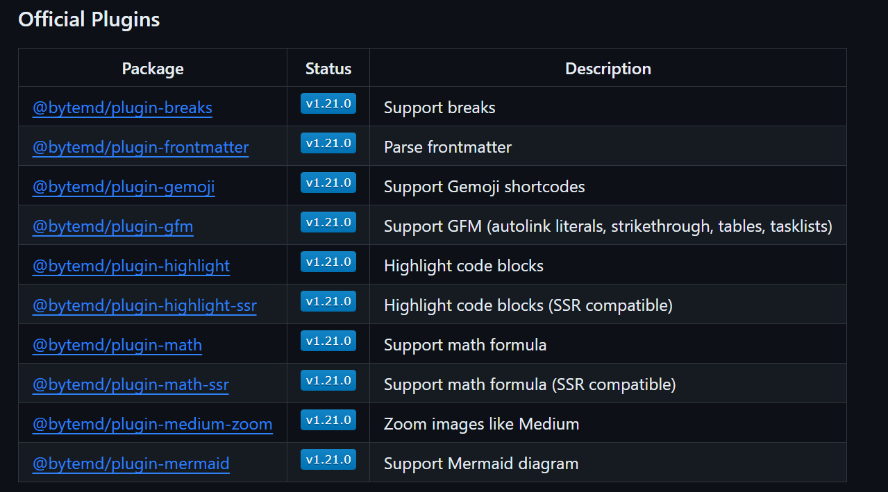

# OJ 判题系统项目笔记

## P3 纯前端页面开发

### 01 导入 MarkDown 编辑器

#### 1.1 引入插件

[bytemd GitHub 网址](https://github.com/bytedance/bytemd)

```bash
npm i @bytemd/vue-next
```


#### 1.2 使用步骤

在 `main.ts` 全局引入 `css` 样式

```javascript
import 'bytemd/dist/index.css'
```


创建 `component`

```javascript
<template>
  <Editor :value="value" :plugins="plugins" @change="handleChange" />
</template>

<script>
import gfm from '@bytemd/plugin-gfm'
import { Editor, Viewer } from '@bytemd/vue'

const plugins = [
  gfm(),
  // Add more plugins here
]

export default {
  components: { Editor },
  data() {
    return { value: '', plugins }
  },
  methods: {
    handleChange(v) {
      this.value = v
    },
  },
}
</script>
```


#### 1.3 插件管理



通过文档中的内容指定的来引入插件

`MdEditor.vue`

```javascript
<template>
  <Editor
    :value="props.value"
    :plugins="plugins"
    @change="props.handleChange"
  />
</template>

<script setup lang="ts">
import gfm from "@bytemd/plugin-gfm";
import { Editor } from "@bytemd/vue-next";
import { withDefaults, defineProps } from "vue";
import highlight from "@bytemd/plugin-highlight-ssr";
import "highlight.js/styles/default.css";
/**
 * 管理文本编辑器的插件
 */
const plugins = [gfm(), highlight()];
/**
 * 当前插件的 Props
 */
interface Props {
  value: string;
  handleChange: (v: string) => void;
}
const props = withDefaults(defineProps<Props>(), {
  value: "",
  handleChange: (v: string) => {
    console.log(v);
  },
});
</script>

<style>
.markdown-body p {
  font-size: 0.8em !important;
  font-weight: 400;
}
.bytemd {
  height: 700px !important;
}
</style> 
```

`CreateView.vue`

```javascript
<template>
  <div class="about">
    <MdEditor :value="value" :handle-change="handleChange" />
  </div>
</template>
<script setup lang="ts">
import MdEditor from "@/components/MdEditer.vue";
import { ref } from "vue";
const value = ref();
const handleChange = (v: string) => {
  value.value = v;
};
</script>
<style scoped></style>
```

> 要点:
>
> - 在父组件中去声明 `value` 和 `handleChange` 便于与服务器的通信
> - `props` 组件通信


### 02. 导入 Monaco 代码编辑器

[monaco Github 网址](https://github.com/microsoft/monaco-editor)

#### 2.1 引入插件

```bash
 npm install monaco-editor
```


#### 2.2 配置使用

初始化 `monaco` 编辑器

```javascript
import * as monaco from 'monaco-editor'
 
this.editor = monaco.editor.create(document.getElementById('monoco-editor'), {
  value: '',
  language: 'sql',
  automaticLayout: true
})
```

`vue.config.js`

```javascript
// vue.config.js
const MonacoWebpackPlugin = require("monaco-editor-webpack-plugin");
const { defineConfig } = require("@vue/cli-service");

module.exports = defineConfig({
  transpileDependencies: true,
  chainWebpack(config) {
    config.plugin("monaco").use(new MonacoWebpackPlugin());
  },
});
```

`CodeEditor.vue`

```javascript
<template>
  <div
    id="code-editor"
    ref="codeEditorRef"
    style="min-height: 400px; height: 60vh"
  />
</template>

<script setup lang="ts">
import * as monaco from "monaco-editor";
import { onMounted, ref, toRaw, withDefaults, defineProps } from "vue";

/**
 * 定义组件属性类型
 */
interface Props {
  value: string;
  language: string;
  handleChange: (v: string) => void;
}

/**
 * 给组件指定初始值
 */
const props = withDefaults(defineProps<Props>(), {
  value: () => "",
  language: () => "java",
  handleChange: (v: string) => {
    console.log(v);
  },
});

const codeEditorRef = ref();
const codeEditor = ref();

onMounted(() => {
  if (!codeEditorRef.value) {
    return;
  }
  codeEditor.value = monaco.editor.create(codeEditorRef.value, {
    value: props.value, // 初始值
    foldingStrategy: "indentation", // 代码折叠
    language: "java", // 语言
    automaticLayout: true, // 自适应布局
    colorDecorators: true,
    autoClosingBrackets: "always", // 自动添加结束时的括号
    tabSize: 2, // tab 缩进长度
    readOnly: false,
    theme: "vs-light",
    fontSize: 18,
    minimap: {
      enabled: false,
    },
  });

  // 编辑 监听内容变化
  codeEditor.value.onDidChangeModelContent(() => {
    props.handleChange(toRaw(codeEditor.value).getValue());
  });
});
</script>

<style scoped></style>
```

`ProblemView` （temp）

```javascript
<template>
  <div class="questionView">
    <div class="questionMessage">
      给定一个整数数组 nums 和一个整数目标值 target，请你在该数组中找出
      <br />
      <br />
      和为目标值 target 的那 两个 整数，并返回它们的数组下标。
      <br />
      <br />
      你可以假设每种输入只会对应一个答案。但是，数组中同一个元素在答案里不能重复出现。
      你可以按任意顺序返回答案。
    </div>
    <div class="codeEditor" style="height: 600px; width: 50%">
      <div class="tab">
        <a-dropdown @select="handleSelect" :popup-max-height="false">
          <a-button>{{ language }}</a-button>
          <template #content>
            <a-doption>java</a-doption>
            <a-doption>javascript</a-doption>
          </template>
        </a-dropdown>
      </div>
      <CodeEditor
        :value="value"
        :handleChange="handleChange"
        :language="language"
      />
    </div>
  </div>
</template>

<script lang="ts" setup>
import CodeEditor from "@/components/CodeEditor.vue";
import { ref } from "vue";

const value = ref(`public static void main(String[] args) {
}`);
const handleChange = (v: string) => {
  value.value = v;
};
const language = ref<string>("java");
const handleSelect = (v: string) => {
  language.value = v;
  console.log(v);
  console.log(language.value);
};
</script>
```

和 MD 编辑器相同，将 `value` 交给父组件去管理

### 03. 一键生成前端调用代码

[openapi-typescript-codegen Github文档](https://github.com/ferdikoomen/openapi-typescript-codegen)

引入文档

```bash
npm install -g openapi-typescript-codegen
```

 使用命令

```bash
$ openapi --help

  Usage: openapi [options]

  Options:
    -V, --version             output the version number
    -i, --input <value>       OpenAPI specification, can be a path, url or string content (required)
    -o, --output <value>      Output directory (required)
    -c, --client <value>      HTTP client to generate [fetch, xhr, node, axios, angular] (default: "fetch")
    --name <value>            Custom client class name
    --useOptions              Use options instead of arguments
    --useUnionTypes           Use union types instead of enums
    --exportCore <value>      Write core files to disk (default: true)
    --exportServices <value>  Write services to disk (default: true)
    --exportModels <value>    Write models to disk (default: true)
    --exportSchemas <value>   Write schemas to disk (default: false)
    --indent <value>          Indentation options [4, 2, tab] (default: "4")
    --postfixServices         Service name postfix (default: "Service")
    --postfixModels           Model name postfix
    --request <value>         Path to custom request file
    -h, --help                display help for command

  Examples
    $ openapi --input ./spec.json --output ./generated
    $ openapi --input ./spec.json --output ./generated --client xhr
```

本项目中使用的案例生成语句

```bash
openapi --input http://localhost:8101/api/v3/api-docs/default --output ./generated --client axios
```


### 04. 前后端联调

将表单内容发给后端

```javascript
  judgeConfig: {
    memoryLimit: 1000,
    stackLimit: 1000,
    timeLimit: 1000,
  },
  judgeCase: [
    {
      input: "1 2",
      output: "3 4",
    },
  ],
```

对于这种 `JSON `嵌套的结构，后端需要在内部再创建一个 `DTO `用来接收

```java
package com.kq.springbootinit.model.dto.question;

import com.baomidou.mybatisplus.annotation.IdType;
import com.baomidou.mybatisplus.annotation.TableField;
import com.baomidou.mybatisplus.annotation.TableId;
import lombok.Data;
import java.io.Serial;
import java.io.Serializable;
import java.util.Date;
import java.util.List;

@Data
public class QuestionCreateDTO implements Serializable {

    /**
     * 题目标题
     */
    private String title;

    /**
     * 题目内容
     */
    private String content;

    /**
     * 题目考察类型
     */
    private String[] label;

    /**
     * 题目难度（0 简单 1 中等 2 困难）
     */
    private Integer degree;

    /**
     * 管理员设置的标准答案
     */
    private String answer;

    /**
     * 输入和输出配置
     */
    private JudgeConfigDTO judgeConfig;

    /**
     * JSON 数组来存储输入和输出内容
     */
    private List<JudgeCaseDTO> judgeCase;
}
@Data
class JudgeConfigDTO {
    private int memoryLimit;

    private int stackLimit;

    private int timeLimit;
}
@Data
class JudgeCaseDTO {
    private String input;

    private String output;
}
```


前端表格的一点小 tips

```javascript
const form = reactive<QuestionCreateDTO>({
  title: "暴力破解",
  label: ["简单"],
  degree: 1,
  contnet: content.value;
  answer: answer.value;
  judgeConfig: {
    memoryLimit: 1000,
    stackLimit: 1000,
    timeLimit: 1000,
  },
  judgeCase: [
    {
      input: "1 2",
      output: "3 4",
    },
  ],
});
```

```
  contnet: content.value;
  answer: answer.value;
```

这里只会将初始值赋值给表单，应该在提交时接收数据：

```javascript
const handleSubmit = async () => {
  form.answer = answer.value;
  form.content = content.value;
  console.log("要提交的表单为", form);
  const res = await Service.createQuestion(form);
  if (res.data == true) {
    Message.success("创建成功");
  } else {
    Message.warning("创建失败");
  }
};
```

