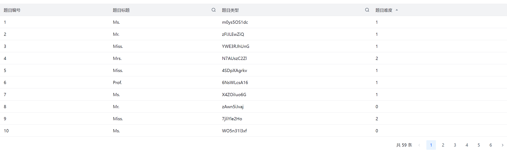
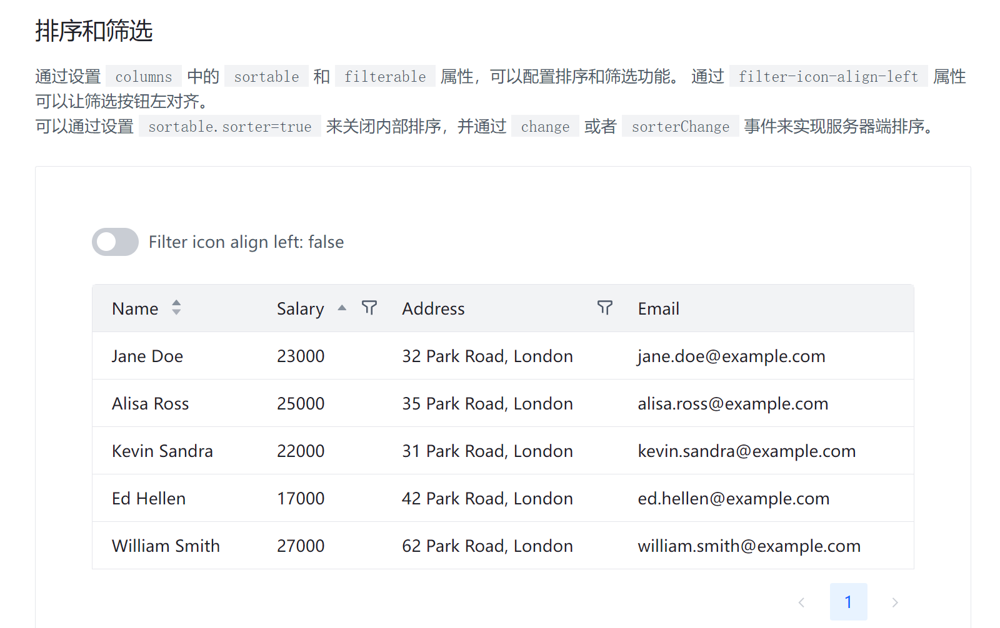
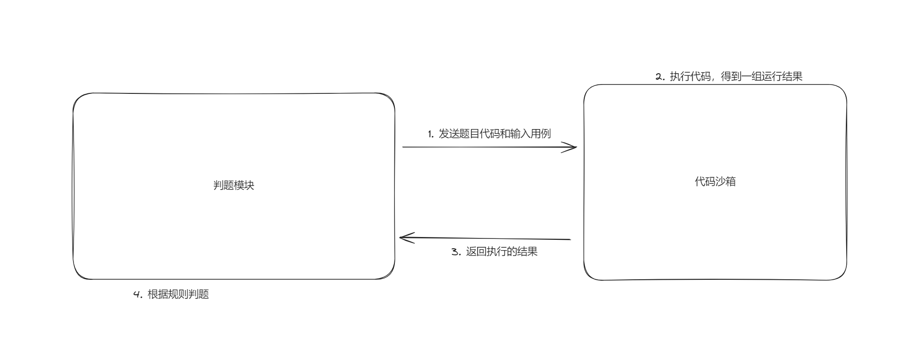
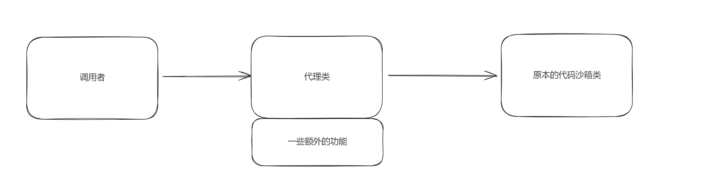

# OJ 判题系统P4 —— 页面优化

## 01. 浏览题目和点击跳转的效果

成果展示



利用自定义筛选菜单实现



官方示例代码

```javascript
<template>
  <a-space direction="vertical" size="large" fill>
    <a-space>
      <a-switch v-model="alignLeft" />
      <span>Filter icon align left: {{alignLeft}}</span>
    </a-space>
    <a-table :columns="columns" :data="data" :filter-icon-align-left="alignLeft" @change="handleChange" />
  </a-space>
</template>

<script>
import { reactive, ref } from 'vue';

export default {
  setup() {
    const alignLeft = ref(false);

    const columns = [
      {
        title: 'Name',
        dataIndex: 'name',
        sortable: {
          sortDirections: ['ascend', 'descend']
        }
      },
      {
        title: 'Salary',
        dataIndex: 'salary',
        sortable: {
          sortDirections: ['ascend']
        },
        filterable: {
          filters: [{
            text: '> 20000',
            value: '20000',
          }, {
            text: '> 30000',
            value: '30000',
          }],
          filter: (value, record) => record.salary > value,
          multiple: true
        }
      },
      {
        title: 'Address',
        dataIndex: 'address',
        filterable: {
          filters: [{
            text: 'London',
            value: 'London',
          }, {
            text: 'Paris',
            value: 'Paris',
          },],
          filter: (value, row) => row.address.includes(value),
        }
      },
      {
        title: 'Email',
        dataIndex: 'email',
      },
    ];
    const data = reactive([{
      key: '1',
      name: 'Jane Doe',
      salary: 23000,
      address: '32 Park Road, London',
      email: 'jane.doe@example.com'
    }, {
      key: '2',
      name: 'Alisa Ross',
      salary: 25000,
      address: '35 Park Road, London',
      email: 'alisa.ross@example.com'
    }, {
      key: '3',
      name: 'Kevin Sandra',
      salary: 22000,
      address: '31 Park Road, London',
      email: 'kevin.sandra@example.com'
    }, {
      key: '4',
      name: 'Ed Hellen',
      salary: 17000,
      address: '42 Park Road, London',
      email: 'ed.hellen@example.com'
    }, {
      key: '5',
      name: 'William Smith',
      salary: 27000,
      address: '62 Park Road, London',
      email: 'william.smith@example.com'
    }]);

    const handleChange = (data, extra, currentDataSource) => {
      console.log('change', data, extra, currentDataSource)
    }

    return {
      alignLeft,
      columns,
      data,
      handleChange
    }
  },
}
</script>
```

通过调整下方的 `columns ` 中的 `sortable` 和 `filterable` 属性，可以配置排序和筛选功能。

修改后整体界面的代码

```javascript
<template>
  <div class="home">
    <a-table
      :columns="columns"
      :data="data"
      @change="handleChange"
      @page-change="onPageChange"
      @row-click="(record) => toQuestionPage(record)"
      :pagination="{
        showTotal: true,
        pageSize: searchParams.pageSize,
        current: searchParams.current,
        total,
      }"
    >
      <template
        #name-filter="{ filterValue, setFilterValue, handleFilterConfirm }"
      >
        <div class="custom-filter">
          <a-space direction="vertical">
            <a-input
              :model-value="filterValue[0]"
              @input="(value) => setFilterValue([value])"
            />
            <div class="custom-filter-footer">
              <a-button @click="handleFilterConfirm">查询</a-button>
            </div>
          </a-space>
        </div>
      </template>
    </a-table>
  </div>
</template>
```

### 要点

#### 实践路由参数

给 `row-click` 事件绑定一个跳转事件

```javascript
@row-click="(record) => toQuestionPage(record)"
```

```javascript
const toQuestionPage = (record: any) => {
  console.log(record.id);
  router.push({ path: `/question`, query: { id: record.id } });
};
```

通过 `query` 携带路由参数


#### 分页实现思路

声明一个 `searchParam` 来定义当前页码和总页数

```javascript
const searchParams = ref<QuestionQueryDTO>({
  pageSize: 10,
  current: 1,
});
```

当 `onPageChange` 事件发生的时候去改变 `current` 的值

```javascript
const onPageChange = (page: number) => {
  searchParams.value = {
    ...searchParams.value,
    current: page,
  };
};
```

通过解构的方式实现


定义拉取数据的方法

```javascript
const fetchQuestionList = async () => {
  console.log("执行查询函数");
  const response = await Service.getQuestionList(searchParams.value);
  data.value = response.data?.records;
  data.value.degree = total.value = response.data?.total;
};
```


上述的表单是拉取数据后在当前界面执行过滤，对每个界面执行筛选，并不会有向上顶格的操作，**后序可以优化**


上述拉取数据的方法在 挂载的时候 和 `searchParams` 改变的时候重新获取

```javascript
watch(searchParams, () => {
  console.log("监听器生效");
  fetchQuestionList();
});
```

```javascript
onMounted(fetchQuestionList);
```


## 02. 添加统一的请求头 —— 跑通代码沙箱流程

通过配置 `/generated/core/OpenAPI.ts` 中的请求代码

```javascript
export const OpenAPI: OpenAPIConfig = {
  BASE: "http://localhost:8101/api",
  VERSION: "0",
  WITH_CREDENTIALS: false,
  CREDENTIALS: "include",
  TOKEN: undefined,
  USERNAME: undefined,
  PASSWORD: undefined,
  HEADERS: {
      Authorization: localStorage.getItem(accessEnum.TOKEN_NAME) ?? "1",
  },
  ENCODE_PATH: undefined,
};
```

```javascript
  HEADERS: {
      Authorization: localStorage.getItem(accessEnum.TOKEN_NAME) ?? "1",
  },
```

这个部分可以配置请求头中的 `key : value`


通过 `??` 可以配置如果是 `null` 的替代值


## 03. 判题机预开发

### 判题模块和代码沙箱的关系

判题模块：作为一个单独的 API 去执行，调用代码沙箱，将代码交给沙箱去运行来检验结果

代码沙箱：接收代码和输入，给出输出，不负责判题，作为一个单独的模块

​			**解耦的思想**



一次提供多组输入输出用例


### 代码沙箱开发

1）定义代码沙箱的接口，便于后续的开发，提高通用性

​	之后项目只调用接口，而不是具体的实现类，后续使用其他实现类的时候，只需要实现前面的接口，而不需要再更改调用的名称（接口开发的思想）。


2）定义多种代码沙箱的实现

​	示例代码沙箱：跑通业务流程

​	远程代码沙箱：实际调用的沙箱

​	第三方代码沙箱：拓展点

小知识 `Builder` 注解

```java
package com.kq.springbootinit.judge.codesandbox.model;

import lombok.AllArgsConstructor;
import lombok.Builder;
import lombok.Data;
import lombok.NoArgsConstructor;

import java.util.List;

@Data
@Builder
@AllArgsConstructor
@NoArgsConstructor
public class ExecuteCodeDTO {
    /**
     * 输入用例
     */
    private List<Object> input;

    /**
     * 编程语言
     */
    private String language;

    /**
     * 题目代码
     */
    private String code;
}

```

加上注解，我们定义对象的时候就可以通过如下的语法

```java
ExecuteCodeDTO executeCodeDTO = ExecuteCodeDTO.builder()
    .code()
    .language
    .input
    .build()
```

来实现构造


### 工厂模式开发

```java
/**
 * 代码沙箱创建工厂，根据字符串创建代码沙箱实例
 */
public class CodeSandBoxFactory {
    /**
     * 创建代码沙箱实例
     * @param type 实例的类型
     * @return 实例
     */
    public static CodeSandBox newInstance(String type) {
        return switch (type) {
            case "example" -> new ExampleCodeSandBox();
            case "remote" -> new RemoteCodeSandBox();
            case "thirdParty" -> new ThirdPartyCodeSandBox();
            default -> null;
        };
    }
}
```

通过工厂模式去给出实例，解耦，后续通过配置项来确定创建的实例。


参数配置化，把项目中一些可以交给用户去自定义的选项或字符串去写到配置文件中，这样就

```java
@Component
@ConfigurationProperties(prefix = "koj.jwt")
```

 通过这样的字符串组合可以实现在配置文件中配置

```java
package com.kq.springbootinit.properties;

import lombok.Data;
import org.springframework.boot.context.properties.ConfigurationProperties;
import org.springframework.stereotype.Component;

@Component
@ConfigurationProperties(prefix = "koj.jwt")
@Data
public class JwtProperties {
    /**
     * 密钥名称
     */
    private String tokenName;
    /**
     * secretKey
     */
    private String secretKey;
    /**
     * 密钥过期时间
     */
    private long TokenTtl;
}
```


```yaml
# 配置 jwt
koj:
  jwt:
    secret-key: 
    token-name: 
    token-ttl: 
```

通过这里来配置


###  代码沙箱的代理实现

除了使用 AOP 切面实现还可以通过下面的方式

为了解决每次请求都属要输入输出日志的情况，通过 `CodeSandboxProxy` 来代理实现



```java
package com.kq.springbootinit.judge.codesandbox;

import com.kq.springbootinit.judge.codesandbox.model.ExecuteCodeDTO;
import com.kq.springbootinit.judge.codesandbox.model.ExecuteCodeResponse;
import lombok.AllArgsConstructor;
import lombok.extern.slf4j.Slf4j;

/**
 * 代码沙箱的代理类
 */
@Slf4j
@AllArgsConstructor
public class CodeSandBoxProxy implements CodeSandBox{

    private CodeSandBox codeSandBox;

    /**
     * 通过代理类实现代码沙箱输入输出的直接打印
     * @param executeCodeDTO 发送信息封装类
     * @return 返回的结果
     */
    @Override
    public ExecuteCodeResponse executeCode(ExecuteCodeDTO executeCodeDTO) {
        log.info("代码沙箱的请求信息{}", executeCodeDTO);
        ExecuteCodeResponse executeCodeResponse = codeSandBox.executeCode(executeCodeDTO);
        log.info("代码沙箱的相应信息{}", executeCodeResponse);
        return executeCodeResponse;
    }
}
```


## 04. 判题服务的完整业务流程

示例代码沙箱（假数据）

```java
public class ExampleCodeSandBox implements CodeSandBox {
    @Override
    public ExecuteCodeResponse executeCode(ExecuteCodeDTO executeCodeDTO) {
        // 获取参数
        String code = executeCodeDTO.getCode();
        String language = executeCodeDTO.getLanguage();
        List<String> input = executeCodeDTO.getInput();
        ExecuteCodeResponse executeCodeResponse = ExecuteCodeResponse.builder()
                .outputList(input)
                .status("success")
                .message("代码执行成功")
                .build();
        JudgeInfo judgeInfo = JudgeInfo.builder()
                .stack(100)
                .memory(100)
                .time(100)
                .build();
        executeCodeResponse.setJudgeInfo(judgeInfo);
        return executeCodeResponse;
    }
}
```

小 tips：

在执行 test 的时候不要直接创建一个实例就调用，Spring Boot 注入是链式的，需要一直通过 `@Resource` 来注入才会有后续的注入。
