# 代码随想录刷题笔记（DAY20 - DAY34）

[TOC]


## Day 20

### 01. 最大二叉树（No. 654）

[题目链接](https://leetcode.cn/problems/maximum-binary-tree/description/)

[代码随想录题解](https://programmercarl.com/0654.%E6%9C%80%E5%A4%A7%E4%BA%8C%E5%8F%89%E6%A0%91.html#%E7%AE%97%E6%B3%95%E5%85%AC%E5%BC%80%E8%AF%BE)

#### 1.1 题目 

给定一个不重复的整数数组 `nums` 。 **最大二叉树** 可以用下面的算法从 `nums` 递归地构建:

1. 创建一个根节点，其值为 `nums` 中的最大值。
2. 递归地在最大值 **左边** 的 **子数组前缀上** 构建左子树。
3. 递归地在最大值 **右边** 的 **子数组后缀上** 构建右子树。

返回 *`nums` 构建的* ***最大二叉树\*** 。

 

**示例 1：**

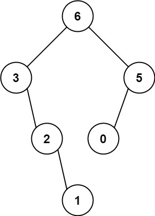

> 输入：nums = [3,2,1,6,0,5]
> 输出：[6,3,5,null,2,0,null,null,1]
> 解释：递归调用如下所示：
> - [3,2,1,6,0,5] 中的最大值是 6 ，左边部分是 [3,2,1] ，右边部分是 [0,5] 。
>     - [3,2,1] 中的最大值是 3 ，左边部分是 [] ，右边部分是 [2,1] 。
>         - 空数组，无子节点。
>         - [2,1] 中的最大值是 2 ，左边部分是 [] ，右边部分是 [1] 。
>             - 空数组，无子节点。
>             - 只有一个元素，所以子节点是一个值为 1 的节点。
>     - [0,5] 中的最大值是 5 ，左边部分是 [0] ，右边部分是 [] 。
>         - 只有一个元素，所以子节点是一个值为 0 的节点。
>         - 空数组，无子节点。

**示例 2：**

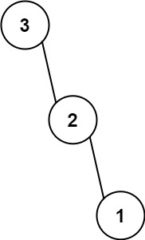

> 输入：nums = [3,2,1]
> 输出：[3,null,2,null,1]

 

**提示：**

- `1 <= nums.length <= 1000`
- `0 <= nums[i] <= 1000`
- `nums` 中的所有整数 **互不相同**


#### 1.2 笔记

力扣只提供了一个构造的方法，但没有告知这个最大二叉树到底是什么

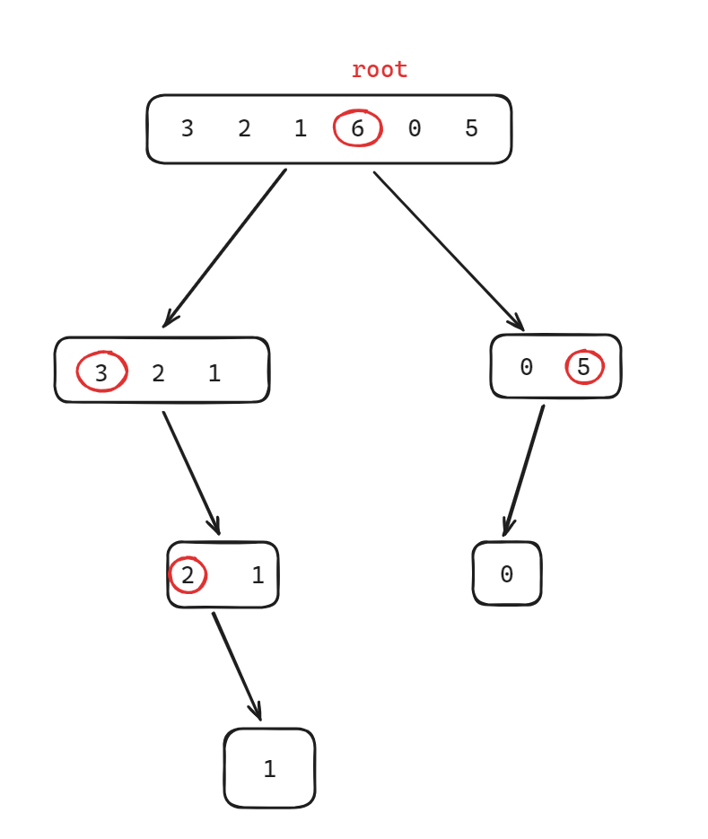

最大二叉树指的是给出一个 **数组**，先选取数组中的 **最大** 的元素作为根节点，根节点左边为左子树，右边为右子树，再分别对左子树和右子树的数组做相同的操作，直到遍历完成。

这道题目和昨天的一道题目思想非常类似，都是构造二叉树的题目

[代码随想录刷题笔记 DAY 18 | 找树左下角的值 No.513 | 路经总和 No.112 | 从中序与后序遍历序列构造二叉树 No.106](https://blog.csdn.net/weixin_74895237/article/details/135941236?spm=1001.2014.3001.5501)

中的 03.从中序与后序遍历序列构造二叉树（No. 106）

这里给出一个基本的思路和实现方式，首先看实现这个方法要执行的操作

1. 在数组中找到最大的元素
2. 以这个元素为节点分割左子树和右子树
3. 左子树执行相同的操作
4. 右子树执行相同的操作
5. 将节点返回

显然是要通过递归来完成，将下一个方法执行的结果作为返回值返回给该方法。

提到递归显然就要考虑递归的三个要考虑到的部分

- 递归的出口：因为因为传入的是一个数组，所以递归的出口就是 `nums == null` 或者 `nums.length == 0`，也就是数组为空的情况
- 数组的返回值：通过上面的步骤明确我们要从下个函数拿到什么，显然是要拿到这个节点的左子树和右子树，所以返回值就是一个 `TreeNode`
- 递归重要执行的步骤：找到最大的元素、分割数组、遍历左节点和右节点

找到最大的节点可以封装为一个方法，因为不止要找到这个数组中最大的元素还需要得到数组中的下标，所以重新封装一个对象作为返回值，返回值中包括下标和大小（也可以只返回下标），为了代码整洁这里再封装一个对象

```java
/**
    作为方法的返回值，返回节点的值和在数组中的下标
 */
class NodeMessage {
    int val;
    int index;
    public NodeMessage(int val, int index) {
        this.val =val;
        this.index = index;
    }
}
```

找到最大值的方法：

```java
    /**
        返回当前数组中最大的数字和下标
     */
public NodeMessage getMaxNumAndIndex(int[] nums) {
        int tempIndex = 0;
        int tempMax = nums[0];
        for (int i = 0; i < nums.length; i++) {
            if (tempMax < nums[i]) {
                tempMax = nums[i];
                tempIndex = i;
            }
        }
        return new NodeMessage(tempMax, tempIndex);
	}
}
```


#### 1.3 代码

```java
class Solution {
    public TreeNode constructMaximumBinaryTree(int[] nums) {
        return reverse(nums);
    }
    public TreeNode reverse(int[] nums) {
        if (nums.length == 0 || nums == null) {
            return null;
        }
        NodeMessage nodeMessage = getMaxNumAndIndex(nums); // 获得最大值作为当前的节点
        int[] left = Arrays.copyOfRange(nums, 0, nodeMessage.index);
        int[] right = Arrays.copyOfRange(nums, (nodeMessage.index+1), nums.length);
        TreeNode node = new TreeNode(nodeMessage.val);
        node.left = reverse(left);
        node.right = reverse(right);
        return node;
    }
    /**
        返回当前数组中最大的数字和下标
     */
    public NodeMessage getMaxNumAndIndex(int[] nums) {
        int tempIndex = 0;
        int tempMax = nums[0];
        for (int i = 0; i < nums.length; i++) {
            if (tempMax < nums[i]) {
                tempMax = nums[i];
                tempIndex = i;
            }
        }
        return new NodeMessage(tempMax, tempIndex);
    }
}
/**
    作为方法的返回值，返回节点的值和在数组中的下标
 */
class NodeMessage {
    int val;
    int index;
    public NodeMessage(int val, int index) {
        this.val =val;
        this.index = index;
    }
}
```


#### 1.4 补充

同样的，重复的切割数组的操作会导致运行时间很长，所以可以采用虚拟切割的方法，通过传入数组的起始位置和终止位置来限制对原数组的访问来达到切割的效果，这里直接给出代码。

```java
class Solution {
    int[] globalNums;
    public TreeNode constructMaximumBinaryTree(int[] nums) {
        globalNums = nums;
        return reverse(0, globalNums.length-1);
    }
    public TreeNode reverse(int startIndex, int endIndex) {
        if (startIndex > endIndex) {
            return null;
        }
        int index = getIndex(startIndex, endIndex); // 获得最大值作为当前的节点
        int leftStartIndex = startIndex;
        int leftEndIndex = index - 1;
        int rightStartIndex = index + 1;
        int rightEndIndex = endIndex;
        TreeNode node = new TreeNode(globalNums[index]);
        node.left = reverse(leftStartIndex, leftEndIndex);
        node.right = reverse(rightStartIndex, rightEndIndex);
        return node;
    }
    /**
        返回当前数组中最大的数字和下标
     */
    public int getIndex(int startIndex, int endIndex) {
        int tempIndex = startIndex;
        for (int i = startIndex; i <= endIndex; i++) {
            if (globalNums[tempIndex] < globalNums[i]) {
                tempIndex = i;
            }
        }
        return tempIndex;
    }
}
```


### 02. 合并二叉树（No. 617）

[题目链接](https://leetcode.cn/problems/merge-two-binary-trees/)

[代码随想录题解](https://programmercarl.com/0617.%E5%90%88%E5%B9%B6%E4%BA%8C%E5%8F%89%E6%A0%91.html#%E7%AE%97%E6%B3%95%E5%85%AC%E5%BC%80%E8%AF%BE)

#### 2.1 题目

给你两棵二叉树： `root1` 和 `root2` 。

想象一下，当你将其中一棵覆盖到另一棵之上时，两棵树上的一些节点将会重叠（而另一些不会）。你需要将这两棵树合并成一棵新二叉树。合并的规则是：如果两个节点重叠，那么将这两个节点的值相加作为合并后节点的新值；否则，**不为** null 的节点将直接作为新二叉树的节点。

返回合并后的二叉树。

**注意:** 合并过程必须从两个树的根节点开始。

 

**示例 1：**


> 输入：root1 = [1,3,2,5], root2 = [2,1,3,null,4,null,7]
> 输出：[3,4,5,5,4,null,7]

**示例 2：**

> 输入：root1 = [1], root2 = [1,2]
> 输出：[2,2]

 

**提示：**

- 两棵树中的节点数目在范围 `[0, 2000]` 内
- `-104 <= Node.val <= 104`

#### 2.2 笔记

这道题的难点其实是处理两个二叉树，但是和之前的题目相同的是，无论是处理几个二叉树，其前序、中序和后序位置是相同的，仍然可以按照之前的思路去处理这些问题。

这道题采用递归的方式解题，继续来思考递归的三个要考虑的部分：

- 递归的返回值，这道题其实还是遍历构造二叉树，所以返回值仍然是 `TreeNode` ，在每次递归中构造新的节点传给上一个节点作为子树。
- 递归的终止条件：`root1 == null` 或者 `root2 == null`
- 每次递归中要做的事情：首先判断是否遍历到空节点，上面提到返回的节点是作为上一个节点的子树，对于遍历到 `root1` 为空就应该返回 `root2` 作为子树，遍历到 `root2` 为空就应该将 `root1` 作为子树，这样就完成了题目中的对 `null` 的处理（其实上面已经包含了 `root1 == null && root2 == null`  的部分了，因为当这个情况其实是直接返回 `null`），如果对于节点都存在的情况，返回的节点就是 `new TreeNode(root1.val + root2.val)`

这样就能写出代码

#### 2.3 代码

```java
class Solution {
    public TreeNode mergeTrees(TreeNode root1, TreeNode root2) {
        return reverse(root1, root2);
    }
    public TreeNode reverse(TreeNode root1, TreeNode root2) {
        if (root1 == null) {
            return root2;
        }
        if (root2 == null) {
            return root1;
        }
        TreeNode node = new TreeNode(root1.val + root2.val);
        node.left = reverse(root1.left, root2.left);
        node.right = reverse(root1.right, root2.right);
        return node;
    }
}
```


### 03. 二叉搜索树中的搜索（No. 700）

[题目链接](https://leetcode.cn/problems/search-in-a-binary-search-tree/description/)

[代码随想录题解](https://programmercarl.com/0700.%E4%BA%8C%E5%8F%89%E6%90%9C%E7%B4%A2%E6%A0%91%E4%B8%AD%E7%9A%84%E6%90%9C%E7%B4%A2.html#%E7%AE%97%E6%B3%95%E5%85%AC%E5%BC%80%E8%AF%BE)

#### 3.1 题目

给定二叉搜索树（BST）的根节点 `root` 和一个整数值 `val`。

你需要在 BST 中找到节点值等于 `val` 的节点。 返回以该节点为根的子树。 如果节点不存在，则返回 `null` 。

 

**示例 1:**


> 输入：root = [4,2,7,1,3], val = 2
> 输出：[2,1,3]

**示例 2:**


> 输入：root = [4,2,7,1,3], val = 5
> 输出：[]

 

**提示：**

- 树中节点数在 `[1, 5000]` 范围内
- `1 <= Node.val <= 107`
- `root` 是二叉搜索树
- `1 <= val <= 107`


#### 3.2 笔记

本题主要是考察对二叉搜索树的概念的掌握

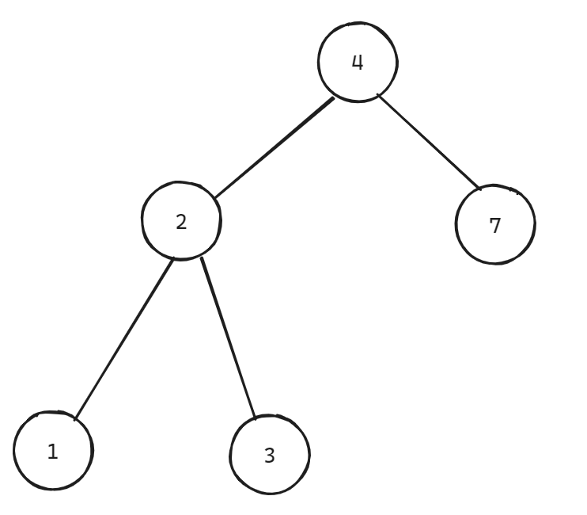

即使刷了很多的算法题，也不要忘记数据结构最重要的任务是 **存储数据**，说白了就是增删改查，二叉搜索树就是存储数据的一种方式，一组数据，先选择一个节点作为根节点（最好保证左右均匀），将小于根节点的置于左子树，大于的置于右子树，往下每次都是这样：选择节点、大的放在左子树，小的放在右子树，直到数组中没有元素，就构建了二叉搜索树。

这样存放的好处就是将搜索时间大大减小了，将搜索速度从 `n` 变为了 `log n`（最好的情况），所谓最好的情况就是每次都能排除一半的节点（平衡二叉树），最坏的情况就还是 `n`，但是如果安排的好那二叉搜索树就会大大降低搜索的时间。

所以遍历的时候看当前节点的值是比需要的大还是小，如果大就去遍历左子树，反之则取遍历右子树，直到 `node == null` 的时候，说明没有找到，或者 `node.val == val` 的时候说明找到了。


#### 3.3 代码

```java
class Solution {
    public TreeNode searchBST(TreeNode root, int val) {
        return reverse(root, val);
    }
    public TreeNode reverse(TreeNode root, int val) {
        if (root == null) {
            return null;
        }
        if (root.val > val) {
            return reverse(root.left, val);
        } else if (root.val < val) {
            return reverse(root.right, val);
        } else if (root.val == val) {
            return root;
        }
        return null;
    }
}
```


### 04. 验证二叉搜索树（No. 98）

[题目链接](https://leetcode.cn/problems/validate-binary-search-tree/description/)

[代码随想录题解](https://programmercarl.com/0098.%E9%AA%8C%E8%AF%81%E4%BA%8C%E5%8F%89%E6%90%9C%E7%B4%A2%E6%A0%91.html)

#### 4.1 题目

给你一个二叉树的根节点 `root` ，判断其是否是一个有效的二叉搜索树。

**有效** 二叉搜索树定义如下：

- 节点的左子树只包含 **小于** 当前节点的数。
- 节点的右子树只包含 **大于** 当前节点的数。
- 所有左子树和右子树自身必须也是二叉搜索树。

 

**示例 1：**


> 输入：root = [2,1,3]
> 输出：true

**示例 2：**


> 输入：root = [5,1,4,null,null,3,6]
> 输出：false
> 解释：根节点的值是 5 ，但是右子节点的值是 4 。

 

**提示：**

- 树中节点数目范围在`[1, 104]` 内
- `-231 <= Node.val <= 231 - 1`


#### 4.2 笔记

要验证二叉搜索树就需要用到它关键的性质：

**中序遍历遍历出来的列表是有序的**

这是因为二叉搜索树是左子树小于中间节点而右子树大于中间节点，中序遍历又恰好是左中右的顺序，所以得到的序列的是有序的。

很容易就能想出一种解题方法：

通过中序遍历得到一个列表，再在主方法中去验证这个列表是否是有序的，很容易的写出代码

```java
    public void reverse(TreeNode node) {
        if (node == null) {
            return;
        }
        reverse(node.left);
        nums.add(new Long(node.val));
        reverse(node.right);
    }
```

这样得到的列表就是一个有序列表（如果是二叉搜索树的话），后面就是验证这个列表有序了

列表有序就是后一个一定大于前面的值所有，前面的所有可以用前面所有数值的最大值来代表，就是 `maxValue`，设定 `maxValue = Long.MIN-VALUE`，遍历这个数组

```java
        for (Long i : nums) {
            if (i > temp) {
                temp = i;
            } else {
                return false;
            }
        }
```

判断后面的是否比前面的要大，如果发现后面有值小于等于 `maxValue` 则说明数组不是有序的

完整的代码在下一小节


除了将其抽离出一个数组，是否可以在遍历的途中去执行上面的操作呢？

肯定是可以的，但是递归要比直接去遍历难理解一些，先来看下面的代码

```java
public void reverse(Treenode node) {
	reverse(node.left);
	System.out.println(node.val);
	reverse(node.right);
}
```

上面的代码会输出什么呢？

答案非常简单，就是上面的有序的数组，那把上面的对数组判断的代码直接移动到中序位置不就是可以判断了吗？

理一下递归的三个要考虑的部分

- 递归的出口：`node == null`
- 递归的返回值：这里直接返回它是否是一个二叉搜索树，所以要去验证左子树和右子树，该节点满足条件其实就是左节点和右节点是否同时满足情况；搞懂返回值是什么，`return` 的时候就不会迷糊了
- 递归中要进行的步骤：判断是否符合出口情况、递归左子树、通过上面的方法查看是否有序、递归右子树、返回

很容易可以写出代码

#### 1.3 代码

直接思路

```java
class Solution {
    List<Long> nums = new ArrayList<>();
    public boolean isValidBST(TreeNode root) {
        if (root == null || root.right == null && root.left == null) {
            return true;
        }
        reverse(root);
        Long temp = Long.MIN_VALUE;
        for (Long i : nums) {
            if (i > temp) {
                temp = i;
            } else {
                return false;
            }
        }
        return true;
    }
    public void reverse(TreeNode node) {
        if (node == null) {
            return;
        }
        reverse(node.left);
        nums.add(new Long(node.val));
        reverse(node.right);
    }
}
```


递归优化

```java
class Solution {
    List<Long> nums = new ArrayList<>();
    public boolean isValidBST(TreeNode root) {
        if (root == null || root.right == null && root.left == null) {
            return true;
        }
        return reverse(root);
    }
    Long max_value = Long.MIN_VALUE;
    public boolean reverse(TreeNode node) {
        if (node == null) {
            return true;
        }
        boolean leftBol = reverse(node.left);
        if (node.val > max_value) {
            max_value = new Long(node.val);
        } else {
            return false;
        }
        boolean rightBol = reverse(node.right);
        return leftBol && rightBol;
    }
}
```


## Day 21

### 01. 二叉搜索树的最小绝对值差值（No. 530）

[题目链接](https://leetcode.cn/problems/minimum-absolute-difference-in-bst/description/)

[代码随想录题解](https://programmercarl.com/0530.%E4%BA%8C%E5%8F%89%E6%90%9C%E7%B4%A2%E6%A0%91%E7%9A%84%E6%9C%80%E5%B0%8F%E7%BB%9D%E5%AF%B9%E5%B7%AE.html)

#### 1.1 题目

给你一个二叉搜索树的根节点 `root` ，返回 **树中任意两不同节点值之间的最小差值** 。

差值是一个正数，其数值等于两值之差的绝对值。

 

**示例 1：**


> 输入：root = [4,2,6,1,3]
> 输出：1

**示例 2：**


> 输入：root = [1,0,48,null,null,12,49]
> 输出：1

 

**提示：**

- 树中节点的数目范围是 `[2, 104]`
- `0 <= Node.val <= 105`


#### 1.2 笔记

提到二叉搜索树其解题最重要的特质就是：

**中序遍历的时候输出是一个有序的序列**

那本题中的问题就比较简单了，转化为一个 **有序序列** 的差的绝对值的最小值，这个最小值一定是 **出现在相邻的位置**，因为前一个减去后一个的绝对值肯定不可能小于前一个减去后面其他的值。

先思考如何在数组中实现这个算法，再将其转化为二叉树递归的写法：

因为要同时操作两个数，所以需要一个指针指向前一个值，很容易可以写出代码：

```java
public static void getMin(int[] arr) {
    int pre = -1; // 指针，指向前一个值
    int res = Integer.MAX_VALUE;
    for (int i : arr) {
        if (pre == -1) {
            i = pre; // 为 pre 初始化
        } else {
            res = Math.min(res, i - pre);
            pre = i;
        }
    }	
}
```

这样不断遍历直到结束就能得到查的最小绝对值。


接下来就是将其改为二叉树的写法，已知中序遍历得到的结果其实就是该数组，所以将上面的步骤直接搬到中序位置即可。


#### 1.3 代码

```java
class Solution {
    int pre;
    int ans;
    public int getMinimumDifference(TreeNode root) {
        pre = -1;
        ans = Integer.MAX_VALUE;
        reverse(root);
        return ans;
    }
    public void reverse(TreeNode node) {
        if (node == null) {
            return;
        }
        reverse(node.left);
        if (pre == -1) {
            pre = node.val;
        } else {
            ans = Math.min(ans, node.val - pre);
            pre = node.val;
        }
        reverse(node.right);
    }
}
```


### 02. 二叉搜索树中的众数（No. 501）

[题目链接](https://leetcode.cn/problems/find-mode-in-binary-search-tree/description/)

[代码随想录题解](https://programmercarl.com/0501.%E4%BA%8C%E5%8F%89%E6%90%9C%E7%B4%A2%E6%A0%91%E4%B8%AD%E7%9A%84%E4%BC%97%E6%95%B0.html)

#### 2.1 题目

给你一个含重复值的二叉搜索树（BST）的根节点 `root` ，找出并返回 BST 中的所有 [众数](https://baike.baidu.com/item/众数/44796)（即，出现频率最高的元素）。

如果树中有不止一个众数，可以按 **任意顺序** 返回。

假定 BST 满足如下定义：

- 结点左子树中所含节点的值 **小于等于** 当前节点的值
- 结点右子树中所含节点的值 **大于等于** 当前节点的值
- 左子树和右子树都是二叉搜索树

 

**示例 1：**


> 输入：root = [1,null,2,2]
> 输出：[2]

**示例 2：**

> 输入：root = [0]
> 输出：[0]

 

**提示：**

- 树中节点的数目在范围 `[1, 104]` 内
- `-105 <= Node.val <= 105`


#### 2.2 笔记

还是和上面相同，对于二叉搜索树优先考虑对数组的操作，然后将这个操作转换到二叉树的中序遍历即可。

对于一个有序数组要求众数的话，首先需要一个指针指向前一个数，还需要一个 `tempNum` 来统计当前的总数和一个 `maxNum` 来统计总的数目，当
`current == pre` 的时候就让 `tempNum++`，且当 `current != pre` 的时候说明已经到了不同的数字，再去统计 `tempNum` 和 `maxNum` 哪个大，持续遍历更新直到遍历结束。

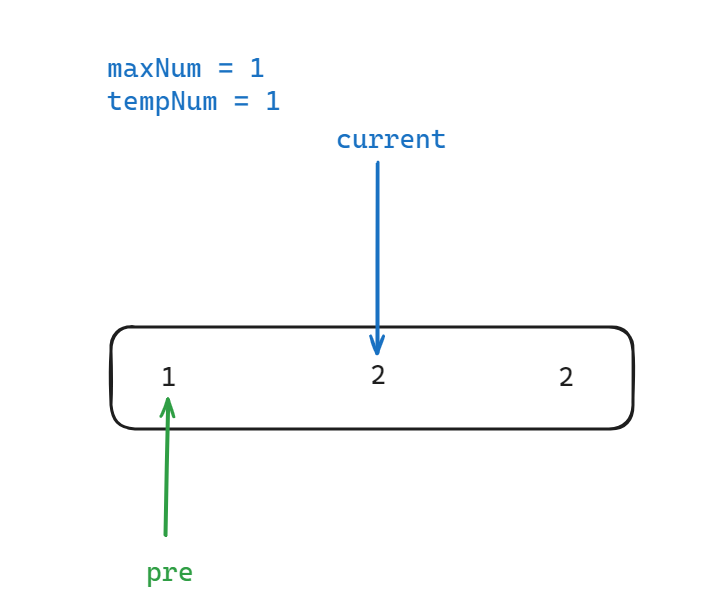

直接写出代码

```java
maxNum = 0;
tempNum = 0;
List<Integer> res = new ArrayList<>();
pre = Integer.MAX_VALUE;

for (int current : arr) {
    if (pre == Integer.MAX_VALUE || current != pre) {
    	tempNum = 1;
    	pre = current;
    } else {
    	tempNum++;
    }
    if (tempNum > maxNum) {
    	res.clear();
    	res.add(node.val);
    	maxNum = tempNum;
    } else if (tempNum == maxNum) {
    	res.add(node.val);
    }
}
```

注意当 `tempNum > maxNum` 的时候说明此时 `res` 中存储的内容已经不是最大的了，这时候就需要 `res.clear()` 来清除内部的值再来添加。

最后将这段代码转移到中序遍历中即可。

#### 2.3 代码

```java
class Solution {
    int pre = Integer.MAX_VALUE; // 前一个节点的值
    List<Integer> res = new ArrayList<>(); // 结果集
    int maxNum; //最大值
    int tempNum; // 当前节点的总数
    public int[] findMode(TreeNode root) {
        maxNum = 0;
        tempNum = 0;
        reverse(root);
        int[] resArr = new int[res.size()];
        for (int i = 0; i < res.size(); i++) {
            resArr[i] = res.get(i);
        }
        return resArr;
    }
    public void reverse(TreeNode node) {
        if (node == null) {
            return;
        }
        
        reverse(node.left);
        
        // 计数
        if (pre == Integer.MAX_VALUE || node.val != pre) {
            tempNum = 1;
            pre = node.val;
        } else {
            tempNum++;
        }
        // 判断
        if (tempNum > maxNum) {
            res.clear();
            res.add(node.val);
            maxNum = tempNum;
        } else if (tempNum == maxNum) {
            res.add(node.val);
        }
        
        reverse(node.right);
    }
}
```


### 03. 二叉树的最近公共祖先（No. 236）

[题目链接](https://leetcode.cn/problems/lowest-common-ancestor-of-a-binary-tree/description/)

[代码随想录题解](https://programmercarl.com/0236.%E4%BA%8C%E5%8F%89%E6%A0%91%E7%9A%84%E6%9C%80%E8%BF%91%E5%85%AC%E5%85%B1%E7%A5%96%E5%85%88.html#%E6%80%BB%E7%BB%93)

#### 3.1 题目

给定一个二叉树, 找到该树中两个指定节点的最近公共祖先。

[百度百科](https://baike.baidu.com/item/最近公共祖先/8918834?fr=aladdin)中最近公共祖先的定义为：“对于有根树 T 的两个节点 p、q，最近公共祖先表示为一个节点 x，满足 x 是 p、q 的祖先且 x 的深度尽可能大（**一个节点也可以是它自己的祖先**）。”

 

**示例 1：**


> 输入：root = [3,5,1,6,2,0,8,null,null,7,4], p = 5, q = 1
> 输出：3
> 解释：节点 5 和节点 1 的最近公共祖先是节点 3 。

**示例 2：**


> 输入：root = [3,5,1,6,2,0,8,null,null,7,4], p = 5, q = 4
> 输出：5
> 解释：节点 5 和节点 4 的最近公共祖先是节点 5 。因为根据定义最近公共祖先节点可以为节点本身。

**示例 3：**

> 输入：root = [1,2], p = 1, q = 2
> 输出：1

 

**提示：**

- 树中节点数目在范围 `[2, 105]` 内。
- `-109 <= Node.val <= 109`
- 所有 `Node.val` `互不相同` 。
- `p != q`
- `p` 和 `q` 均存在于给定的二叉树中。


#### 3.2 笔记

要找到最近的公共祖先，首先想到的思路是这样的：

先找到 p 点或者 q 点，不断向上返回，直到双方的遍历的节点重合，则就说明找到了最近的公共祖先。

两边节点重合就代表着：

**这个节点的左子树含有 p 或者 q 其中之一，右子树含有 p 或者 q 其中之一**

能够得出这个结论是因为题目中要求的 **最近**，如果这个节点的左子树或者右子树包含 p 和 q 那它一定不是最近的公共祖先，且题目中提到每个节点的 `val` 不重复，且一定会包含 p 和 q，由此推断出如上的结论。


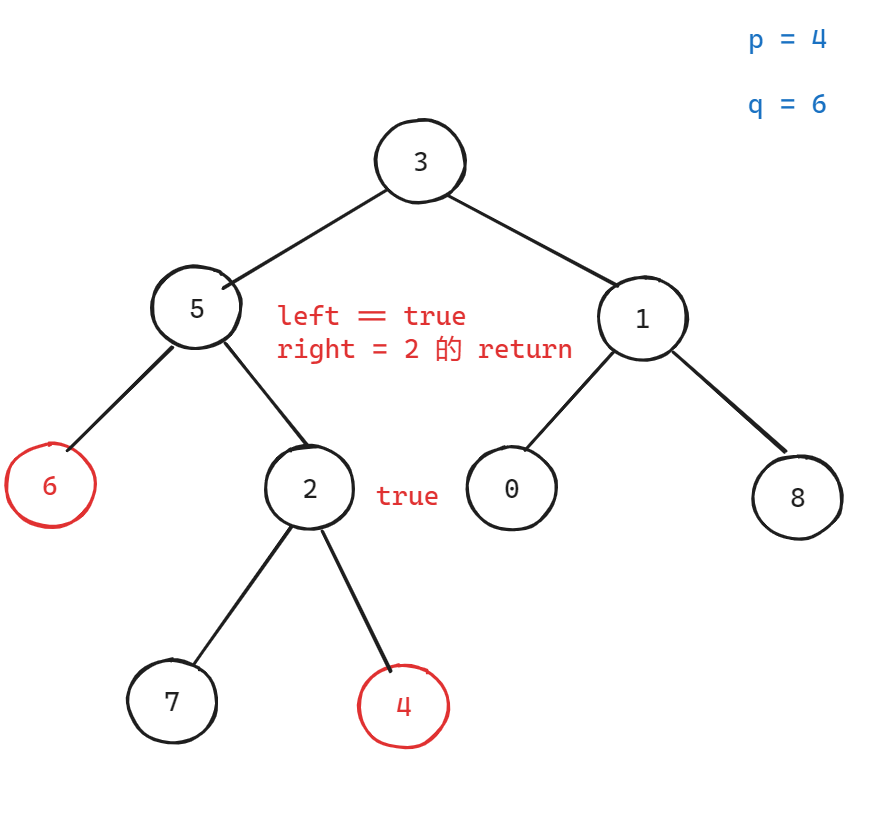

可以通过 Boolean 来判断是否含有，然后在 `left == true && right == true` 的时候读取这个节点然后返回；比如上图中，遍历到 2 的时候发现其左子树和右子树不分别包含 p q，说明 2 不是需要的节点，当遍历到 5 的时候，发现其 左子树和右子树分别包含 p 和 q 所以返回 5，需要注意的是针对与题目中的实例 2 ，也就是 p 或者 q 就是它们的公共祖先的情况要做额外的处理。

这里因为题目中要求的是返回 TreeNode 所以这里将返回值设为 TreeNode，返回值设定为 p 和 q 的公共祖先，以 left 和 right 是否为空作为判断依据来判断是否左子树和右子树同时包含：

```java

    if (node == null) {
    	return null;
    }
    if (node.val == pVal || node.val == qVal) {
    	return node;
    }
    TreeNode left = reverse(node.left);
    TreeNode right = reverse(node.right);
	// 判断逻辑
```

`if (left != null && right != null)` 说明此时是需要的节点，其判断方法和上面的思想是完全相同的。

但好处是不需要处理 p 或者 q 就是它们的公共祖先的情况

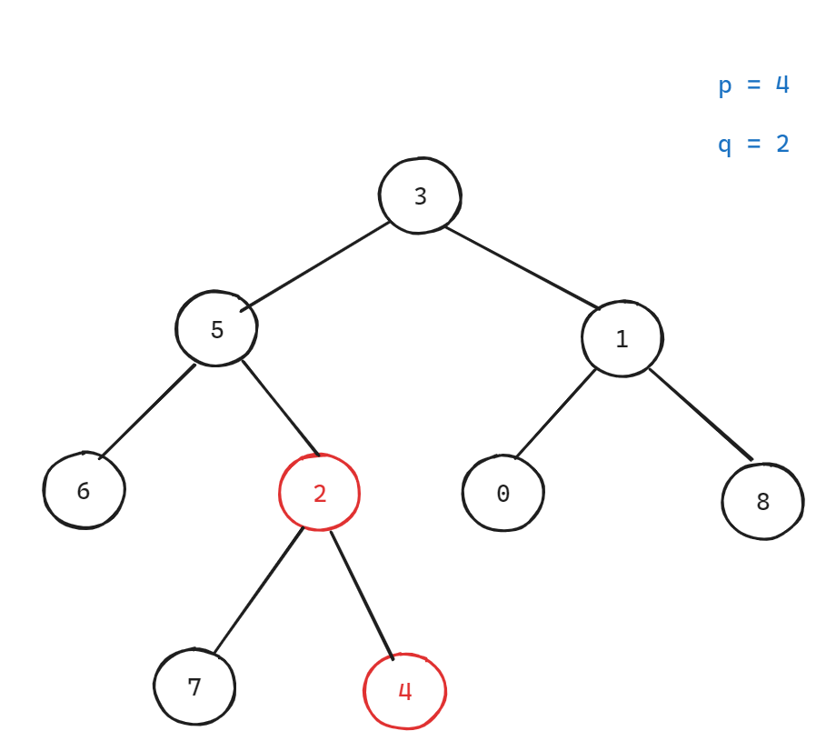

因为上面的代码当遇到 q = 2 的时候就通过
 `    if (node.val == pVal || node.val == qVal) {return node;}` 来直接返回了，这样直到顶上返回的值都是 2

而如果采用刚刚的情况就需要再多加一步来判断这个情况

#### 3.3 代码

```java
class Solution {
    int pVal;
    int qVal;
    public TreeNode lowestCommonAncestor(TreeNode root, TreeNode p, TreeNode q) {
        pVal = p.val;
        qVal = q.val;
        return reverse(root);
    }
    public TreeNode reverse(TreeNode node) {
        if (node == null) {
            return null;
        }
        if (node.val == pVal || node.val == qVal) {
            return node;
        }
        TreeNode left = reverse(node.left);
        TreeNode right = reverse(node.right);
        if (left != null && right != null) {
            return node;
        } else if (left == null && right != null) {
            return right;
        } else if (left != null && right == null) {
            return left;
        } else {
            return null;
        }
        
    }
}
```

## Day 22

### 01. 二叉搜索树的最近公共祖先（No. 235）

[题目链接](https://leetcode.cn/problems/lowest-common-ancestor-of-a-binary-search-tree/description/)

[代码随想录题解](https://programmercarl.com/0235.%E4%BA%8C%E5%8F%89%E6%90%9C%E7%B4%A2%E6%A0%91%E7%9A%84%E6%9C%80%E8%BF%91%E5%85%AC%E5%85%B1%E7%A5%96%E5%85%88.html#%E5%85%B6%E4%BB%96%E8%AF%AD%E8%A8%80%E7%89%88%E6%9C%AC)

#### 1.1 题目

给定一个二叉搜索树, 找到该树中两个指定节点的最近公共祖先。

[百度百科](https://baike.baidu.com/item/最近公共祖先/8918834?fr=aladdin)中最近公共祖先的定义为：“对于有根树 T 的两个结点 p、q，最近公共祖先表示为一个结点 x，满足 x 是 p、q 的祖先且 x 的深度尽可能大（**一个节点也可以是它自己的祖先**）。”

例如，给定如下二叉搜索树: root = [6,2,8,0,4,7,9,null,null,3,5]


 

**示例 1:**

> 输入: root = [6,2,8,0,4,7,9,null,null,3,5], p = 2, q = 8
> 输出: 6 
> 解释: 节点 2 和节点 8 的最近公共祖先是 6。

**示例 2:**

> 输入: root = [6,2,8,0,4,7,9,null,null,3,5], p = 2, q = 4
> 输出: 2
> 解释: 节点 2 和节点 4 的最近公共祖先是 2, 因为根据定义最近公共祖先节点可以为节点本身。

**说明:**

- 所有节点的值都是唯一的。
- p、q 为不同节点且均存在于给定的二叉搜索树中。


#### 1.2 笔记

二叉搜索树的特点使得二者的公共祖先的节点值一定在所求两点的节点值之间；所以当某一节点的值大于两个节点的时候，所求节点在其左子树（缩小直到在两者之间），反之，所求节点在右子树（增大直到在两者之间）。

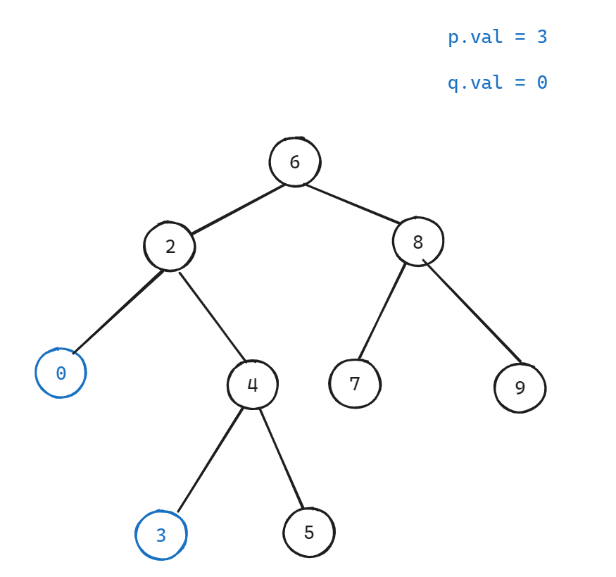

比如这个案例，模拟一下遍历的过程

1. `6 > p.val && 6 > q.val`
2. `2 > p.val && 2 < q.val`

由此得出 `2` 就是要求的结果

看到这里很多朋友会有疑问这个节点一定是结果吗？有没有可能在它的后面呢？

`2 > p.val && 2 < q.val` 这条语句可以推出 `p` 在它的左子树， `q` 在它的右子树，所以如果继续向下遍历的话，得到的就不是公共节点了，所以遍历到的第一个在中间的节点就是所求的节点。


#### 1.3 代码

```java
class Solution {
    int pVal;
    int qVal;
    TreeNode res; // 结果
    public TreeNode lowestCommonAncestor(TreeNode root, TreeNode p, TreeNode q) {
        pVal = p.val;
        qVal = q.val;
        reverse(root);
        return res;
    }
    public void reverse(TreeNode node) {
        if (node == null) {
            return;
        }
        if (node.val > pVal && node.val > qVal) {
            // 向左查询
            reverse(node.left);
        } else if (node.val < pVal && node.val < qVal) {
            // 向右查询
            reverse(node.right);
        } else {
           //得到结果
           res = node; 
        }
    }
}
```


### 02. 二叉搜索树中的插入操作（No. 701）

[题目链接](https://leetcode.cn/problems/insert-into-a-binary-search-tree/description/)

[代码随想录题解](https://programmercarl.com/0701.%E4%BA%8C%E5%8F%89%E6%90%9C%E7%B4%A2%E6%A0%91%E4%B8%AD%E7%9A%84%E6%8F%92%E5%85%A5%E6%93%8D%E4%BD%9C.html)

#### 2.1 题目

给定二叉搜索树（BST）的根节点 `root` 和要插入树中的值 `value` ，将值插入二叉搜索树。 返回插入后二叉搜索树的根节点。 输入数据 **保证** ，新值和原始二叉搜索树中的任意节点值都不同。

**注意**，可能存在多种有效的插入方式，只要树在插入后仍保持为二叉搜索树即可。 你可以返回 **任意有效的结果** 。

**示例 1：**


> 输入：root = [4,2,7,1,3], val = 5
> 输出：[4,2,7,1,3,5]
> 解释：另一个满足题目要求可以通过的树是：

**示例 2：**

> 输入：root = [40,20,60,10,30,50,70], val = 25
> 输出：[40,20,60,10,30,50,70,null,null,25]

**示例 3：**

> 输入：root = [4,2,7,1,3,null,null,null,null,null,null], val = 5
> 输出：[4,2,7,1,3,5]

 

**提示：**

- 树中的节点数将在 `[0, 104]`的范围内。
- `-108 <= Node.val <= 108`
- 所有值 `Node.val` 是 **独一无二** 的。
- `-108 <= val <= 108`
- **保证** `val` 在原始BST中不存在。


#### 2.2 笔记

做本题之前，首先要清楚：

**对于任何一个新增的节点都一定能在叶子节点处找到它可以放置的位置**

所以这里先确定将这个新增的节点添加到叶子节点就可以减少很多的步骤且更便于理解

确定了方向，先考虑如何 **找到所处的位置**：从根节点开始遍历，当发现 `root.val` 大于插入值的时候向 **左** 遍历，反之则向右遍历，最终一定会遍历到 `null` 的节点。

而这个位置就是插入的节点所处的位置。

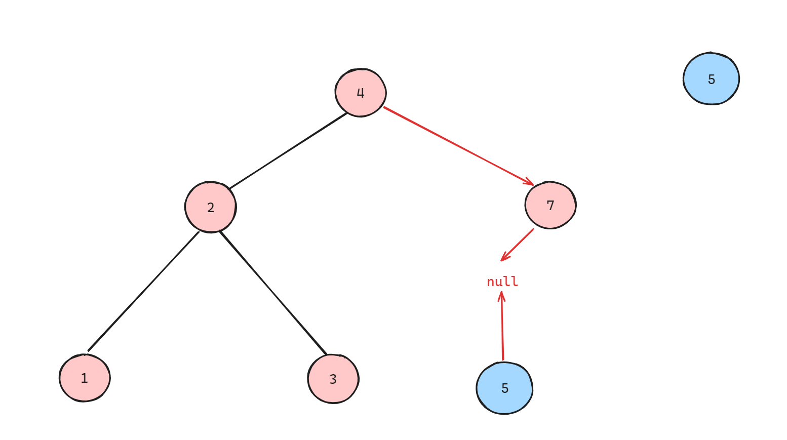

找到这个节点就可以创建一个新的节点并且将其返回，

```java
        if (root == null) {
            TreeNode node = new TreeNode(val);
            return node;
        }
```

在本案例中这个返回值会返回到上一个节点也就是 `7` 节点的 `insertIntoBST(root.left)` 中，这时候只需要将 `root.left = insertIntoBST(root.left) `  就完成了赋值。

本方法的返回值设为 `TreeNode`，也就是递归的顶层是 `root` 节点，所以在一层递归中，最终的返回值就是本节点。

梳理一下一层递归中的操作：

1. 判断是否为空
2. 判断节点值向左或者向右遍历，同时设置节点的 `left` 或 `right`
3. 将本节点返回


#### 2.3 代码

```java
class Solution {
    public TreeNode insertIntoBST(TreeNode root, int val) {
        if (root == null) {
            TreeNode node = new TreeNode(val);
            return node;
        }
        if (root.val > val) {
            root.left = insertIntoBST(root.left, val);
        } else if (root.val < val) {
            root.right = insertIntoBST(root.right, val);
        }
        return root;
    }
}
```


### 03. 删除二叉搜索树中的节点（No. 450）

[题目链接](https://leetcode.cn/problems/delete-node-in-a-bst/description/)

[代码随想录题解](https://programmercarl.com/0450.%E5%88%A0%E9%99%A4%E4%BA%8C%E5%8F%89%E6%90%9C%E7%B4%A2%E6%A0%91%E4%B8%AD%E7%9A%84%E8%8A%82%E7%82%B9.html)

#### 3.1 题目

给定一个二叉搜索树的根节点 **root** 和一个值 **key**，删除二叉搜索树中的 **key** 对应的节点，并保证二叉搜索树的性质不变。返回二叉搜索树（有可能被更新）的根节点的引用。

一般来说，删除节点可分为两个步骤：

1. 首先找到需要删除的节点；
2. 如果找到了，删除它。

 

**示例 1:**


> 输入：root = [5,3,6,2,4,null,7], key = 3
> 输出：[5,4,6,2,null,null,7]
> 解释：给定需要删除的节点值是 3，所以我们首先找到 3 这个节点，然后删除它。
> 一个正确的答案是 [5,4,6,2,null,null,7], 如下图所示。
> 另一个正确答案是 [5,2,6,null,4,null,7]。

**示例 2:**

> 输入: root = [5,3,6,2,4,null,7], key = 0
> 输出: [5,3,6,2,4,null,7]
> 解释: 二叉树不包含值为 0 的节点

**示例 3:**

> 输入: root = [], key = 0
> 输出: []

 

**提示:**

- 节点数的范围 `[0, 104]`.
- `-105 <= Node.val <= 105`
- 节点值唯一
- `root` 是合法的二叉搜索树
- `-105 <= key <= 105`


#### 3.2 代码

这道题的难度主要在于考虑全全部可能出现的情况

1. 删除节点是非头节点节点的情况
   - 删除的是叶子节点
   - 删除的是非叶子节点
2. 删除节点是头节点的情况

要删除节点首先要找到它，采用搜索二叉树的遍历

```java
if (node.val > ket) {
    reverse(node.left);
} else if (node.val < key) {
    reverse(node.right);
} else {
    // 找到该节点
}
```

找到该节点后，因为这是要删除的节点，所以上一层应该知道它的 **左节点 和 右节点**

定义一个全局变量来存储删除节点的左节点和右节点（`changeNodeLeft` `changeNodeRight`）

其次，仅仅对于这个的处理只需要 **上一层来处理**，所以定义一个全局的 `boolean` 来判断 **本层返回后** 是否需要删除。

```java
    boolean needToChange;
    TreeNode changeNodeLeft;
    TreeNode changeNodeRight;
```

这时候当节点返回，以左递归为案例

```java
	 	if (node.val > key) {
            reverse(node.left, key);
            if (needToChange) {
                if (changeNodeLeft == null && changeNodeRight == null) {
                    // 叶子节点
                    node.left = null;
                } else if (changeNodeLeft == null && changeNodeRight != null) {
                    node.left = changeNodeRight;
                } else if (changeNodeLeft == null && changeNodeRight != null){
                    node.left = changeNodeLeft;
                } else {
                    node.left = changeNodeLeft;
                    while (changeNodeLeft.right != null) {
                        changeNodeLeft = changeNodeLeft.right;
                    }
                    changeNodeLeft.right = changeNodeRight;
                }
                needToChange = false;
            }
        }
```

这里要考虑这几种情况

1. 左右节点都为空
2. 左节点为空但是右节点不为空
3. 左节点不为空但是右节点为空
4. 左节点和右节点都不为空

对于第一种情况直接将其 `node.left` 设置为空即可

**因为要删除的节点在其左子树，所以要删除的节点的左子树和右子树中的所有节点都一定比本节点小。**

这样对于 2 和 3 情况的处理就是将不为空的放到本节点的左子树 `node.left`


**节点的左子树中的所有值一定比右子树中的任何一个值要小**

所以如果将左右子树合并的话，右子树一定在左子树的最右边的叶子节点，所以对于情况 4 只需要将右子树置于左子树的最右边的叶子节点，再将左子树的节点放置到 `node.left` 即可

关系：本节点的值 > 右子树中所有的值 > 左子树中所有的值

由这个关系就可以推断出处理的方法


对于右递归也是同理

```java
else if (node.val < key) {
            reverse(node.right, key);
            if (needToChange) {
                if (changeNodeLeft == null && changeNodeRight == null) {
                    // 叶子节点
                    node.right = null;
                } else if (changeNodeLeft == null && changeNodeRight != null) {
                    node.right = changeNodeRight;
                } else if (changeNodeLeft == null && changeNodeRight != null){
                    node.right = changeNodeLeft;
                } else {
                    node.right = changeNodeLeft;
                    while (changeNodeLeft.right != null) {
                        changeNodeLeft = changeNodeLeft.right;
                    }
                    changeNodeLeft.right = changeNodeRight;
                }
                needToChange = false;
            }
        }
```


然后就是如果头节点是要删除的节点

1. 仅有头节点的情况
2. 头节点左子树为空，右子树不为空
3. 头节点左子树不为，空右子树为空
4. 头节点左右子树都不为空

情况 1 直接返回 `null`

情况 2 和 3 直接返回不为空的子树即可

最后一个情况和上面一样处理，将右子树放到左子树的最右边的节点上，再将左子树返回即可

```java
if (root.val == key) {
            TreeNode left = root.left;
            TreeNode right = root.right;
            if (right == null && left == null) {
                return null;
            } else if (right != null && left == null) {
                return right;
            } else if (right == null && left != null) {
                return left;
            } else {
                TreeNode temp = left;
                while (temp.right != null) {
                    temp = temp.right;
                }
                temp.right = right;
                return left;
            }
        }
```


#### 3.3 代码

```java
class Solution {
    boolean needToChange;
    TreeNode changeNodeLeft;
    TreeNode changeNodeRight;
    public TreeNode deleteNode(TreeNode root, int key) {
        if (root == null) {
            return null;
        }
        if (root.val == key) {
            TreeNode left = root.left;
            TreeNode right = root.right;
            if (right == null && left == null) {
                return null;
            } else if (right != null && left == null) {
                return right;
            } else if (right == null && left != null) {
                return left;
            } else {
                TreeNode temp = left;
                while (temp.right != null) {
                    temp = temp.right;
                }
                temp.right = right;
                return left;
            }
        }
        reverse(root, key);
        return root;
    }
    public void reverse(TreeNode node, int key) {
        if (node == null) {
            return;
        }
        if (node.val > key) {
            reverse(node.left, key);
            if (needToChange) {
                if (changeNodeLeft == null && changeNodeRight == null) {
                    // 叶子节点
                    node.left = null;
                } else if (changeNodeLeft == null && changeNodeRight != null) {
                    node.left = changeNodeRight;
                } else if (changeNodeLeft == null && changeNodeRight != null){
                    node.left = changeNodeLeft;
                } else {
                    node.left = changeNodeLeft;
                    while (changeNodeLeft.right != null) {
                        changeNodeLeft = changeNodeLeft.right;
                    }
                    changeNodeLeft.right = changeNodeRight;
                }
                needToChange = false;
            }
        } else if (node.val < key) {
            reverse(node.right, key);
            if (needToChange) {
                if (changeNodeLeft == null && changeNodeRight == null) {
                    // 叶子节点
                    node.right = null;
                } else if (changeNodeLeft == null && changeNodeRight != null) {
                    node.right = changeNodeRight;
                } else if (changeNodeLeft == null && changeNodeRight != null){
                    node.right = changeNodeLeft;
                } else {
                    node.right = changeNodeLeft;
                    while (changeNodeLeft.right != null) {
                        changeNodeLeft = changeNodeLeft.right;
                    }
                    changeNodeLeft.right = changeNodeRight;
                }
                needToChange = false;
            }
        } else {
            needToChange = true;
            changeNodeLeft = node.left;
            changeNodeRight = node.right;
        }
    }
}
```


## Day 23

### 01. 修剪二叉搜索树（No. 669）

[题目链接](https://leetcode.cn/problems/trim-a-binary-search-tree/description/)

[代码随想录题解](https://programmercarl.com/0669.%E4%BF%AE%E5%89%AA%E4%BA%8C%E5%8F%89%E6%90%9C%E7%B4%A2%E6%A0%91.html)

#### 1.1 题目

给你二叉搜索树的根节点 `root` ，同时给定最小边界`low` 和最大边界 `high`。通过修剪二叉搜索树，使得所有节点的值在`[low, high]`中。修剪树 **不应该** 改变保留在树中的元素的相对结构 (即，如果没有被移除，原有的父代子代关系都应当保留)。 可以证明，存在 **唯一的答案** 。

所以结果应当返回修剪好的二叉搜索树的新的根节点。注意，根节点可能会根据给定的边界发生改变。

**示例 1：**


> 输入：root = [1,0,2], low = 1, high = 2
> 输出：[1,null,2]

**示例 2：**


> 输入：root = [3,0,4,null,2,null,null,1], low = 1, high = 3
> 输出：[3,2,null,1]

**提示：**

- 树中节点数在范围 `[1, 104]` 内
- `0 <= Node.val <= 104`
- 树中每个节点的值都是 **唯一** 的
- 题目数据保证输入是一棵有效的二叉搜索树
- `0 <= low <= high <= 104`


#### 1.2 笔记

在解这道题之前，先来看一段代码

```java
public TreeNode traversal(root) {
    if (root == null) {
        return null;
    }
    root.left = traversal(root.left);
    root.right = traversal(root.right);
    return root;
}
```

这段代码实现了什么呢？

> 根据递归来分析
>
> - 递归的出口：`root == null`
> - 递归的返回值，以及其用途：返回的是当前节点经过处理后的值，将其作为上个节点的左子树或者右子树
> - 对每个节点的操作：分别向左递归，返回左子树，向右递归，返回右子树。
>
> 最终可以分析得出，上面的代码就是没有做任何的操作，只是将左子树赋给左子树将右子树赋值给右子树。
>
> ❓ 很多朋友看到这里可能怀疑我脑子坏掉了，为什么要举这么无意义的例子呢？
>
> 💡 其实换个思路去想，将左子树赋值给左子树，相当于没做任何操作，那如果在递归中进行一些操作，使得这个返回值不是左子树，而是左子树的下的节点，那不就完成了节点的删除吗？

那这道题的思路就清晰了一些，对于不处于规定范围内的节点在递归的过程中去**改变返回的值**，使得其上个节点得到的是修剪后的子树；但对于处于范围内的节点则负责**接收修改的左子树和右子树**。

那这样递归的框架就能很容易的写出来写出来：

```java
public TreeNode traversal(TreeNode root, int low, int high) {
        if (root == null) {
         
        }
        if (root.val > high) {
           
        } else if (root.val < low) {
  
        } else {
            root.right = traversal(root.right, low, high);
            root.left = traversal(root.left, low, high);  
            return root;
        }
    }
```

> 1. 先确定了返回值：送分题，`root == null`，因为对空节点的任何操作都没有意义。
> 2. 然后对该节点不处于规定范围和处于规定范围做不同的处理。
> 3. 对于处于规定范围的节点直接负责接收值。

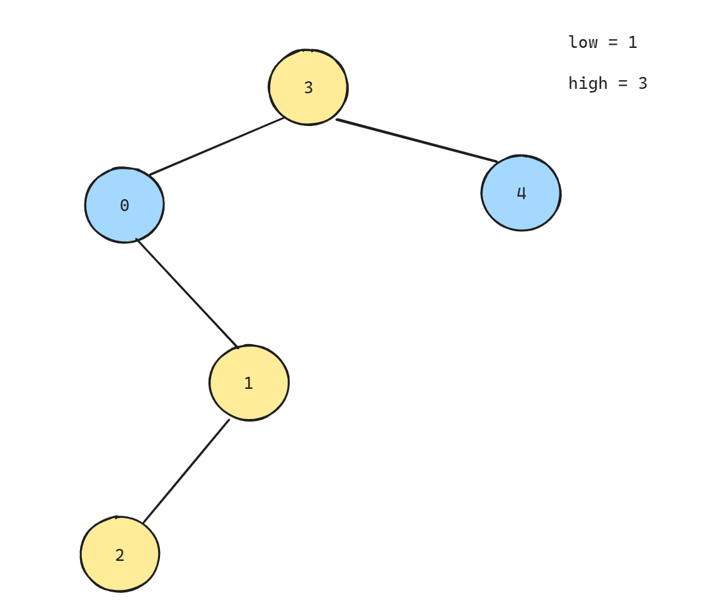

然后来看这个具体的案例，来思考如果节点处于范围外应该去做些什么：回想一下上面提到的，**修剪其实就是让本节点的返回值不再是它自己而是它的符合情况的子树**

- 节点 `0` 是在范围外的，所以它的**右子树可能在范围内**，所以这里返回的就是它的向右递归搜索的结果，思考到这里就可以了，递归一定不要去特别深入的思考，否则很容易将自己绕进去

- 这里理顺这个关系就可以：首先要去返回它符合条件子树来达到修剪的目的，而符合条件的子树肯定是出现在该节点的右子树，然后在右子树中去执行相同的逻辑，那调用这个方法最终返回的结果就是符合规范的子树。

- 比如 `0` 节点返回的就是 `1 2` 这个子树

  ```java
  return traversal(root.right);
  ```

那对于 `root.val > high`  的处理情况也很清晰了，要去它 **左子树** 去得到符合规范的子树。

```java
return traversal(root.left)k
```

将上面的代码补充完整。

#### 1.3 代码

```java
class Solution {
    public TreeNode trimBST(TreeNode root, int low, int high) {
        if (root == null) {
            return null;
        }
        if (root.val > high) {
            return trimBST(root.left, low, high);
        } else if (root.val < low) {
            return trimBST(root.right, low, high);
        } else {
            root.right = trimBST(root.right, low, high);
            root.left = trimBST(root.left, low, high);  
            return root;
        }
    }
}
```


### 02. 将有序数组转换为二叉搜索树（No. 108）

[题目链接](https://leetcode.cn/problems/convert-sorted-array-to-binary-search-tree/description/)

[代码随想录题解](https://programmercarl.com/0108.%E5%B0%86%E6%9C%89%E5%BA%8F%E6%95%B0%E7%BB%84%E8%BD%AC%E6%8D%A2%E4%B8%BA%E4%BA%8C%E5%8F%89%E6%90%9C%E7%B4%A2%E6%A0%91.html#%E7%AE%97%E6%B3%95%E5%85%AC%E5%BC%80%E8%AF%BE)

#### 2.1 题目

给你一个整数数组 `nums` ，其中元素已经按 **升序** 排列，请你将其转换为一棵 **高度平衡** 二叉搜索树。

**高度平衡** 二叉树是一棵满足「每个节点的左右两个子树的高度差的绝对值不超过 1 」的二叉树。

 

**示例 1：**


> 输入：nums = [-10,-3,0,5,9]
> 输出：[0,-3,9,-10,null,5]
> 解释：[0,-10,5,null,-3,null,9] 也将被视为正确答案：

**示例 2：**


> 输入：nums = [1,3]
> 输出：[3,1]
> 解释：[1,null,3] 和 [3,1] 都是高度平衡二叉搜索树。

 

**提示：**

- `1 <= nums.length <= 104`
- `-104 <= nums[i] <= 104`
- `nums` 按 **严格递增** 顺序排列


#### 2.2 笔记

延续上一道题，其实构造一个二叉树无非也就是这样的思路：

首先将这个节点创造出来，然后分别向两侧去遍历，**使得返回值是构造好的子树**，并且将这个子树置于其左子树和右子树即可。

先来写一个基础的结构

```java
public TreeNode traversal(int[] nums, int startIndex, int endIndex) {
	if () {
        // 终止条件
    }
    TreeNode node = new TreeNode(); // 构造新节点的条件
    node.right = traversal(); // 右递归的条件传输
    node.left = traversal(); // 左递归的条件传输
    return node;
}
```

> 💡 这里涉及到了逻辑切割数组，可以查看一下我这篇博客的第三道题目
>
> - [代码随想录刷题笔记 DAY 18 | 找树左下角的值 No.513 | 路经总和 No.112 | 从中序与后序遍历序列构造二叉树 No.106](https://blog.csdn.net/weixin_74895237/article/details/135941236?spm=1001.2014.3001.5502)
> - 其实理解起来也很容易，就是传入数组的起始和终止位置来约束来达到和分割数组相同的效果。

接下来就是依照题目去一点点解决这些问题了：

👉 构造节点的条件

- 这里才开始做和这道题目有关的事情，首先题目交给的就已经是排序好的数组，只需要保证左右子树平衡即可，也就是考虑怎样分割数组的问题。

  - 平衡就需要保证左子树和右子树的节点数量尽量相同，那 **分割点起始就是数组中间点**。

  - 将代码补充出来：

    ```java
    int mid = (startIndex + endIndex) / 2;
    Treenode node = new TreeNode(nums[mid]);
    ```


👉 左右递归的条件传输

- 那分析到这里其实做有递归的条件也很容易写出来了，就是从 `startIndex` 到 `mid - 1` 作为其左子树， `mid + 1` 到 `endIndex` 作为其右子树。

  - 将代码补充出来

    ```java
    node.left = traversal(nums, startIndex, mid - 1);
    node.right = traversal(nums, mid + 1, endIndex);
    ```

    

👉 递归的终点

- 当是实际的切割数组的时候，终止条件其实很容易写出，就是 `nums == null` 的时候，但是对于这种逻辑切割就要考虑一下了。

- 答案是 `startIndex > endIndex` 而不是 `startIndex == endIndex`，因为在过程中如果出现表示的数组为空，逻辑的起始和终止就会出现这种情况，可以当作结论记忆。

  - 将代码补充出来

    ```java
    if (startIndex > endIndex) {
    	return null;
    }
    ```


#### 2.3 代码

```java
class Solution {
    public TreeNode sortedArrayToBST(int[] nums) {
        return traversal(nums, 0, (nums.length - 1));
    }
    public TreeNode traversal(int[] nums, int startIndex, int endIndex) {
        if (startIndex > endIndex) {
            return null;
        }
        int mid = (startIndex + endIndex) / 2;
        TreeNode node = new TreeNode(nums[mid]);
        node.left = traversal(nums, startIndex, mid - 1);
        node.right = traversal(nums, mid + 1, endIndex);
        return node;
    }
}
```


### 03. 把二叉搜索树转换为累加树（No. 538）

[题目链接](https://leetcode.cn/problems/convert-bst-to-greater-tree/description/)

[代码随想录题解](https://programmercarl.com/0538.%E6%8A%8A%E4%BA%8C%E5%8F%89%E6%90%9C%E7%B4%A2%E6%A0%91%E8%BD%AC%E6%8D%A2%E4%B8%BA%E7%B4%AF%E5%8A%A0%E6%A0%91.html)

#### 3.1 题目

给出二叉 **搜索** 树的根节点，该树的节点值各不相同，请你将其转换为累加树（Greater Sum Tree），使每个节点 `node` 的新值等于原树中大于或等于 `node.val` 的值之和。

提醒一下，二叉搜索树满足下列约束条件：

- 节点的左子树仅包含键 **小于** 节点键的节点。
- 节点的右子树仅包含键 **大于** 节点键的节点。
- 左右子树也必须是二叉搜索树。

**注意：**本题和 1038: https://leetcode-cn.com/problems/binary-search-tree-to-greater-sum-tree/ 相同

 

**示例 1：**

****

> 输入：[4,1,6,0,2,5,7,null,null,null,3,null,null,null,8]
> 输出：[30,36,21,36,35,26,15,null,null,null,33,null,null,null,8]

**示例 2：**

> 输入：root = [0,null,1]
> 输出：[1,null,1]

**示例 3：**

> 输入：root = [1,0,2]
> 输出：[3,3,2]

**示例 4：**

> 输入：root = [3,2,4,1]
> 输出：[7,9,4,10]

 

**提示：**

- 树中的节点数介于 `0` 和 `104` 之间。
- 每个节点的值介于 `-104` 和 `104` 之间。
- 树中的所有值 **互不相同** 。
- 给定的树为二叉搜索树。


#### 3.2 笔记

题目中给出的是二叉搜索树，来观察上面的 **示例 1**

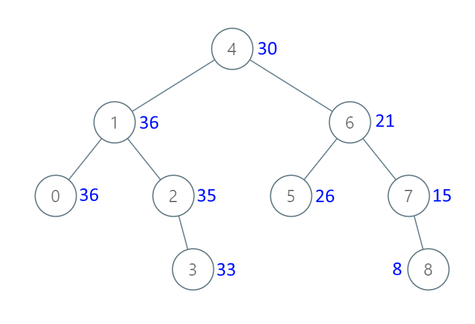

累加树的特征为：每个节点 `node` 的新值等于原树中大于或等于 `node.val` 的值之和。

二叉搜索树的最右边的节点是整个树中最大的节点，也就是说大于等于它的节点就是它本身，而再往上推到上图中的节点 `7` 作为次大的节点，这个节点的值就是它本身加上比他大的值也就是 `8`，按照这个规律很容易就能得出其他的节点的值，节点 `6` 的值就是 `6 + 7 + 8` ，而节点 `5` 的值就是 `5 + 6 + 7 + 8`。

所以这道题的思路就很明确了：以 **右、中、左** 的顺序去遍历二叉树，在这途中给节点加上路径中的节点和即可。

最后只需要解决如何按照 **右、中、左** 的顺序去遍历二叉树就可以了，这其实就是一种另类的中序遍历：

```java
traversal(node.left);
System.out.println(node.val);
traversal(node.right);
```

这样的遍历顺序是 **左、中、右**，那修改一下

```java
traversal(node.right);
System.out.println(node.val);
traversal(node.left);
```

这样就能得到符合上面遍历顺序的值。

只要将输出语句改为对节点的操作就能达到倒序的操作树（将搜索树看作升序数组）。

定义一个全局变量为 `0`，随着遍历逐步累加为 `8 15 21 26` 然后将其赋值给该节点即可。

- ```java
  globalNum += node.val;
  node.val = globalNum;
  ```


#### 3.3 代码

```java
class Solution {
    int globalNum = 0;
    public TreeNode convertBST(TreeNode root) {
        traversal(root);
        return root;
    }
    public void traversal(TreeNode node) {
        if (node == null) {
            return;
        }
        traversal(node.right);
        globalNum += node.val;
        node.val = globalNum;
        traversal(node.left);
    }
}
```


## Day 24

### 01. 回溯算法理论基础

#### 1.1 什么是回溯法？


👉 递归函数的下面就是回溯的逻辑（有递归就有回溯）

- 递归函数的后面位置其实就是平时提到的 **后序位置** 
- 也就是当前这个节点做完所有的操作返回上一个节点的时候，这时候对这个节点可以通过某些逻辑做回溯的操作


#### 1.2 为什么要使用回溯法？


👉 💡 回溯法是一个**纯暴力**的搜索方法，并不是一个性能很优的算法

- 当一个题目无法用正常的解法（多层 for 循环嵌套）来求出的时候就需要用到回溯法
- 比如说求 组合问题、切割问题、子集问题、排列问题、棋盘问题


#### 1.3 如何理解回溯法？


👉 将回溯法抽象为一个树形结构

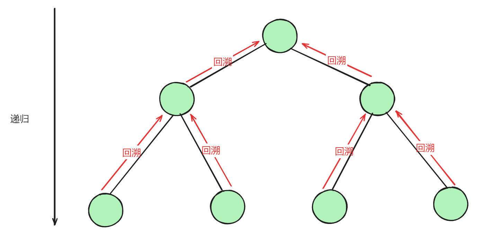

- 递归可以形成一个树形结构，如果一层中只有一个递归就只会形成一个链表结构而不是树形结构，所以一层中是存在多个递归调用的。

- 所以可以总结出回溯法的一个模板

  ```java
  public void backtracking() {
  	if (...) {
  		return;
  	}
  	for (int i = ...; i < ...; i++) {
  		// 分枝来形成树形结构达到搜索的目的
      	// 回溯算法
  	}
  }
  ```

  

### 02. 组合问题（No. 77）

[题目链接](https://leetcode.cn/problems/combinations/description/)

[代码随想录题解](https://programmercarl.com/0077.%E7%BB%84%E5%90%88.html#%E7%AE%97%E6%B3%95%E5%85%AC%E5%BC%80%E8%AF%BE)

#### 2.1 题目

给定两个整数 `n` 和 `k`，返回范围 `[1, n]` 中所有可能的 `k` 个数的组合。

你可以按 **任何顺序** 返回答案。

 

**示例 1：**

> 输入：n = 4, k = 2
> 输出：
> [
>   [2,4],
>   [3,4],
>   [2,3],
>   [1,2],
>   [1,3],
>   [1,4],
> ]

**示例 2：**

> 输入：n = 1, k = 1
> 输出：[[1]]

 

**提示：**

- `1 <= n <= 20`
- `1 <= k <= n`


#### 2.2 笔记

先来思考这道题为什么需要用回溯算法来解决。

如果要通过 `for` 循环来解这道题的话会遇到什么困难呢？

如果说固定 k 仅仅限制 n 的话，代码很容易写的出来比如说 k 是 2

```java
List<Integer> path = new ArrayList<>(); // 存储路径值的链表
List<List<Integer>> res = new ArrayList<>(); // 存储结果的链表
for (int i = 1; i <= n; i++) {
	path.add(i);
	for (int j = i + 1, i <= n; i++) {
		path.add(j);
		res.add(new ArrayList(path));
		path.remove(path.size() - 1);
	}
	path.remove(path.size() - 1);
}
```

但是如果说 k = 50 或者 k = 100 呢？写一百层 `for` 循环就会出现很多问题了。

其次不只是书写的问题，通过 `for` 循环来解题是无法控制 `for `循环的层数的

而使用回溯算法可以很容易的解决这个问题

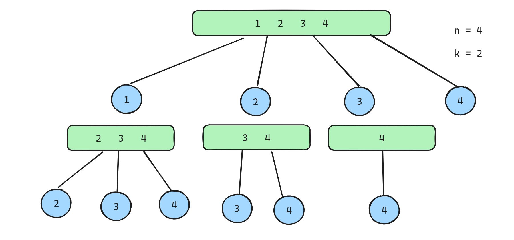

回溯法可以通过递归来控制 `for` 循环的层数来达到和多层嵌套相同的效果。

这道题的解题思路就是通过一个 `List` 来收集路径上的节点，当节点的数量等于 `k` 的时候就收集起来，并且删除掉这个节点来进行后序的遍历。

套用回溯法的模板来解决问题：

```java
public void backtracking() {
	if (...) {
		return;
	}
	for (int i = ...; i < ...; i++) {
		// 分枝来形成树形结构达到搜索的目的
    	// 回溯算法
	}
}
```

递归结束的条件也就是收集结果的时候，在这道题目中是收集到的节点数目等于 n 的时候，就是 `path.size() == n`。

然后就是分枝的处理了，先将 `1 ~ 4` 分成四份然后再从 `i 到 n` 分成 `n - i + 1` 份，所以需要一个指针来标识要分成几份 `startIndex`。

最后就是回溯的代码，和上面说的相同，删除掉这个节点来进行后序的遍历。

#### 2.3 代码

```java
class Solution {
    List<Integer> path = new ArrayList<>();
    List<List<Integer>> res = new ArrayList<>();
    public List<List<Integer>> combine(int n, int k) {
        backtracking(n, k, 1);
        return res;
    }
    public void backtracking(int n, int k, int startIndex) {
        if (path.size() == k) {
            res.add(new ArrayList<>(path));
            return;
        }
        for (int i = startIndex; i <= n; i++) {
            path.add(i);
            backtracking(n, k, i+1);
            path.remove(path.size() - 1); // 回溯删除节点
        }
    }
}
```


## Day 25

### 01. 组合问题（No. 77）

#### 2.1 题目

给定两个整数 `n` 和 `k`，返回范围 `[1, n]` 中所有可能的 `k` 个数的组合。

你可以按 **任何顺序** 返回答案。

 

**示例 1：**

> 输入：n = 4, k = 2
> 输出：
> [
> [2,4],
> [3,4],
> [2,3],
> [1,2],
> [1,3],
> [1,4],
> ]

**示例 2：**

> 输入：n = 1, k = 1
> 输出：[[1]]

 

**提示：**

- `1 <= n <= 20`
- `1 <= k <= n`


#### 2.2 笔记

本题的常规解法在昨天的题解中已经写出

[代码随想录刷题笔记 DAY 24 | 回溯算法理论基础 | 组合问题 No. 77](https://blog.csdn.net/weixin_74895237/article/details/136104558?spm=1001.2014.3001.5501)

这里来讲解一下本题的剪枝优化

假设 `n = 4` 且 `k = 4`


```java
for (int i = startIndex; i <= n; i++) {
    path.add(i);
    backtracking(n, k, i+1);
    path.remove(path.size() - 1); // 回溯删除节点
}
```

当 `startIndex == 2` 的时候，后面能取得的数字为 `3 4` 即遍历完所有的取值数目也不可能达到题目要求的 `k`

所以对上面除了 `1 2 3 4` 这条线都应该通过剪枝去除，因为遍历它们没有意义。

当确定了一个 `i` 那这条路线能取得的最多的数字个数就确认了，也就是 `n - i + 1`

当取到这个节点的时候 `path` 内共有 `path.size()` 个元素，所以从这个路线中能取得的 **最大** 数目为 
$$
N_m = n - i + 1 - path.size()
$$
如果这条路线能够取得总数 `k`，那可以得出
$$
N_m \ge k
$$
最终能够推出
$$
i \le n - k + 1-path.size()
$$
这时候的 `i` 才是 **有意义** 的 `i`

所以 `for` 循环的终止条件应该改为上式


#### 2.3 代码

```java
class Solution {
    List<Integer> path = new ArrayList<>();
    List<List<Integer>> res = new ArrayList<>();
    public List<List<Integer>> combine(int n, int k) {
        backtracking(n, k, 1);
        return res;
    }
    public void backtracking(int n, int k, int startIndex) {
        if (path.size() == k) {
            res.add(new ArrayList<>(path));
            return;
        }
        for (int i = startIndex; i <= (n - k + path.size() + 1); i++) {
            path.add(i);
            backtracking(n, k, i+1);
            path.remove(path.size() - 1);
        }
    }
}
```


### 02. 组合求和III（No. 216）

#### 2.1 题目

找出所有相加之和为 `n` 的 `k` 个数的组合，且满足下列条件：

- 只使用数字1到9
- 每个数字 **最多使用一次** 

返回 *所有可能的有效组合的列表* 。该列表不能包含相同的组合两次，组合可以以任何顺序返回。

 

**示例 1:**

> 输入: k = 3, n = 7
> 输出: [[1,2,4]]
> 解释:
> 1 + 2 + 4 = 7
> 没有其他符合的组合了。

**示例 2:**

> 输入: k = 3, n = 9
> 输出: [[1,2,6], [1,3,5], [2,3,4]]
> 解释:
> 1 + 2 + 6 = 9
> 1 + 3 + 5 = 9
> 2 + 3 + 4 = 9
> 没有其他符合的组合了。

**示例 3:**

> 输入: k = 4, n = 1
> 输出: []
> 解释: 不存在有效的组合。
> 在[1,9]范围内使用4个不同的数字，我们可以得到的最小和是1+2+3+4 = 10，因为10 > 1，没有有效的组合。

 

**提示:**

- `2 <= k <= 9`
- `1 <= n <= 60`


#### 2.2 笔记

如果做过组合问题，这道题目就非常容易了，思路和剪枝操作都是完全相同的，就只需要注意一下递归的终点。

因为本题有两个限制条件

- 数字的总数是 `k`
- 数字的和是 `n`

所以当判断出 `sum > k` 的时候也要记得结束递归

#### 2.3 代码

```java
class Solution {
    int temp = 0;
    List<Integer> path = new ArrayList<>();
    List<List<Integer>> res = new ArrayList<>();
    public List<List<Integer>> combinationSum3(int k, int n) {
        backtracking(k, n, 1);
        return res;
    }
    public void backtracking(int k, int n, int startIndex) {
        if (temp > n) {
            return;
        }
        if (path.size() == k && temp == n) {
            res.add(new ArrayList(path));
        }
        for (int i = startIndex; i <= (9 - k + path.size() + 1); i++) {
            path.add(i);
            temp += i;
            backtracking(k, n, i+1);
            temp -= i;
            path.remove(path.size() - 1);
        }
    }
}
```


### 03. 电话号码的字母组合（No. 17）

[题目链接](https://leetcode.cn/problems/letter-combinations-of-a-phone-number/description/)

[代码随想录题解](https://programmercarl.com/0017.%E7%94%B5%E8%AF%9D%E5%8F%B7%E7%A0%81%E7%9A%84%E5%AD%97%E6%AF%8D%E7%BB%84%E5%90%88.html#%E5%85%B6%E4%BB%96%E8%AF%AD%E8%A8%80%E7%89%88%E6%9C%AC)

#### 3.1 题目

给定一个仅包含数字 `2-9` 的字符串，返回所有它能表示的字母组合。答案可以按 **任意顺序** 返回。

给出数字到字母的映射如下（与电话按键相同）。注意 1 不对应任何字母。


 

**示例 1：**

> 输入：digits = "23"
> 输出：["ad","ae","af","bd","be","bf","cd","ce","cf"]

**示例 2：**

> 输入：digits = ""
> 输出：[]

**示例 3：**

> 输入：digits = "2"
> 输出：["a","b","c"]

 

**提示：**

- `0 <= digits.length <= 4`
- `digits[i]` 是范围 `['2', '9']` 的一个数字。


#### 3.2 笔记

先给出这道题的回溯解法：

在大多数的题目中回溯的作用就是提供一个层数可控的 `for` 循环来暴力解决这个问题，所以当某道题目没有思路的时候就先向 `for` 循环的方向思考。

❓ 这道题目用 `for` 循环应该如何解答呢？

> 💡 假如说只按了两个数字，`2` 和 `3`，首先将 **数字映射为字符数组**，再去求这 **两个数组** 的组合，那肯定很容易，两层 `for` 循环就可以解决。
>
> ```java
> for (String a : arr1) {
> 	for (String b : arr2) {		
> 	}
> }
> ```
>
> 通过这样的形式就能求出所有的组合。

那三个按键、五个按键该怎么解决呢？

这就需要回溯法来解决这个问题了，大家遇到这道题没思路的原因很大概率是没接触过这种每层的**分枝**操作的 **不是同一个数组**

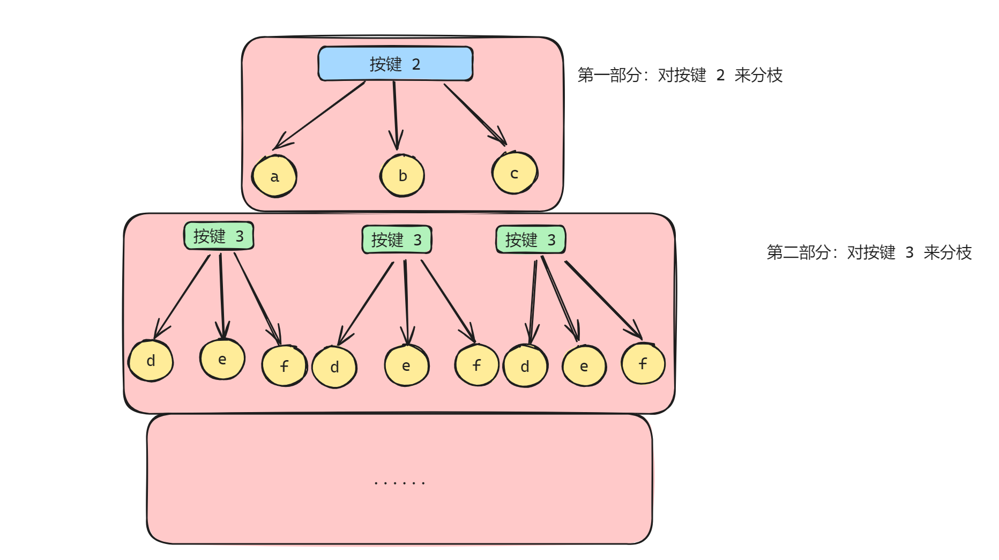

所以要做的就是在每层遍历完后去**改变 `for` 循环中遍历的数组**，这就是形成本题目要求的树形结构的方法。

可以在每次递归（前往下一层）的时候传递一个标识，用这个标识来确定 **本层** 遍历的数组是哪一个。

这里定为 `index`，从 `0` 开始，直到遍历完 **所有的按键结束**，也就是 `index > 按下的按键总数`

如何通过 `index` 来定位到遍历的是 **哪些** 字母呢？

- 因为数字和字母存在着映射的关系，所以可以提前准备好所有的映射关系

  ```java
  static Map<Character, String[]> NumMap = new HashMap<>();
  static {
          NumMap.put('2', new String[]{"a", "b", "c"});
          NumMap.put('3', new String[]{"d", "e", "f"});
          NumMap.put('4', new String[]{"g", "h", "i"});
          NumMap.put('5', new String[]{"j", "k", "l"});
          NumMap.put('6', new String[]{"m", "n", "o"});
          NumMap.put('7', new String[]{"p", "q", "r", "s"});
          NumMap.put('8', new String[]{"t", "u", "v"});
          NumMap.put('9', new String[]{"w", "x", "y", "z"});
      }
  ```

- 接下来将输入的字符串转为字符数组，`index` 的意义就是这个字符数组的下标

  ```java
  globalArr = digits.toCharArray();
  ```

- 这样通过下标找到当前层是**哪个数字**，再通过 **数字和字母的映射关系** 就直到当前层遍历的字符串数组


#### 3.3 代码

```java
class Solution {
    char[] globalArr; // 存储传入的按键
    StringBuilder temp = new StringBuilder(); // 路径变量
    List<String> res = new ArrayList<>();
    static Map<Character, String[]> NumMap = new HashMap<>();
    static {
        NumMap.put('2', new String[]{"a", "b", "c"});
        NumMap.put('3', new String[]{"d", "e", "f"});
        NumMap.put('4', new String[]{"g", "h", "i"});
        NumMap.put('5', new String[]{"j", "k", "l"});
        NumMap.put('6', new String[]{"m", "n", "o"});
        NumMap.put('7', new String[]{"p", "q", "r", "s"});
        NumMap.put('8', new String[]{"t", "u", "v"});
        NumMap.put('9', new String[]{"w", "x", "y", "z"});
    }
    public List<String> letterCombinations(String digits) {
        globalArr = digits.toCharArray();
        if (globalArr.length == 0) {
            return new ArrayList<>();
        }
        backtracking(0);
        return res;
    }
    public void backtracking(int index) {
        if (index > globalArr.length - 1) {
            res.add(temp.toString());
            return;
        }
        // 获取本层遍历的是哪个字符数组
        String[] letterArr = NumMap.get(globalArr[index]);
        for (String s : letterArr) {
            temp.append(s);
            backtracking(++index);
            temp.deleteCharAt(temp.length() - 1);   
            index--;
        }
    }
}
```


#### 3.4 补充

其实这道题目我一开始做的时候使用的是另一种方法。

以 按键 `234` 为例，本题其实就是求 `2` 和 `3` 的所有组合 `x`，再求 `x` 和 `4` 的所有组合。

所以先编写一个实现两两组合的代码，再通过遍历将所有的按键全部组合起来也能得到结果。

```java
class Solution {
    // 映射关系
    static Map<Character, String[]> NumMap = new HashMap<>();
    static {
        NumMap.put('2', new String[]{"a", "b", "c"});
        NumMap.put('3', new String[]{"d", "e", "f"});
        NumMap.put('4', new String[]{"g", "h", "i"});
        NumMap.put('5', new String[]{"j", "k", "l"});
        NumMap.put('6', new String[]{"m", "n", "o"});
        NumMap.put('7', new String[]{"p", "q", "r", "s"});
        NumMap.put('8', new String[]{"t", "u", "v"});
        NumMap.put('9', new String[]{"w", "x", "y", "z"});
    }
    public List<String> letterCombinations(String digits) {
        char[] charArray = digits.toCharArray();
        // 边界情况的处理：字符个数不足两个
        if (charArray.length == 1) {
            return Arrays.stream(NumMap.get(charArray[0])).toList();
        } else if (charArray.length == 0) {
            return new ArrayList<>();
        }
        // 将 temp 与其他字符依次两两组合
        String[] temp = getTwoCombinations(NumMap.get(charArray[0]), NumMap.get(charArray[1]));
        for (int i = 2; i < charArray.length; i++) {
            temp = getTwoCombinations(temp, NumMap.get(charArray[i]));
        }
        return Arrays.stream(temp).toList();
    }
    /**
    	实现两两组合
     */
    public String[] getTwoCombinations(String[] a, String[] b) {
        String[] res = new String[a.length * b.length];
        int n = 0;
        for (String string : a) {
            String temp = string;
            for (String s : b) {
                temp += s;
                res[n++] = temp;
                temp = string;
            }
        }
        return res;
    }
}   
```


## Day 27

### 01. 组合总和（No. 39）

[题目链接](https://leetcode.cn/problems/combination-sum/description/)

[代码随想录题解](https://programmercarl.com/0039.%E7%BB%84%E5%90%88%E6%80%BB%E5%92%8C.html#%E6%80%9D%E8%B7%AF)

#### 1.1 题目

给你一个 **无重复元素** 的整数数组 `candidates` 和一个目标整数 `target` ，找出 `candidates` 中可以使数字和为目标数 `target` 的 所有 **不同组合** ，并以列表形式返回。你可以按 **任意顺序** 返回这些组合。

`candidates` 中的 **同一个** 数字可以 **无限制重复被选取** 。如果至少一个数字的被选数量不同，则两种组合是不同的。 

对于给定的输入，保证和为 `target` 的不同组合数少于 `150` 个。

 

**示例 1：**

> 输入：candidates = [2,3,6,7], target = 7
> 输出：[[2,2,3],[7]]
> 解释：
> 2 和 3 可以形成一组候选，2 + 2 + 3 = 7 。注意 2 可以使用多次。
> 7 也是一个候选， 7 = 7 。
> 仅有这两种组合。

**示例 2：**

> 输入: candidates = [2,3,5], target = 8
> 输出: [[2,2,2,2],[2,3,3],[3,5]]

**示例 3：**

> 输入: candidates = [2], target = 1
> 输出: []

 

**提示：**

- `1 <= candidates.length <= 30`
- `2 <= candidates[i] <= 40`
- `candidates` 的所有元素 **互不相同**
- `1 <= target <= 40`


#### 1.2 笔记

本题需要求得能使得总和为 `target` 的结果的集合，和之前的组合的题目非常类似

[代码随想录刷题笔记 DAY 25 | 组合问题 No.77 | 组合求和III No.216 | 电话号码的字母组合 No.17](https://blog.csdn.net/weixin_74895237/article/details/136110107?spm=1001.2014.3001.5501)

但需要本题的区别是：**可以取得相同的元素**


一开始写的时候没有画图，导致写出了这样的代码

```java
for (int i = 0; i < arr.length; i++) {
	path.add(arr[i]);
	sum += i;
	backtracking();
	path.remove(path.size() - 1);
	sum -= i;
}
```

导致结果出现了 `2 2 3` 和 `3 2 2` 这样的重复情况。

其实参考上图很容易看出来，对于一个节点的遍历从数组中这节点开始的，所以对于 `i` 应该限制 `startIndex`，所以 **如果是一个集合求组合** 的题目一定要加上 `startIndex`;

更改代码为：

```java
for (int i = index; i < candidates.length; i++) {
    path.add(candidates[i]);
    temp += candidates[i];
    backtarcking(candidates, target, i);
    temp -= candidates[i];
    path.remove(path.size() - 1);
}
```

写出完整的代码

#### 1.3 代码

```java
class Solution {
    List<Integer> path = new ArrayList<>();
    List<List<Integer>> res = new ArrayList<>();
    int temp = 0;
    public List<List<Integer>> combinationSum(int[] candidates, int target) {
        backtracking(candidates, target, 0);
        return res;
    }
    public void backtracking(int[] candidates, int target, int index) {
        if (temp > target) {
            index++;
            return;
        }
        if (temp == target) {
            index++;
            res.add(new ArrayList(path));
        }
        for (int i = index; i < candidates.length; i++) {
            path.add(candidates[i]);
            temp += candidates[i];
            backtracking(candidates, target, i);
            temp -= candidates[i];
            path.remove(path.size() - 1);
        }
    }
}
```


### 02. 组合求和 II（No. 40）

[题目链接](https://leetcode.cn/problems/combination-sum-ii/description/)

[代码随想录题解](https://programmercarl.com/0040.%E7%BB%84%E5%90%88%E6%80%BB%E5%92%8CII.html#%E7%AE%97%E6%B3%95%E5%85%AC%E5%BC%80%E8%AF%BE)

#### 2.1 题目

给定一个候选人编号的集合 `candidates` 和一个目标数 `target` ，找出 `candidates` 中所有可以使数字和为 `target` 的组合。

`candidates` 中的每个数字在每个组合中只能使用 **一次** 。

**注意：**解集不能包含重复的组合。 

**示例 1:**

> 输入: candidates = [10,1,2,7,6,1,5], target = 8,
> 输出:
> [
> [1,1,6],
> [1,2,5],
> [1,7],
> [2,6]
> ]

**示例 2:**

> 输入: candidates = [2,5,2,1,2], target = 5,
> 输出:
> [
> [1,2,2],
> [5]
> ]

**提示:**

- `1 <= candidates.length <= 100`
- `1 <= candidates[i] <= 50`
- `1 <= target <= 30`


#### 2.2 笔记

这道题目与之前接触到的组合的问题不同的点在于数组中出现了相同的元素，这就会导致这种情况：

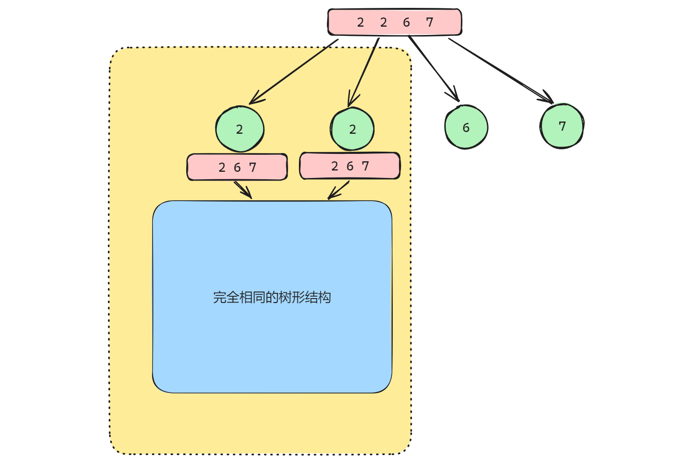

所以要进行去重的操作
❓ 但很容易发现这次的去重好像和之前的不相同？

> 💡 之前的去重操作是通过控制 `i = index`，通过每次递归修改 `i` 的值来使得不会取得相同的元素

也就是对一个 **路径** 去做去重操作；但本题显然是不只是需要对路径进行去重，还需要对 **一层中** 遍历到相同的元素的时候进行去重操作。

所以在进行一层中的分枝操作也就是 `for` 循环遍历的时候，有些节点需要 **跳过**，比如上图中的两个 `2` 节点，剩下的内容其实和其他的组合问题没什么区别。

如果要跳过的话首先要对数组进行排序（将相同的数字放到一起），在执行 `for` 循环的时候，如果遇到和前面相同的就跳过。

```java
for (int i = index; i < candidates.length; i++) {
    if ( i > index && candidates[i] == candidates[i - 1] ) {
    	continue;
    }
    // 其他逻辑
}
```


#### 2.3 代码

```java
class Solution {
    List<Integer> path = new ArrayList<>();
    List<List<Integer>> res = new ArrayList<>();
    int temp = 0;
    public List<List<Integer>> combinationSum2(int[] candidates, int target) {
        Arrays.sort(candidates);
        backtracking(candidates, target, 0);
        return res;
    }
    public void backtracking(int[] candidates, int target, int index) {
        if (temp > target) {
            return;
        }
        if (temp == target) {
            res.add(new ArrayList<>(path));
            return;
        }
        for (int i = index; i < candidates.length; i++) {
            if ( i > index && candidates[i] == candidates[i - 1] ) {
                continue;
            }
            temp += candidates[i];
            path.add(candidates[i]);
            backtracking(candidates, target, i + 1);
            temp -= candidates[i];
            path.remove(path.size() - 1);
        }
    }
}
```


### 03. 分割回文串（No. 131）

[题目链接](https://leetcode.cn/problems/palindrome-partitioning/description/)

[代码随想录题解](https://programmercarl.com/0131.%E5%88%86%E5%89%B2%E5%9B%9E%E6%96%87%E4%B8%B2.html#%E5%85%B6%E4%BB%96%E8%AF%AD%E8%A8%80%E7%89%88%E6%9C%AC)

#### 3.1 题目

给你一个字符串 `s`，请你将 `s` 分割成一些子串，使每个子串都是 **回文串** 。返回 `s` 所有可能的分割方案。

**回文串** 是正着读和反着读都一样的字符串。

**示例 1：**

> 输入：s = "aab"
> 输出：[["a","a","b"],["aa","b"]]

**示例 2：**

> 输入：s = "a"
> 输出：[["a"]] 

**提示：**

- `1 <= s.length <= 16`
- `s` 仅由小写英文字母组成


#### 3.2 笔记

分割字符串和组合问题非常类似，先将树形结构画出：

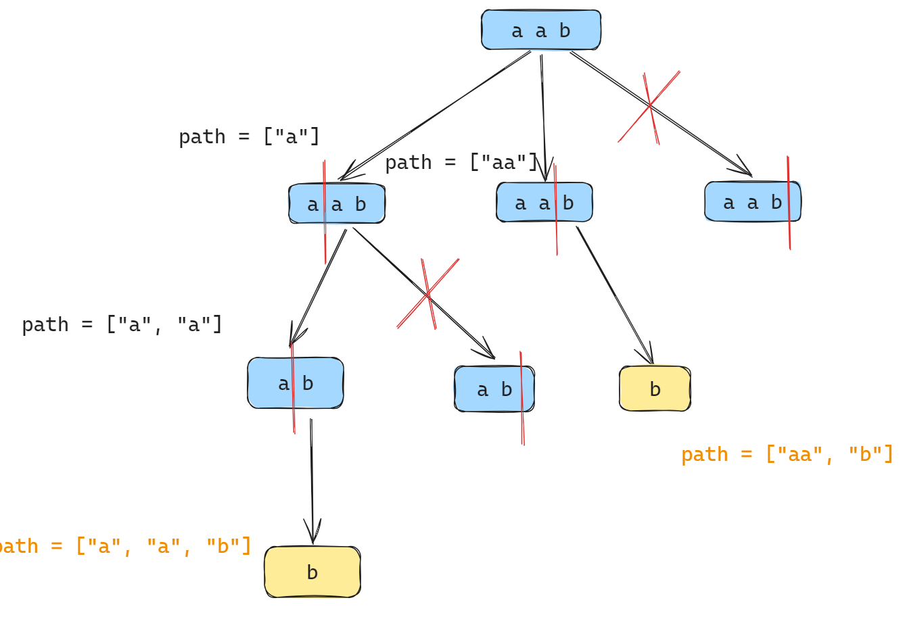

在一层中，遍历的是本层的 **字符串** 的所有的切割情况，而向下层传递的是 **切割后** 的字符串的所有的切割情况，其实和组合问题是十分类似的。

单层中切割通过遍历来完成，比如 `aab` 在第一个 `a` 的位置切割就是通过将字符串从 `start` 到 `i` 来分割

```java
for (int i = startIndex; i < s.length(); i++) {
    s.substring(startIndex, i + 1); // 单层中切割字符串
}
```

通过 `i` 逐步遍历到最后实现了 **本层** 的 **所有切割情况**

❓ 那什么时候说明本层的这种切割情况 **可能** 能够获得最终的结果呢？

答案就是本层的这种切割方式切割的部分是回文串，也就是从 `startIndex` 到 `i` 这一部分

所以需要一个方法来判断这种切割是否是回文串

```java
    /**
        判断是否是回文字符串
     */
    public boolean isValid(String s, int startIndex, int endIndex) {
        char[] charArray = s.toCharArray();
        for (int i = startIndex, j = endIndex; i < j; i++, j--) {
            if (charArray[i] != charArray[j]) {
                return false;
            }
        }
        return true;
    }
```

通过双指针的遍历方式来确定回文串


如果是回文串的话就继续向深层次递归，反之则取遍历本层的其他可能性

```java
if (isValid(s, startIndex, i)) {
	path.add(s.substring(startIndex, i + 1));
} else {
	continue;
}
backtracking(i + 1, s);
path.remove(path.size() - 1);
```

再来确定递归的终点：

如果 `startIndex >= s.length()` 的话，就说明已经找到一种情况了因为此时已经分割完成了所有的字符串，如果分割途中出现了非回文字符串就会通过 `continue` 跳过而不可能使得 `startIndex == 0`。


#### 3.3 代码

```java
class Solution {
    List<String> path = new ArrayList<>();
    List<List<String>> res = new ArrayList<>();
    public List<List<String>> partition(String s) {
        backtracking(0, s);
        return res;
    }
    public void backtracking(int startIndex, String s) {
        if (startIndex >= s.length()) {
            res.add(new ArrayList(path));
            return;
        }
        for (int i = startIndex; i < s.length(); i++) {
            if (isValid(s, startIndex, i)) {
                path.add(s.substring(startIndex, i + 1));
            } else {
                continue;
            }
            backtracking(i + 1, s);
            path.remove(path.size() - 1);
        }
    }
    /**
        判断是否是回文字符串
     */
    public boolean isValid(String s, int startIndex, int endIndex) {
        char[] charArray = s.toCharArray();
        for (int i = startIndex, j = endIndex; i < j; i++, j--) {
            if (charArray[i] != charArray[j]) {
                return false;
            }
        }
        return true;
    }
}
```


## Day 28

### 01. 复原 IP 地址（No. 93）

[题目链接](https://leetcode.cn/problems/restore-ip-addresses/description/)

[代码随想录题解](https://programmercarl.com/0093.%E5%A4%8D%E5%8E%9FIP%E5%9C%B0%E5%9D%80.html#%E6%80%9D%E8%B7%AF)

#### 1.1 题目

**有效 IP 地址** 正好由四个整数（每个整数位于 `0` 到 `255` 之间组成，且不能含有前导 `0`），整数之间用 `'.'` 分隔。

- 例如：`"0.1.2.201"` 和` "192.168.1.1"` 是 **有效** IP 地址，但是 `"0.011.255.245"`、`"192.168.1.312"` 和 `"192.168@1.1"` 是 **无效** IP 地址。

给定一个只包含数字的字符串 `s` ，用以表示一个 IP 地址，返回所有可能的**有效 IP 地址**，这些地址可以通过在 `s` 中插入 `'.'` 来形成。你 **不能** 重新排序或删除 `s` 中的任何数字。你可以按 **任何** 顺序返回答案。

 

**示例 1：**

> 输入：s = "25525511135"
> 输出：["255.255.11.135","255.255.111.35"]

**示例 2：**

> 输入：s = "0000"
> 输出：["0.0.0.0"]

**示例 3：**

> 输入：s = "101023"
> 输出：["1.0.10.23","1.0.102.3","10.1.0.23","10.10.2.3","101.0.2.3"]

 

**提示：**

- `1 <= s.length <= 20`
- `s` 仅由数字组成


#### 1.2 笔记

如果要更好的理解这道题目，建议先去做一下

[分割回文字符串（No. 131）](https://leetcode.cn/problems/palindrome-partitioning/description/)

这里附上我的题解 [代码随想录刷题笔记 DAY 26 | 组合总和 No.39 | 组合求和 II No.40 | 分割回文串 No.131](https://blog.csdn.net/weixin_74895237/article/details/136115379?spm=1001.2014.3001.5501)

其实分割问题和组合问题非常类似，分割问题就是 **对分割位置** 的组合。

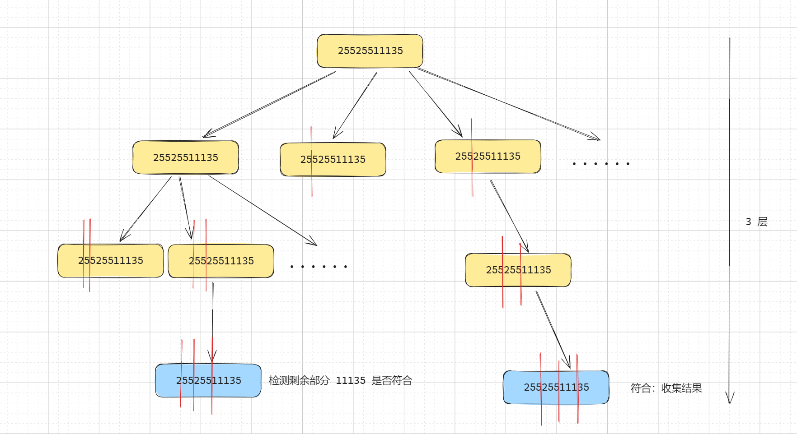

通过不断移动切割的位置来讲所有的情况遍历。

在切割过程中需要注意的是

1. 一共只能分割三次，因为 IP 是由四个整数组成的
2. 每次分割时要进行检测


下面来讲解具体的代码实现：

首先就是如何实现字符串的切割：这里用到的方法和上面分割回文字符串相同，也就是通过 index 表示本次切割的起点，通过循环变量 i 表示切割的终点

```java
for (int i = index; i < s.length(); i++) {
    if ((i - index + 1) <= 3 && isValid(s, index, i)) {
        pointNum++;
        path.add(s.substring(index, i + 1));
    } else {
        continue;
    }
    backtracking(i+1, s);
    pointNum--;
    path.remove(path.size() - 1);
}
```

同时因为一共分割四次的限制，所以需要有一个变量来记录分割的次数 `pointNum`


分割的终点就是这个 `pointNum` 达到 `3` 的时候，也就是分割了三次，这时候要验证最后一段是否符合，如果符合就将其存入结果中

```java
    if (pointNum == 3) {
        if (isValid(s, index, s.length()-1)) {
            // 对结果的处理
            String temp = String.join(".", path);
            temp += ".";
            temp += s.substring(index, s.length());
            res.add(temp);
        }
    	return;
    }
```


最后就是如何判断分割的部分是否符合标准，总结一下判断标准

1. 不能是 0 开头的数字
2. 数字范围在 0 到 255

所以可以得出这样的逻辑：

- 首先判断字符串长度是否小于 `3` 同时大于 `0`（避免了转换越界的情况）
- 然后判断这个数字是否是以`0` 开头的数字
- 再去判断转换的数字是否在规定范围内

其中第一步在上面的 for 循环中已经做过了 `if ((i - index + 1) <= 3 && isValid(s, index, i))` 这里只需要判断 `0` 即可

```java
    public boolean isValid(String s, int startIndex, int endIndex) {
        int length = endIndex - startIndex + 1;
        if (length > 0) {
            String substr = s.substring(startIndex, endIndex+1);
            int number = Integer.parseInt(substr);
            // 表明是含有前导 0 的
            if (substr.length() > 1 && substr.startsWith("0")) {
                return false;
            }
            // 整数大小不符合规范
            if (!(number >= 0 && number <= 255)) {
                return false;
            }
            return true;
        } else {
            return false;
        }

    }
```


#### 1.3 代码

```java
class Solution {
    List<String> res = new ArrayList<>();
    List<String> path = new ArrayList<>(); // 路径变量
    int num = 0; // 统计分割的次数
    int pointNum = 0;
    public List<String> restoreIpAddresses(String s) {
        backtracking(0, s);
        return res;
    }
    public void backtracking(int index, String s) {
        if (pointNum == 3) {
            if (isValid(s, index, s.length()-1)) {
                String temp = String.join(".", path);
                temp += ".";
                temp += s.substring(index, s.length());
                res.add(temp);
            }
            return;
        }
        for (int i = index; i < s.length(); i++) {
            if ((i - index + 1) <= 3 && isValid(s, index, i)) {
                pointNum++;
                path.add(s.substring(index, i + 1));    
            } else {
                continue;
            }
            backtracking(i+1, s);
            pointNum--;
            path.remove(path.size() - 1);
        }
    }
    /**
     判断是否是正确的 IP 地址
     */
    public boolean isValid(String s, int startIndex, int endIndex) {
        int length = endIndex - startIndex + 1;
        if (length > 0) {
            String substr = s.substring(startIndex, endIndex+1);
            int number = Integer.parseInt(substr);
            // 表明是含有前导 0 的
            if (substr.length() > 1 && substr.startsWith("0")) {
                return false;
            }
            // 整数大小不符合规范
            if (!(number >= 0 && number <= 255)) {
                return false;
            }
            return true;
        } else {
            return false;
        }

    }
}
```


### 02. 子集（No. 78）

[题目链接](https://leetcode.cn/problems/subsets/)

[代码随想录题解](https://programmercarl.com/0078.%E5%AD%90%E9%9B%86.html#%E7%AE%97%E6%B3%95%E5%85%AC%E5%BC%80%E8%AF%BE)

#### 2.1 题目

给你一个整数数组 `nums` ，数组中的元素 **互不相同** 。返回该数组所有可能的子集（幂集）。

解集 **不能** 包含重复的子集。你可以按 **任意顺序** 返回解集。

**示例 1：**

> 输入：nums = [1,2,3]
> 输出：[[],[1],[2],[1,2],[3],[1,3],[2,3],[1,2,3]]

**示例 2：**

> 输入：nums = [0]
> 输出：[[],[0]]

**提示：**

- `1 <= nums.length <= 10`
- `-10 <= nums[i] <= 10`
- `nums` 中的所有元素 **互不相同**


#### 2.2 笔记

子集问题其实就是组合问题的一种变式，组合问题是收集长度为 `k` 的组合，而子集问题就是收集长度为 `0` 到 `nums.length` 的所有组合。

这也就导致了其收集结果的位置和组合问题不同

这是收集长度为 `2` 的组合的递归树

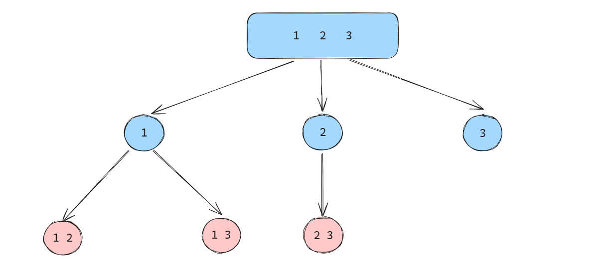

这是收集子集的递归树

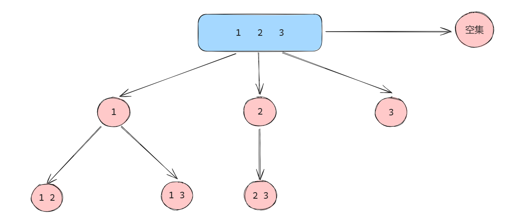

上述粉色的部分表示收集的结果，可以看出，子集就是对每个节点都做了信息的收集

```java
for (int i = index; i < nums.length; i++) {
    path.add(nums[i]);
    res.add(new ArrayList(path));
    backtracking(i+1, nums);
    path.remove(path.size() - 1);
}
```

就是讲 `res.add()` 放到了 `for` 循环中

递归的终点就是起点越界的时候：

```java
if (index > nums.length - 1) {
    return;
}
```

最后不要忘记将空集加上即可


#### 2.3 代码

```java
class Solution {
    List<Integer> path = new ArrayList<>();
    List<List<Integer>> res = new ArrayList<>();
    public List<List<Integer>> subsets(int[] nums) {
        res.add(new ArrayList<>());
        backtracking(0, nums);
        return res;
    }
    public void backtracking(int index, int[] nums) {
        if (index > nums.length - 1) {
            return;
        }
        for (int i = index; i < nums.length; i++) {
            path.add(nums[i]);
            res.add(new ArrayList(path));
            backtracking(i+1, nums);
            path.remove(path.size() - 1);
        }
    }
}
```


### 03. 子集 II（No. 90）

[题目链接](https://leetcode.cn/problems/subsets-ii/description/)

[代码随想录题解](https://programmercarl.com/0090.%E5%AD%90%E9%9B%86II.html)

#### 3.1 题目

给你一个整数数组 `nums` ，其中可能包含重复元素，请你返回该数组所有可能的子集（幂集）。

解集 **不能** 包含重复的子集。返回的解集中，子集可以按 **任意顺序** 排列。

 

**示例 1：**

> 输入：nums = [1,2,2]
> 输出：[[],[1],[1,2],[1,2,2],[2],[2,2]]

**示例 2：**

> 输入：nums = [0]
> 输出：[[],[0]]

 

**提示：**

- `1 <= nums.length <= 10`
- `-10 <= nums[i] <= 10`


#### 3.2 笔记

做过 [组合总和II](https://leetcode.cn/problems/combination-sum-ii/description/) 的朋友对这种题目一定不陌生，这道题目其实就是 组合总和II 与上一题 子集的结合，组合总和II 的详解在这里，建议先做完再来尝试本题。

[代码随想录刷题笔记 DAY 26 | 组合总和 No.39 | 组合求和 II No.40 | 分割回文串 No.131](https://blog.csdn.net/weixin_74895237/article/details/136115379?spm=1001.2014.3001.5501)

本题的特点就是题目中出现了有相同元素的数组，所以需要做到层级去重，收集结果的方式和上面一题完全相同，这里直接给出代码。


#### 3.3 代码

```java
class Solution {
    List<Integer> path = new ArrayList<>();
    List<List<Integer>> res = new ArrayList<>();
    public List<List<Integer>> subsetsWithDup(int[] nums) {
        Arrays.sort(nums);
        res.add(new ArrayList<>());
        backtracking(0, nums);
        return res;
    }
    public void backtracking(int index, int[] nums) {
        // 和上题相同的出口
        if (index > nums.length - 1) {
            return;
        }
        for (int i = index; i < nums.length; i++) {
            // 层级的去重
            if (i > index && nums[i-1] == nums[i]) {
                continue;
            } else {
                path.add(nums[i]);
            }
            res.add(new ArrayList<>(path));
            backtracking(i+1, nums);
            path.remove(path.size() - 1);
        }
    }
}
```


## Day 29

### 01. 非递减子序列（No. 491）

[题目链接](https://leetcode.cn/problems/non-decreasing-subsequences/description/)

[代码随想录题解](https://programmercarl.com/0491.%E9%80%92%E5%A2%9E%E5%AD%90%E5%BA%8F%E5%88%97.html#%E4%BC%98%E5%8C%96)

#### 1.1 题目

给你一个整数数组 `nums` ，找出并返回所有该数组中不同的递增子序列，递增子序列中 **至少有两个元素** 。你可以按 **任意顺序** 返回答案。

数组中可能含有重复元素，如出现两个整数相等，也可以视作递增序列的一种特殊情况。

 

**示例 1：**

> 输入：nums = [4,6,7,7]
> 输出：[[4,6],[4,6,7],[4,6,7,7],[4,7],[4,7,7],[6,7],[6,7,7],[7,7]]

**示例 2：**

> 输入：nums = [4,4,3,2,1]
> 输出：[[4,4]]

 

**提示：**

- `1 <= nums.length <= 15`
- `-100 <= nums[i] <= 100`


#### 1.2 笔记

看完题目，很容易就可以发现，递增子序列就是 **符合递增条件的子集**，而且其中会包含重复元素，这就和昨天做到的题目 [子集 II](https://leetcode.cn/problems/subsets-ii/description/) 十分相似，建议做完这道题再来看本题的题解

[代码随想录刷题笔记 DAY 28 | 复原 IP 地址 No.93 | 子集 No.78 | 子集 II No.90](https://blog.csdn.net/weixin_74895237/article/details/136141635?spm=1001.2014.3001.5501)

但是有一个很大的坑：

**递增子序列是无法通过排序来去重的**

回顾一下子集中如果出现重复的元素的去重方式

`[1 2 2]` ，将这个数组进行排序如果一层中遇到相同的元素就进行 `continue`

但递增子序列的问题就是它的顺序是固定的，不能通过排序来去重。

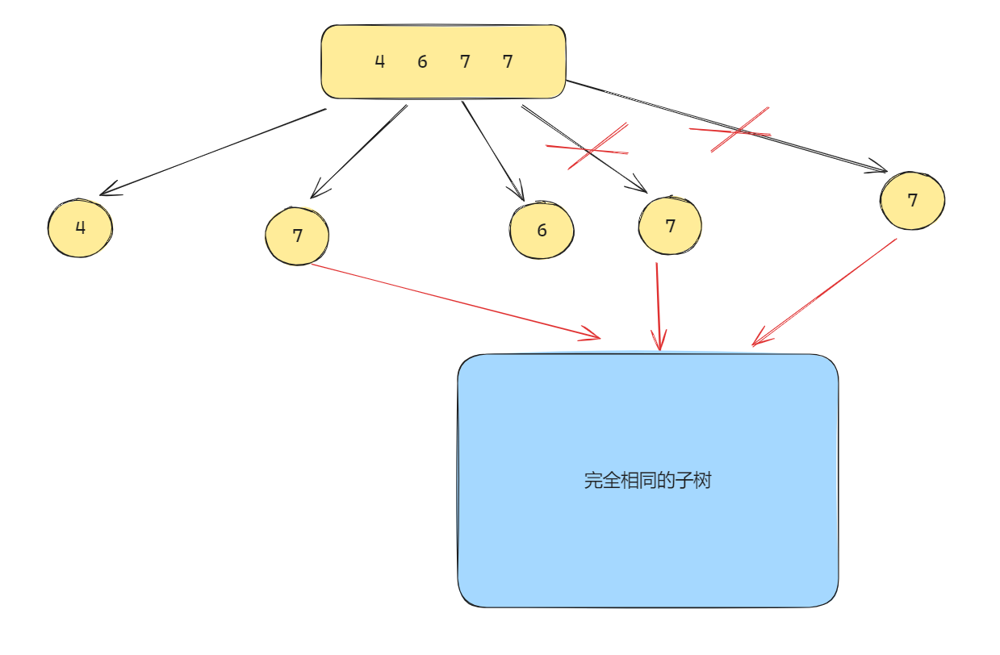

比如说如上的这种情况，所有的节点都会去遍历相同的子树，这就导致了重复。

所以要做的是 **层内去重**，但是又不能通过排序的方式，所以我们可以想到在每一层去声明一个 `record` 当发现后续遍历的内容已经在 `record` 中出现的时候就跳过本次遍历。

这个 `record` 可以采用哈希方式实现，也可以使用列表方式去实现，显然哈希的实现方式更好

```java
    public void backtracking(int index, int[] nums) {
        if (index > nums.length - 1) {
            return;
        }
        int[] record = new int[300];
        for (int i = index; i < nums.length; i++) {
            // 去重操作
            if (i > index && record[nums[i]+100] > 0) {
                continue;
            } else {
                record[nums[i] + 100] = 1;
            }
           // ...
        }
    }
```

因为 `nums[i]` 的范围是在 `-100` 到 `100` 的范围内的，所以这里将 `nums[i] + 100` 存入数组，避免出现越界的情况。

这样就完成了层内的去重，剩下的就是考虑如何保证递增了。

显然这里也有两种选择：

- 写一个方法，每次去判断 `path` 是否符合
- 在递归过程中去判断

先来看比较容易理解的第一个方法

```java
 public boolean isValid(List<Integer> path) {
        if (path.size() <= 1) {
            return false;
        }
        int currentMax = Integer.MIN_VALUE;
        for (int i : path) {
            if(i < currentMax) {
                return false;
            } else {
                currentMax = i;
            }
        }
        return true;
}
```

判断一个列表是否非递减，只需要在递增中不断更新 `currentMax` 并且确定后面的元素是否大于等于这个 `current` 即可。

在递归中也是相同的思路，只需要判断 `nums[i]` 是否大于等于 `path.get(size() - 1)` 也就是最后一个元素即可，否则，同样 `continue`。

```java
    if (!path.isEmpty() && nums[i] < path.get(path.size() - 1)) {
    	continue;
    } else {
    	record[nums[i] + 100] = 1;
    }
```

将这段代码和上面去重的代码组成一个 `if` 语句，写出代码。

#### 1.3 代码

```java
class Solution {
    List<Integer> path = new ArrayList<>();
    List<List<Integer>> res = new ArrayList<>();
    public List<List<Integer>> findSubsequences(int[] nums) {
        backtracking(0, nums);
        return res;
    }
    public void backtracking(int index, int[] nums) {
        if (index > nums.length - 1) {
            return;
        }
        int[] record = new int[300];
        for (int i = index; i < nums.length; i++) {
            // 去重操作
            if (i > index && record[nums[i]+100] > 0 ||
                !path.isEmpty() && nums[i] < path.get(path.size() - 1)) {
                continue;
            } else {
                record[nums[i] + 100] = 1;
            }
            path.add(nums[i]);
            if (path.size() > 1) {
                res.add(new ArrayList(path));
            }
            backtracking(i+1, nums);
            path.remove(path.size() - 1);
        }
    }
}
```


### 02. 全排列（No. 46）

[题目链接](https://leetcode.cn/problems/permutations/description/)

[代码随想录题解](https://programmercarl.com/0046.%E5%85%A8%E6%8E%92%E5%88%97.html#%E6%80%BB%E7%BB%93)

#### 2.1 题目

给定一个不含重复数字的数组 `nums` ，返回其 *所有可能的全排列* 。你可以 **按任意顺序** 返回答案。

 

**示例 1：**

> 输入：nums = [1,2,3]
> 输出：[[1,2,3],[1,3,2],[2,1,3],[2,3,1],[3,1,2],[3,2,1]]

**示例 2：**

> 输入：nums = [0,1]
> 输出：[[0,1],[1,0]]

**示例 3：**

> 输入：nums = [1]
> 输出：[[1]]

 

**提示：**

- `1 <= nums.length <= 6`
- `-10 <= nums[i] <= 10`
- `nums` 中的所有整数 **互不相同**


#### 2.2 笔记

上面说到过，回溯法可以解决排列问题，这就是一个经典的例子。

当遇到一开始思路不明确的回溯的题，建议大家先把树形结构画出来，这样各种操作就一目了然了。

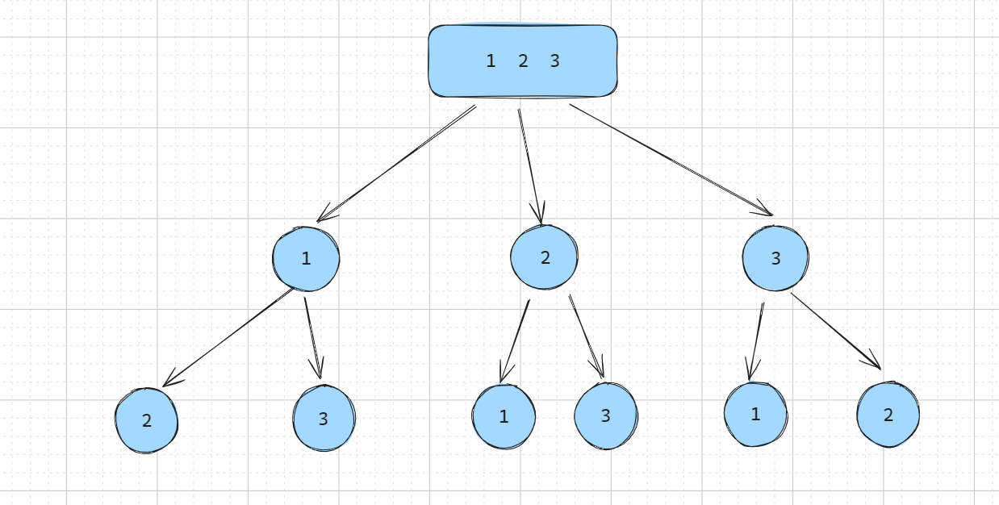

遍历到 `1` 之后就只能遍历 `2` 和 `3` 了，也就是每次遍历到一个节点，在这个节点剩余的遍历过程中，这个节点的值都不能出现，即在数组中删除掉这个遍历过的数。

但在数组中删除的操作时间复杂度相当高，所以很明显需要用到标记数组的方法。

与上题区分开，这里使用 `boolean` 数组

因为这里的去重是在路径中的，对全局的去重，所以标记数组的声明需要在层外

```java
    boolean[] used;
    public List<List<Integer>> permute(int[] nums) {
        used = new boolean[30];
        // ...
    }
	public void backtracking(int[] nums) {
        // ...
    }
```

当路径中遇到遍历过的内容的时候就跳过

```java
		for (int i = 0; i < nums.length; i++) {
            if (used[nums[i] + 10]) {
                continue;
            }
			// ...
        }
```

如果大家做过一些回溯的题目，很容易发现当层内去重的时候就不需要回溯，而路径去重就**需要回溯**，因为层内去重是在一层 `for` 循环中做的。

递归的终点，很显然就是当收集的数量等于数组长度的时候。

```java
        if (path.size() == nums.length) {
            res.add(new ArrayList(path));
            return;
        }
```

写出代码

#### 2.3 代码

```java
class Solution {
    List<Integer> path = new ArrayList<>();
    List<List<Integer>> res = new ArrayList<>();
    boolean[] used;
    public List<List<Integer>> permute(int[] nums) {
        used = new boolean[30];
        backtracking(nums);
        return res;
    }
    public void backtracking(int[] nums) {
        if (path.size() == nums.length) {
            res.add(new ArrayList(path));
            return;
        }
        for (int i = 0; i < nums.length; i++) {
            if (used[nums[i] + 10]) {
                continue;
            }
            path.add(nums[i]);
            used[nums[i] + 10] = true;
            backtracking(nums);
            path.remove(path.size() - 1);
            used[nums[i] + 10] = false;
        }
    }
}
```


### 03. 全排列 II（No. 47）

[题目链接](https://leetcode.cn/problems/permutations-ii/description/)

[代码随想录题解](https://programmercarl.com/0047.%E5%85%A8%E6%8E%92%E5%88%97II.html#%E7%AE%97%E6%B3%95%E5%85%AC%E5%BC%80%E8%AF%BE)

#### 3.1 题目

给定一个可包含重复数字的序列 `nums` ，***按任意顺序*** 返回所有不重复的全排列。

 

**示例 1：**

> 输入：nums = [1,1,2]
> 输出：
> [[1,1,2],
>  [1,2,1],
>  [2,1,1]]

**示例 2：**

> 输入：nums = [1,2,3]
> 输出：[[1,2,3],[1,3,2],[2,1,3],[2,3,1],[3,1,2],[3,2,1]]

 

**提示：**

- `1 <= nums.length <= 8`
- `-10 <= nums[i] <= 10`


#### 3.2 笔记

做过上一题的朋友不用猜也能知道这个题要考察的是什么

就是在数组中加上重复的元素，考察层内去重的问题

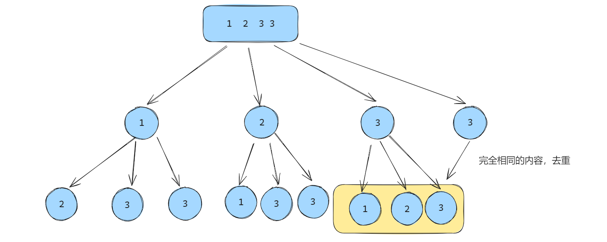

所以这道题除了上题的路径去重还需要添加上层内去重。

但路径去重的时候应该注意，不能再以 `nums[i]` 作为标识了，因为内部含有相同的元素，所以应该使用 `i` 下标作为去重的标识。

```java
		for (int i = 0; i < nums.length; i++) {
            if (used[i]) {
                continue;
            }
			// ...
        }
```

然后只需要加上层内去重的代码就大功告成了

本题几乎没有新的内容，只需要注意路径去重的逻辑即可。

#### 3.3 代码

```java
class Solution {
    List<Integer> path = new ArrayList<>();
    List<List<Integer>> res = new ArrayList<>();
    boolean[] used;
    public List<List<Integer>> permute(int[] nums) {
        used = new boolean[30];
        backtracking(nums);
        return res;
    }
    public void backtracking(int[] nums) {
        if (path.size() == nums.length) {
            res.add(new ArrayList(path));
            return;
        }
        for (int i = 0; i < nums.length; i++) {
            if (used[nums[i] + 10]) {
                continue;
            }
            path.add(nums[i]);
            used[nums[i] + 10] = true;
            backtracking(nums);
            path.remove(path.size() - 1);
            used[nums[i] + 10] = false;
        }
    }
}
```


## Day 30

### 01. 分发饼干（No. 455）

[题目链接](https://leetcode.cn/problems/assign-cookies/description/)

[代码随想录题解](https://programmercarl.com/0455.%E5%88%86%E5%8F%91%E9%A5%BC%E5%B9%B2.html)

#### 1.1 题目

假设你是一位很棒的家长，想要给你的孩子们一些小饼干。但是，每个孩子最多只能给一块饼干。

对每个孩子 `i`，都有一个胃口值 `g[i]`，这是能让孩子们满足胃口的饼干的最小尺寸；并且每块饼干 `j`，都有一个尺寸 `s[j]` 。如果 `s[j] >= g[i]`，我们可以将这个饼干 `j` 分配给孩子 `i` ，这个孩子会得到满足。你的目标是尽可能满足越多数量的孩子，并输出这个最大数值。

 

**示例 1:**

> 输入: g = [1,2,3], s = [1,1]
> 输出: 1
> 解释: 
> 你有三个孩子和两块小饼干，3个孩子的胃口值分别是：1,2,3。
> 虽然你有两块小饼干，由于他们的尺寸都是1，你只能让胃口值是1的孩子满足。
> 所以你应该输出1。

**示例 2:**

> 输入: g = [1,2], s = [1,2,3]
> 输出: 2
> 解释: 
> 你有两个孩子和三块小饼干，2个孩子的胃口值分别是1,2。
> 你拥有的饼干数量和尺寸都足以让所有孩子满足。
> 所以你应该输出2.

 

**提示：**

- `1 <= g.length <= 3 * 104`
- `0 <= s.length <= 3 * 104`
- `1 <= g[i], s[j] <= 231 - 1`


#### 1.2 笔记

贪心算法就是局部最优解来推出全局最优解。

那如何能保证最多的孩子能够吃饱呢？

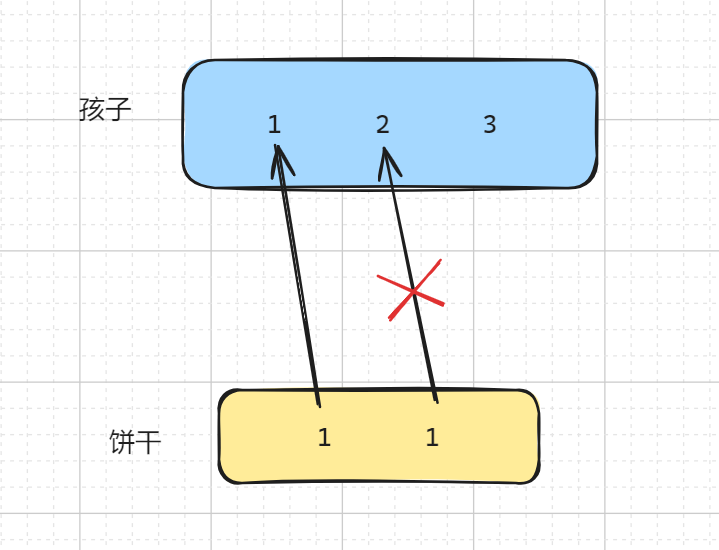

其实思路也比较简单，先满足 **用质量小的饼干胃口小的孩子**，这样就能保证满足的孩子最多。

所以为了保证这个顺序，需要先将孩子的胃口和饼干的质量做一个排序，然后使用双指针去遍历这两个数组，直到饼干分发完或者孩子全部满足。

```java
// 将两个数组排序
Arrays.sort(g);
Arrays.sort(s);
int i = 0; // 指向 g 的指针
int j = 0; // 指向 s 的指针
while(i < g.length && j < s.length) {
	// ... 
}
```

在 `while` 循环中，当饼干可以满足孩子的时候就同时移动指针，否则就只移动饼干数组的指针直到能找到满足孩子的饼干为止。

#### 1.3 代码

```java
class Solution {
    public int findContentChildren(int[] g, int[] s) {
        int num = 0;
        // 将两个数组排序
        Arrays.sort(g);
        Arrays.sort(s);
        int i = 0; // 指向 g 的指针
        int j = 0; // 指向 s 的指针
        while(i < g.length && j < s.length) {
            if (s[j] >= g[i]) {
                num++;
                i++;
                j++;
            } else {
                j++;
            }
        }
        return num;
    }
}
```


### 02. 摆动序列（No. 376）

[题目链接](https://leetcode.cn/problems/wiggle-subsequence/)

[代码随想录题解](https://programmercarl.com/0376.%E6%91%86%E5%8A%A8%E5%BA%8F%E5%88%97.html)

#### 2.1 题目

如果连续数字之间的差严格地在正数和负数之间交替，则数字序列称为 **摆动序列 。**第一个差（如果存在的话）可能是正数或负数。仅有一个元素或者含两个不等元素的序列也视作摆动序列。

- 例如， `[1, 7, 4, 9, 2, 5]` 是一个 **摆动序列** ，因为差值 `(6, -3, 5, -7, 3)` 是正负交替出现的。
- 相反，`[1, 4, 7, 2, 5]` 和 `[1, 7, 4, 5, 5]` 不是摆动序列，第一个序列是因为它的前两个差值都是正数，第二个序列是因为它的最后一个差值为零。

**子序列** 可以通过从原始序列中删除一些（也可以不删除）元素来获得，剩下的元素保持其原始顺序。

给你一个整数数组 `nums` ，返回 `nums` 中作为 **摆动序列** 的 **最长子序列的长度** 。

 

**示例 1：**

> 输入：nums = [1,7,4,9,2,5]
> 输出：6
> 解释：整个序列均为摆动序列，各元素之间的差值为 (6, -3, 5, -7, 3) 。

**示例 2：**

> 输入：nums = [1,17,5,10,13,15,10,5,16,8]
> 输出：7
> 解释：这个序列包含几个长度为 7 摆动序列。
> 其中一个是 [1, 17, 10, 13, 10, 16, 8] ，各元素之间的差值为 (16, -7, 3, -3, 6, -8) 。

**示例 3：**

> 输入：nums = [1,2,3,4,5,6,7,8,9]
> 输出：2

 

**提示：**

- `1 <= nums.length <= 1000`
- `0 <= nums[i] <= 1000`


#### 2.2 笔记

这道题目给我的感觉就是要考虑的条件太多了，先将大致的图画出来再来总结一共有哪些情况。

先来看最基础的情况，也就是没有平坡的时候：

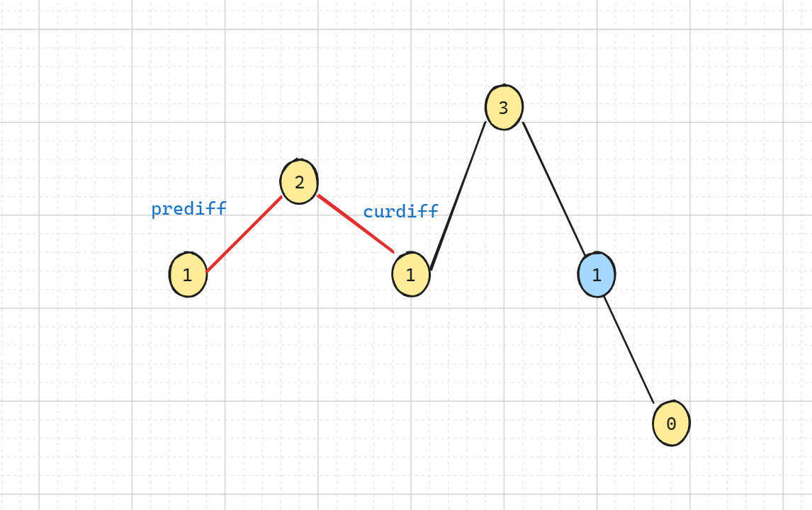

先来看判断摆动的依据，最终的结果通过 `num` 来存储；将本节点与上一个节点的差值设为 `prediff` 将下一个节点与本节点的差值定为 `curdiff`，判断摆动的条件就是 `prediff < 0 && curdiff > 0` 和 `prediff > 0 && curdiff < 0`，取等的情况这里先按下不表。

因为要判断前后两部分的差值，所以 **遍历必然是从中间开始**，也就是 **开头和结尾** 必须做特殊的处理；但比如整个数组都是平的，比如这种情况：

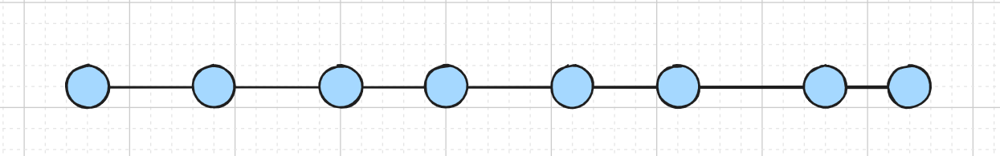

这种情况下摆动序列的长度是 `1`，所以我们可以先选择 **结尾的元素将其作为这个 `1`**，所以结果 `num` 的初始值应该设为 `1`。

说到这里很多朋友可能不理解

- 先是上面这种情况，也就是完全的平坡，我们将 **最后一个节点** 作为选取的节点，最后返回 `1`

- 然后来看第二种情况：
  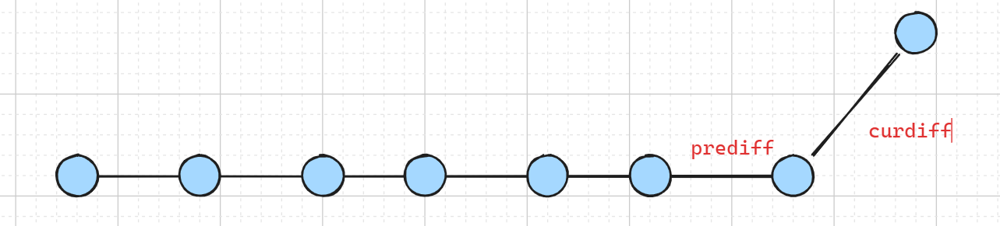

  当遍历到倒数第二个节点的时候因为形成了一个摆动，所以最终的结果需要 `num++`，得到的结果就是 `2` 也就是要求的最后一个结果。

处理完了结尾的元素，接下来就是 **开头的元素** 了，因为这里将结尾元素作为这个 `1` ，结尾元素无需去遍历，但是开头元素是需要去遍历的，即遍历的范围是从 `0` 到 `nums.length - 1`，这里的 `prediff` 的设置又成了问题，因为 `nums[0]` 前面是没有元素的。

所以这里采用经典的补节点的方式，在 `nums[0]`  这个节点前面再补充上一个节点

那补充上什么不会影响摆动序列的长度呢？

毫无疑问是补充上和 `nums[0]` 相同的节点，**所以初始的 `prediff` 设置为 `0`**，随后 `prediff` 随着 `curdiff` 做更新。

解决完开头和结尾就可以写出基本的代码了：

```java
    int num = 1; // 结果
    int prediff = 0;
    for (int i = 0; i < nums.length - 1; i++) {
        int curdiff = nums[i + 1] - nums[i];
        if (prediff > 0 && curdiff < 0 || prediff < 0 && curdiff > 0) {
            num++;
        }
        prediff = curdiff;
    }
    return num;
```

提交后显然是不对的，因为还有 **平坡** 的情况需要讨论

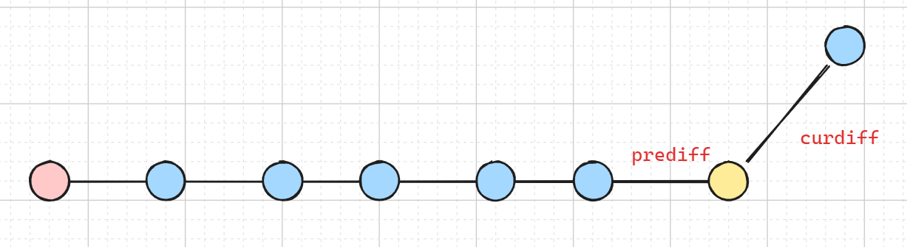

通过上面的讲述，可以知道结果为 `2` 这个 `2` 是由最后一个节点和其前面一个节点构成的，那粉色的节点是否也能取代这个黄色的节点作为最终的节点呢？

答案是当然可以，这就是当遇到平坡的时候的应对策略的问题，可以选择删除粉色节点后面的所有节点，也可以选择删除黄色节点前面的所有节点，这两种策略是都可行的。

如果要删除黄色前面的所有节点或者粉色后面的所有节点，判断条件都是这样的：

```java
if (prediff >= 0 && curdiff < 0 || prediff <= 0 && curdiff > 0) {
    num++;
}
```

当然黄色的很好理解，但是为什么粉色的也是这样的呢？这里仍然按下不表，留到下一种情况再做叙述。

到这里其实就可以写出较为完整的代码了：

```java
        int num = 1; // 结果
        int prediff = 0;
        for (int i = 0; i < nums.length - 1; i++) {
            int curdiff = nums[i + 1] - nums[i];
            if (prediff >= 0 && curdiff < 0 || prediff <= 0 && curdiff > 0) {
                num++;
            }
            prediff = curdiff;
        }
        return num;
```

按照这样提交上去还是错误，因为还有最后一种情况没有考虑：


就是这种单调且含有平坡的情况，这种情况输出的是 `1` 但是通过上面的算法其实输出的是 `2`，是因为上面的算法取了粉色节点、黄色节点和最后一个节点，这是因为 `prediff` 随着 `curdiff` 做更新，导致后面的黄色节点也被取到了。

解决的方法就是 `prediff` 不随着 `curdiff` 做更新，而是当出现摆动的时候再做更新，即上面的 `prediff` 在黄色结点之前都取得粉色减去第一个节点值，这也就使得即使遍历到黄色位置的节点也不会出现 `prediff` **不对等** 的情况。

所以这里我们**既可以看作是删除掉粉色节点后面的节点，也可以看作是删除掉了黄色节点前面的节点**。

说到这里所有的情况就将讲完了，写出最终的代码。

#### 2.3 代码

```java
class Solution {
    public int wiggleMaxLength(int[] nums) {
        int num = 1; // 结果
        int prediff = 0;
        for (int i = 0; i < nums.length - 1; i++) {
            int curdiff = nums[i + 1] - nums[i];
            if (prediff >= 0 && curdiff < 0 || prediff <= 0 && curdiff > 0) {
                num++;
                prediff = curdiff;
            }
        }
        return num;
    }
}
```


### 03. 最大子数组和（No. 53）

[题目链接](https://leetcode.cn/problems/maximum-subarray/description/)

[代码随想录题解](https://programmercarl.com/0053.%E6%9C%80%E5%A4%A7%E5%AD%90%E5%BA%8F%E5%92%8C.html#%E7%AE%97%E6%B3%95%E5%85%AC%E5%BC%80%E8%AF%BE)

#### 3.1 题目

给你一个整数数组 `nums` ，请你找出一个具有最大和的连续子数组（子数组最少包含一个元素），返回其最大和。

**子数组** 是数组中的一个连续部分。

 

**示例 1：**

> 输入：nums = [-2,1,-3,4,-1,2,1,-5,4]
> 输出：6
> 解释：连续子数组 [4,-1,2,1] 的和最大，为 6 。

**示例 2：**

> 输入：nums = [1]
> 输出：1

**示例 3：**

> 输入：nums = [5,4,-1,7,8]
> 输出：23

 

**提示：**

- `1 <= nums.length <= 105`
- `-104 <= nums[i] <= 104`


#### 3.2 笔记

相比较贪心，本题的动态规划更容易理解，也是我第一个想到的方法。

动态规划最重要的是先来确定 `dp[i]` 代表着什么含义，思考一下，一个如果目前遍历到当前的一个节点，它只有三种选择：

- 将本节点加到前面的节点上
- 或者是从本节点开始遍历
- 不取本节点

所以写出如下的代码

```java
for (int i = 1; i < nums.length; i++) {
	dp[i] = Math.max(nums[i], dp[i-1] + nums[i]);
	dp[i] = Math.max(nums[i-1], dp[i]);
}
```

但是是错误的，因为在这种情况下取得的其实是整个数组的最大和，而不是最大连续子序列，因为在这里 `dp[i]` 的含义是在包含 `nums[i]` 的节点中任取之后得到的最大值。

而如果要连续的话，`dp[i]` 的值就是从本节点开始取值或者将本节点加到前面的连续节点上，这两个中的最大值。

所以写出来应该是：

```java
for (int i = 1; i < nums.length; i++) {
	dp[i] = Math.max(nums[i], dp[i-1] + nums[i]);
}
```

然后还需要一个收集结果的节点，因为此时的 `dp` 数组的最后一个元素不一定是最大值。

```java
for (int i = 1; i < nums.length; i++) {
    dp[i] = Math.max(nums[i], dp[i-1] + nums[i]);
    res = Math.max(res, dp[i]);
}
```

写出代码


#### 3.3 代码

```java
class Solution {
    public int maxSubArray(int[] nums) {
        int[] dp = new int[nums.length];
        dp[0] = nums[0];
        int res = nums[0];
        for (int i = 1; i < nums.length; i++) {
            dp[i] = Math.max(nums[i], dp[i-1] + nums[i]);
            res = Math.max(res, dp[i]);
        }
        return res;
    }
}
```


## Day 31

### 01. 买卖股票的最佳时机 II（No. 122）

[题目链接](https://leetcode.cn/problems/best-time-to-buy-and-sell-stock-ii/)

[代码随想录题解](https://programmercarl.com/0122.%E4%B9%B0%E5%8D%96%E8%82%A1%E7%A5%A8%E7%9A%84%E6%9C%80%E4%BD%B3%E6%97%B6%E6%9C%BAII.html#%E6%80%9D%E8%B7%AF)

#### 1.1 题目

给你一个整数数组 `prices` ，其中 `prices[i]` 表示某支股票第 `i` 天的价格。

在每一天，你可以决定是否购买和/或出售股票。你在任何时候 **最多** 只能持有 **一股** 股票。你也可以先购买，然后在 **同一天** 出售。

返回 *你能获得的 **最大** 利润* 。

 

**示例 1：**

> 输入：prices = [7,1,5,3,6,4]
> 输出：7
> 解释：在第 2 天（股票价格 = 1）的时候买入，在第 3 天（股票价格 = 5）的时候卖出, 这笔交易所能获得利润 = 5 - 1 = 4 。
>      随后，在第 4 天（股票价格 = 3）的时候买入，在第 5 天（股票价格 = 6）的时候卖出, 这笔交易所能获得利润 = 6 - 3 = 3 。
>      总利润为 4 + 3 = 7 。

**示例 2：**

> 输入：prices = [1,2,3,4,5]
> 输出：4
> 解释：在第 1 天（股票价格 = 1）的时候买入，在第 5 天 （股票价格 = 5）的时候卖出, 这笔交易所能获得利润 = 5 - 1 = 4 。
>      总利润为 4 。

**示例 3：**

> 输入：prices = [7,6,4,3,1]
> 输出：0
> 解释：在这种情况下, 交易无法获得正利润，所以不参与交易可以获得最大利润，最大利润为 0 。

 

**提示：**

- `1 <= prices.length <= 3 * 104`
- `0 <= prices[i] <= 104`


#### 1.2 笔记

初次见到这个题的时候大家想的可能是选择价格最低的买入再选择价格最高的卖出，但显然是不合理的，因为可以有 **多次买入和卖出** 来收取多次的利润。

但其实利润是可以分解的，先选择价格低的时候买入，价格高的时候直接卖出。

两天之间其实只有三种情况：

- **后一天比前一天贵**
- **后一天比前一天便宜**
- **后一天和前一天一样多**

本题是可以在同一天去卖出的，所以采取这样的贪心策略：

- 如果后一天比前一天便宜那就将 **前一天的卖出** 再去买后一天的
- 如果后一天比前一天贵，那就直接卖出来收取利息，并且 **买入这一天的股票**
- 后一天和前一天一样多的话不做处理即可

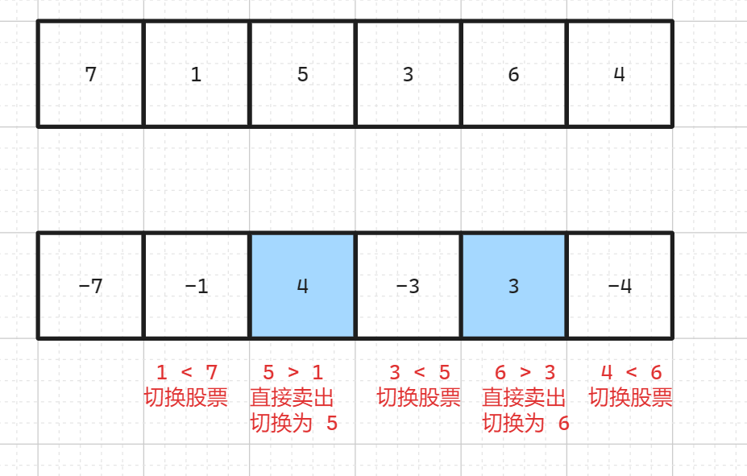

其实取得的就是所有的正数和，举不出其他的反例，来试试贪心算法

```java
class Solution {
    public int maxProfit(int[] prices) {
        int[] dp = new int[prices.length];
        int res = 0;
        int pre = prices[0]; // 记录昨天的金钱
        for (int i = 1; i < prices.length; i++) {
            if (prices[i] > pre) {
                // 说明今天的股价升高了 卖出并且将今天的买入
                res += prices[i] - pre;
                pre = prices[i];
            } else {
                pre = prices[i];
            }
        }
        return res;
    }
}
```

可以发现 `if` 和 `else` 都有 `pre = prives[i]` 的语句，提取到外面，这是因为无论何种情况，都买入了今天的股票。


#### 1.3 代码

```java
class Solution {
    public int maxProfit(int[] prices) {
        int[] dp = new int[prices.length];
        int res = 0;
        int pre = prices[0]; // 记录昨天的金钱
        for (int i = 1; i < prices.length; i++) {
            if (prices[i] > pre) {
                // 说明今天的股价升高了 卖出并且将今天的买入
                res += prices[i] - pre;   
            }
            pre = prices[i];
        }
        return res;
    }
}
```


### 02. 跳跃游戏（No. 55）

[题目链接](https://leetcode.cn/problems/jump-game/)

[代码随想录题解](https://programmercarl.com/0055.%E8%B7%B3%E8%B7%83%E6%B8%B8%E6%88%8F.html#%E7%AE%97%E6%B3%95%E5%85%AC%E5%BC%80%E8%AF%BE)

#### 2.1 题目

给你一个非负整数数组 `nums` ，你最初位于数组的 **第一个下标** 。数组中的每个元素代表你在该位置可以跳跃的最大长度。

判断你是否能够到达最后一个下标，如果可以，返回 `true` ；否则，返回 `false` 。

 

**示例 1：**

> 输入：nums = [2,3,1,1,4]
> 输出：true
> 解释：可以先跳 1 步，从下标 0 到达下标 1, 然后再从下标 1 跳 3 步到达最后一个下标。

**示例 2：**

> 输入：nums = [3,2,1,0,4]
> 输出：false
> 解释：无论怎样，总会到达下标为 3 的位置。但该下标的最大跳跃长度是 0 ， 所以永远不可能到达最后一个下标。

 

**提示：**

- `1 <= nums.length <= 104`

- `0 <= nums[i] <= 105`

  

#### 2.2 笔记

遇到这个题的时候，纠结的就是我在这个节点上跳**几步**呢？

其实完全不需要考虑，我们只需要考虑这个节点 **最远** 能到哪个位置就可以了，因为上一个节点能够到达这个节点，这个节点又能取到最远的这个节点，所以 

**节点可以到达这个范围内的任何位置**

只需要判断这个最远举例能否延伸到最后一个节点即可。

比如上面的案例 `1`

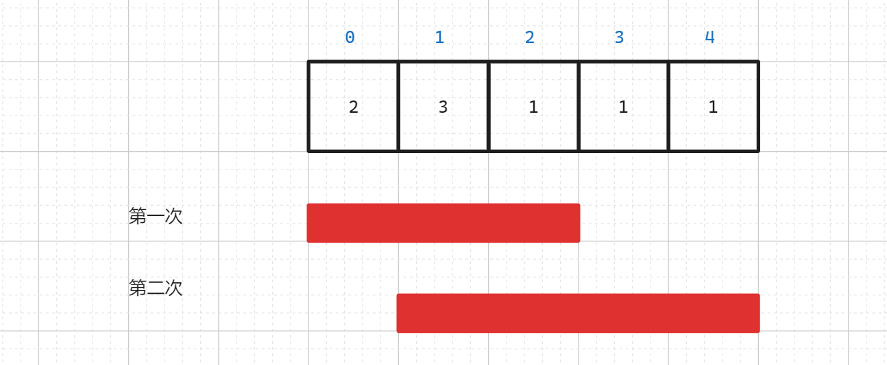

先根据节点 `0` 可以到达节点 `1` 和节点 `2`，通过节点 `1` 又可以最远到达节点 `4`，这时候就可以返回 `true`。


再来看另一个案例

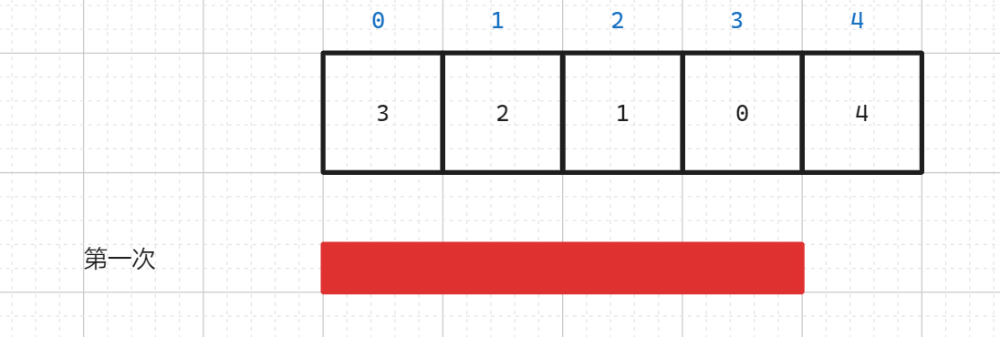

通过节点 `0` 可以到达节点 `3`，所以在 `0 - 3` 的范围内去寻找另一个最远的距离，发现直到遍历到 `3` 也无法到达节点 `4`，出循环，直接返回 `false`。

所以能得到如下的贪心策略：

- 先找第一个节点能到达的最远距离，遍历这个范围看第二次**最远**能到达哪里，重复这个步骤，直到这个最远能够到达最后的位置。
- 如果遍历完**整个范围**还是没能扩展这个范围，说明被困死在这个范围中了，必然无法到达目标节点。

先定义一个 变量 `cover` 来存储，从**起始节点**能到达的最远距离

```java
int cover = 0;
```

然后去循环整个数组，直到到达最终的节点或者发现其 **被困死**

```java
    // 遍历从 i 到 cover 这个范围
	for (int i = 0; i <= cover; i++) {
        cover = Math.max(i + nums[i], cover);
        if (cover >= nums.length - 1) {
        	return true;
        }
    }
    return false;
```


#### 2.3 代码

```java
class Solution {
    public boolean canJump(int[] nums) {
        int cover = 0;
        if (nums.length <= 1) {
            return true;
        }
        // 遍历从 i 到 cover 这个范围
        for (int i = 0; i <= cover; i++) {
            cover = Math.max(i + nums[i], cover);
            if (cover >= nums.length - 1) {
                return true;
            }
        }
        return false;
    }
}
```


### 03. 跳跃游戏 II（No. 45）

[题目链接](https://leetcode.cn/problems/jump-game-ii/description/)

[代码随想录题解](https://programmercarl.com/0045.%E8%B7%B3%E8%B7%83%E6%B8%B8%E6%88%8FII.html#%E7%AE%97%E6%B3%95%E5%85%AC%E5%BC%80%E8%AF%BE)

#### 3.1 题目

给定一个长度为 `n` 的 **0 索引**整数数组 `nums`。初始位置为 `nums[0]`。

每个元素 `nums[i]` 表示从索引 `i` 向前跳转的最大长度。换句话说，如果你在 `nums[i]` 处，你可以跳转到任意 `nums[i + j]` 处:

- `0 <= j <= nums[i]` 
- `i + j < n`

返回到达 `nums[n - 1]` 的最小跳跃次数。生成的测试用例可以到达 `nums[n - 1]`。

 

**示例 1:**

> 输入: nums = [2,3,1,1,4]
> 输出: 2
> 解释: 跳到最后一个位置的最小跳跃数是 2。
>      从下标为 0 跳到下标为 1 的位置，跳 1 步，然后跳 3 步到达数组的最后一个位置。

**示例 2:**

> 输入: nums = [2,3,0,1,4]
> 输出: 2

 

**提示:**

- `1 <= nums.length <= 104`
- `0 <= nums[i] <= 1000`
- 题目保证可以到达 `nums[n-1]`


#### 3.2 笔记

这道题与上一道题的区别就是本题需要得到的是 **最小跳跃** 的次数

那在一个范围的节点中，什么时候去跳跃能够使得跳跃的次数最短呢？

答案就是从 **跳的最远的那个节点** 开始跳跃

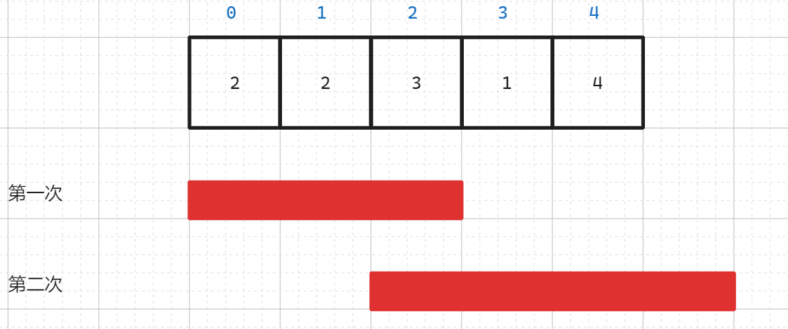

比如上面这个例子，从节点 `0` 可以到达节点 `1` 和节点 `2`，这两个节点都能够去 **扩充** 这个最大范围，但为了保证跳跃的次数最少，选择的节点就是移动的最远的那个节点，即节点 `2`，所以当确定了一个范围后，要去寻找这个 **最远的节点**

因为要完全遍历完整个范围才能知道哪个是最远的，所以需要一个变量来存储 **当前的距离**，还需要一个变量来存储 **最远的距离**

```java
int currentCover = 0; // 此时能到达的最远距离
int nextCover = 0; // 下次能到达的最远距离
int res = 0; // 结果
```

因为本题是保证可以跳到最终的节点的，所以遍历直接从 `0` 到 `nums.length` 即可

```java
for (int i = 0; i <= nums.length; i++) {}
```

接下来要解决的就是什么时候去更新这个 `res` 了，上面说到是找到范围内最远距离的那个节点的时候，其

**也就是 `i` 遍历到 `currentCover` 的时候**，这时候就确定了最远的节点，然后将 `nextCover` 赋值给 `currentCover` 再进行下一次循环。

写出代码。

#### 3.3 代码

```java
class Solution {
    public int jump(int[] nums) {
        int currentCover = 0; // 此时能到达的最远距离
        int nextCover = 0; // 下次能到达的最远距离
        int res = 0; // 结果
        if (nums.length <= 1) {
            return 0;
        }
        for (int i = 0; i <= nums.length; i++) {
            nextCover = Math.max(nums[i] + i, nextCover);
            if (i == currentCover) { //
                res++;
                currentCover = nextCover;
                if (currentCover >= nums.length - 1) {
                    break;
                }
            }
        }
        return res;
    }
}
```


## Day 32

### 01. K 次取反后最大化的数组和（No. 1005）

[题目链接](https://leetcode.cn/problems/maximize-sum-of-array-after-k-negations/description/)

[代码随想录题解](https://programmercarl.com/1005.K%E6%AC%A1%E5%8F%96%E5%8F%8D%E5%90%8E%E6%9C%80%E5%A4%A7%E5%8C%96%E7%9A%84%E6%95%B0%E7%BB%84%E5%92%8C.html)

#### 1.1 题目

给你一个整数数组 `nums` 和一个整数 `k` ，按以下方法修改该数组：

- 选择某个下标 `i` 并将 `nums[i]` 替换为 `-nums[i]` 。

重复这个过程恰好 `k` 次。可以多次选择同一个下标 `i` 。

以这种方式修改数组后，返回数组 **可能的最大和** 。

 

**示例 1：**

> 输入：nums = [4,2,3], k = 1
> 输出：5
> 解释：选择下标 1 ，nums 变为 [4,-2,3] 。

**示例 2：**

> 输入：nums = [3,-1,0,2], k = 3
> 输出：6
> 解释：选择下标 (1, 2, 2) ，nums 变为 [3,1,0,2] 。

**示例 3：**

> 输入：nums = [2,-3,-1,5,-4], k = 2
> 输出：13
> 解释：选择下标 (1, 4) ，nums 变为 [2,3,-1,5,4] 。

 

**提示：**

- `1 <= nums.length <= 104`
- `-100 <= nums[i] <= 100`
- `1 <= k <= 104`


#### 1.2 笔记

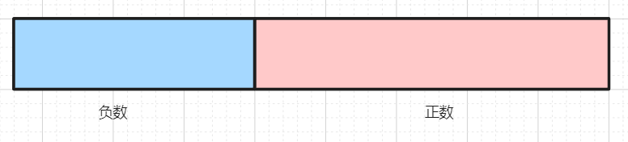

本题中的数组会有三种构成方式：

- 全是正数
- 全是负数
- 正数和负数混合型的数组

1. 而对于全是正数的数组如果又 `k` 次取反机会的话，最好的情况肯定是 `k` 是一个偶数，取偶数次反的最大和就是原数组的和，但如果是奇数的话，就需要将数组进行排序来找到最小的那个数字，整个数组减去最小的那个数就是最大和。
2. 如果数组全是负数的话，最好的情况肯定是尽可能利用这 `k` 次取反 **尽可能** 将所有的负数变成正数
   - 如果完全变成正数数组但是 `k` 还是没有消耗完，再次返回全是正数的情况
3. 如果数组是正数和负数混合的情况那和全是负数是相同的处理方式，尽可能多的将负数变为正数

这样就构成了本题的贪心策略，仔细想想没有反例。

为了确定正数和负数的界限以及最小的正数在哪里，要将数组进行排序，但是注意，如果将所有的负数都遍历完后 `k`  还有剩余就需要 **再次排序** 来获取最小的正数。


先尽可能多的将负数变为正数：

```java
		Arrays.sort(nums);
// 先尽可能将所有的负数都去除掉
        for (int i = 0; i < nums.length && nums[i] < 0; i++) {
            if (k == 0 || i > nums.length - 1) {
                // 说明使用 k 次取反没有将所有的负数取完
                return getSum(nums);
            }
            nums[i] = 0 - nums[i];
            k--;
        }
```

如果在这个途中使得 `k` 变为了负数，那此时的结果就是最大的。

遍历结束后说明是此时数组全部变为正数

```java
    if (k % 2 == 0) {
   	 return getSum(nums);
    } else {
    	Arrays.sort(nums);
    	return getSum(nums) - nums[0] - nums[0];
    }
```

此时再去判断 `k` 是奇数还是偶数来进行处理。


#### 1.3 代码

```java
class Solution {
    public int largestSumAfterKNegations(int[] nums, int k) {
        int res = 0;
        Arrays.sort(nums);
        // 先尽可能将所有的负数都去除掉
        for (int i = 0; i < nums.length && nums[i] < 0; i++) {
            if (k == 0 || i > nums.length - 1) {
                // 说明使用 k 次取反没有将所有的负数取完
                return getSum(nums);
            }
            nums[i] = 0 - nums[i];
            k--;
        }
        if (k % 2 == 0) {
            return getSum(nums);
        } else {
            Arrays.sort(nums);
            return getSum(nums) - nums[0] - nums[0];
        }
        
    }
    public int getSum(int[] nums) {
        int res = 0;
        for (int i : nums) {
            res += i;
        }
        return res;
    }
}
```


### 02. 加油站（No. 134）

#### 2.1 题目

在一条环路上有 `n` 个加油站，其中第 `i` 个加油站有汽油 `gas[i]` 升。

你有一辆油箱容量无限的的汽车，从第 `i` 个加油站开往第 `i+1` 个加油站需要消耗汽油 `cost[i]` 升。你从其中的一个加油站出发，开始时油箱为空。

给定两个整数数组 `gas` 和 `cost` ，如果你可以按顺序绕环路行驶一周，则返回出发时加油站的编号，否则返回 `-1` 。如果存在解，则 **保证** 它是 **唯一** 的。

 

**示例 1:**

> 输入: gas = [1,2,3,4,5], cost = [3,4,5,1,2]
> 输出: 3
> 解释:
> 从 3 号加油站(索引为 3 处)出发，可获得 4 升汽油。此时油箱有 = 0 + 4 = 4 升汽油
> 开往 4 号加油站，此时油箱有 4 - 1 + 5 = 8 升汽油
> 开往 0 号加油站，此时油箱有 8 - 2 + 1 = 7 升汽油
> 开往 1 号加油站，此时油箱有 7 - 3 + 2 = 6 升汽油
> 开往 2 号加油站，此时油箱有 6 - 4 + 3 = 5 升汽油
> 开往 3 号加油站，你需要消耗 5 升汽油，正好足够你返回到 3 号加油站。
> 因此，3 可为起始索引。

**示例 2:**

> 输入: gas = [2,3,4], cost = [3,4,3]
> 输出: -1
> 解释:
> 你不能从 0 号或 1 号加油站出发，因为没有足够的汽油可以让你行驶到下一个加油站。
> 我们从 2 号加油站出发，可以获得 4 升汽油。 此时油箱有 = 0 + 4 = 4 升汽油
> 开往 0 号加油站，此时油箱有 4 - 3 + 2 = 3 升汽油
> 开往 1 号加油站，此时油箱有 3 - 3 + 3 = 3 升汽油
> 你无法返回 2 号加油站，因为返程需要消耗 4 升汽油，但是你的油箱只有 3 升汽油。
> 因此，无论怎样，你都不可能绕环路行驶一周。

 

**提示:**

- `gas.length == n`
- `cost.length == n`
- `1 <= n <= 105`
- `0 <= gas[i], cost[i] <= 104`


#### 2.2 笔记

本题的解法可以说是非常的巧妙。

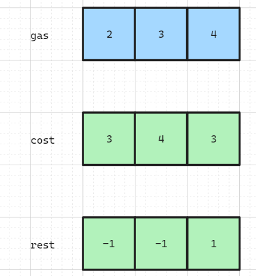

由题目中给出的两个数组可以推出一个新的数组 `rest[gas.length]` 这个数组表示从这个加油站 **到达下一个加油站** 剩余的油量。

如果这个数组求和得到的结果小于零，那么肯定无法环绕。

但如果这个数组求和大于等于零的话，那就一定能环绕一圈吗？

答案是一定可以，搞清楚这个就是解题的关键了。

肯定可以将整段路程（`rest` 数组）分为两个阶段：

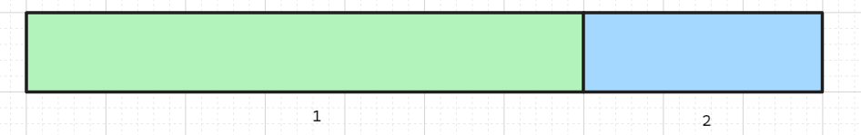

首先来确定这两个阶段的的和，答案肯定是正数或者零，那假如题目中给的恰好是 `0`，那第一段的和就恰好是第二段的 **相反数**，也就是如果 通过第二段 **到达终点**，此时的油量恰好能支持他走回来。

**也就是说此时的题目就变成了寻找从哪个节点开始 走到终点 油量为正数**。

首先构建出 `rest` 数组

```java
    int[] rest = new int[gas.length];
    int sum = 0;
    for(int i = 0; i < gas.length; i++) {
        sum += gas[i] - cost[i];
        rest[i] = gas[i] - cost[i];
    }
```

然后来判断这个数组的总和是否大于等于 `0`

```java
		 if (sum < 0) {
            return -1;
        }
```


然后去寻找这个节点，从节点 0 开始寻找，如果途中发现 `sum` 变为负数就从 `i + 1` 继续寻找，直到遍历完成一定能找到一个节点。

```java
		for (int i = 0; i < rest.length; i++) {
            currentSum += rest[i];
            if (currentSum < 0) {
                currentSum = 0;
                startIndex = i + 1;
            }
        }
```

此时的节点就是结果。

简化一下，写出代码。


#### 2.3 代码

```java
class Solution {
    public int canCompleteCircuit(int[] gas, int[] cost) {
        int sum = 0; // rest 数组的总数
        int currentSum = 0;
        int startIndex = 0;
        for(int i = 0; i < gas.length; i++) {
            currentSum += gas[i] - cost[i];
            if (currentSum < 0) {
                currentSum = 0;
                startIndex = i + 1;
            }
        }
        if (sum < 0) {
            return -1;
        }
        return startIndex;
    }
}
```


### 03. 分发糖果（No. 135）

[题目链接](https://leetcode.cn/problems/candy/description/)

[代码随想录题解](https://programmercarl.com/0135.%E5%88%86%E5%8F%91%E7%B3%96%E6%9E%9C.html#%E7%AE%97%E6%B3%95%E5%85%AC%E5%BC%80%E8%AF%BE)

#### 3.1 题目

`n` 个孩子站成一排。给你一个整数数组 `ratings` 表示每个孩子的评分。

你需要按照以下要求，给这些孩子分发糖果：

- 每个孩子至少分配到 `1` 个糖果。
- 相邻两个孩子评分更高的孩子会获得更多的糖果。

请你给每个孩子分发糖果，计算并返回需要准备的 **最少糖果数目** 。

 

**示例 1：**

> 输入：ratings = [1,0,2]
> 输出：5
> 解释：你可以分别给第一个、第二个、第三个孩子分发 2、1、2 颗糖果。

**示例 2：**

> 输入：ratings = [1,2,2]
> 输出：4
> 解释：你可以分别给第一个、第二个、第三个孩子分发 1、2、1 颗糖果。
>      第三个孩子只得到 1 颗糖果，这满足题面中的两个条件。

 

**提示：**

- `n == ratings.length`
- `1 <= n <= 2 * 104`
- `0 <= ratings[i] <= 2 * 104`


#### 3.2 笔记

本题难的地方就在于一个节点的变化可能会导致整个分发情况的变化。

所以本题一定要 **整体** 来求解，即一次只考虑一种情况：左边大于右边或者右边大于左边

这样遍历一个整体就能保证最后的结果满足其中的一个，通过两次对整体的修改就能得到最终的结果。

先从头开始遍历处理，这里必须要注意遍历顺序的有效性，因为后面是要 **在前面的基础上** 去做一个自增操作，所以从前往后遍历只能是解决 **右边比左边大** 的情况，这样才能保证操作是准确的。

从前向后遍历不断更新，可以得到如下的数组


```java
		// 先从前向后去遍历，右边比左边大的情况
        for (int i = 1; i < ratings.length; i++) {
            nums[i] = 1;
            if (ratings[i] > ratings[i - 1]) {
                nums[i] = nums[i - 1] + 1;
            }
        }
```

这就保证右边比左边大的情况全部处理了，现在还需要处理左边比右边大的情况，此时为了结果的有效就需要从后往前去遍历了。

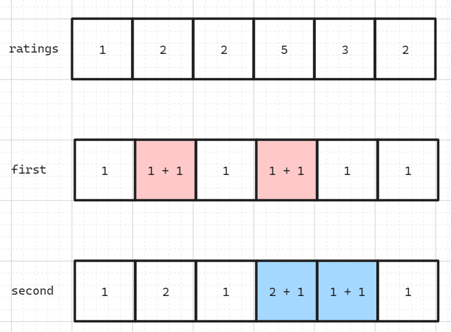

注意上图中的 `2 + 1` 中的 `2` 是后一个节点的 `2` 而不是第一次遍历得到的 `2`

```java
// 再从后往前去遍历，左边比右边大的情况
        for (int i = ratings.length - 2; i >= 0; i--) {
            if (ratings[i] > ratings[i + 1]) {
                nums[i] = Math.max(nums[i], nums[i + 1] + 1);
            }
        }
```

第二次遍历就会出现某个节点的糖果数量的改变，一旦改变就说明这个节点 **大于左边的节点，同时大于右边的节点**，那此时这个节点的值就应该是其中的最大值

```java
nums[i] = Math.max(nums[i], nums[i + 1] + 1);
```


通过这种前后遍历来分别处理 **改变一个节点的数值造成的影响** 就能保证不会出现纰漏


#### 3.3 代码

```java
class Solution {
    public int candy(int[] ratings) {
        int[] nums = new int[ratings.length];
        Arrays.fill(nums, 1);
        // 先从前向后去遍历，右边比左边大的情况
        for (int i = 1; i < ratings.length; i++) {
            nums[i] = 1;
            if (ratings[i] > ratings[i - 1]) {
                nums[i] = nums[i - 1] + 1;
            }
        }
        // 再从后往前去遍历，左边比右边大的情况
        for (int i = ratings.length - 2; i >= 0; i--) {
            if (ratings[i] > ratings[i + 1]) {
                nums[i] = Math.max(nums[i], nums[i + 1] + 1);
            }
        }
        return Arrays.stream(nums).sum();
    }
}
```


## Day 34

### 01. 柠檬水找零（No. 860）

[题目链接](https://leetcode.cn/problems/lemonade-change/description/)

[代码随想录题解](https://programmercarl.com/0860.%E6%9F%A0%E6%AA%AC%E6%B0%B4%E6%89%BE%E9%9B%B6.html)

#### 1.1 题目

在柠檬水摊上，每一杯柠檬水的售价为 `5` 美元。顾客排队购买你的产品，（按账单 `bills` 支付的顺序）一次购买一杯。

每位顾客只买一杯柠檬水，然后向你付 `5` 美元、`10` 美元或 `20` 美元。你必须给每个顾客正确找零，也就是说净交易是每位顾客向你支付 `5` 美元。

注意，一开始你手头没有任何零钱。

给你一个整数数组 `bills` ，其中 `bills[i]` 是第 `i` 位顾客付的账。如果你能给每位顾客正确找零，返回 `true` ，否则返回 `false` 。

 

**示例 1：**

> 输入：bills = [5,5,5,10,20]
> 输出：true
> 解释：
> 前 3 位顾客那里，我们按顺序收取 3 张 5 美元的钞票。
> 第 4 位顾客那里，我们收取一张 10 美元的钞票，并返还 5 美元。
> 第 5 位顾客那里，我们找还一张 10 美元的钞票和一张 5 美元的钞票。
> 由于所有客户都得到了正确的找零，所以我们输出 true。

**示例 2：**

> 输入：bills = [5,5,10,10,20]
> 输出：false
> 解释：
> 前 2 位顾客那里，我们按顺序收取 2 张 5 美元的钞票。
> 对于接下来的 2 位顾客，我们收取一张 10 美元的钞票，然后返还 5 美元。
> 对于最后一位顾客，我们无法退回 15 美元，因为我们现在只有两张 10 美元的钞票。
> 由于不是每位顾客都得到了正确的找零，所以答案是 false。

 

**提示：**

- `1 <= bills.length <= 105`
- `bills[i]` 不是 `5` 就是 `10` 或是 `20` 

#### 1.2 笔记

本题的情况较少，只有三种情况，这也就导致了本题的解法很简单。

在 `5` `10` 和 `20` 中，如果要找零的话，`5` 是比 `10` 的作用更大的，所以我们要**尽可能多的**去保留 `5`，来应对后面找零的情况。

遍历整个数组

- 对于 `5` 直接收下
- 对于 `10` 找一张 `5`
- 对于 `20` 优先找 `10` 和 `5`，否则找三张 `5`

如果找零的时候发现某一个达到了 `-1` 就直接返回 `false`


#### 1.3 代码

```java
class Solution {
    public boolean lemonadeChange(int[] bills) {
        int[] money = new int[21]; // 标识每个金额有多少张
        for (int i = 0; i < bills.length; i++) {
            if (bills[i] == 5) {
                money[5]++;
            } else if (bills[i] == 10) {
                money[5]--;
                money[10]++;
                if (money[5] < 0) {
                    return false;
                } 
            } else if (bills[i] == 20) {
                if (money[10] > 0 && money[5] > 0) {
                    // 优先去使用 10
                    money[10]--;
                    money[5]--;
                } else if (money[10] == 0 && money[5] >= 3) {
                    money[5] = money[5] - 3;
                } else {
                    return false;
                }
            }
        }
        return true;
    }
}
```


### 02. 根据身高重建队伍（No. 406）

[题目链接](https://leetcode.cn/problems/queue-reconstruction-by-height/description/)

[代码随想录题解](https://programmercarl.com/0406.%E6%A0%B9%E6%8D%AE%E8%BA%AB%E9%AB%98%E9%87%8D%E5%BB%BA%E9%98%9F%E5%88%97.html)

#### 2.1 题目

假设有打乱顺序的一群人站成一个队列，数组 `people` 表示队列中一些人的属性（不一定按顺序）。每个 `people[i] = [hi, ki]` 表示第 `i` 个人的身高为 `hi` ，前面 **正好** 有 `ki` 个身高大于或等于 `hi` 的人。

请你重新构造并返回输入数组 `people` 所表示的队列。返回的队列应该格式化为数组 `queue` ，其中 `queue[j] = [hj, kj]` 是队列中第 `j` 个人的属性（`queue[0]` 是排在队列前面的人）。

 

**示例 1：**

> 输入：people = [[7,0],[4,4],[7,1],[5,0],[6,1],[5,2]]
> 输出：[[5,0],[7,0],[5,2],[6,1],[4,4],[7,1]]
> 解释：
> 编号为 0 的人身高为 5 ，没有身高更高或者相同的人排在他前面。
> 编号为 1 的人身高为 7 ，没有身高更高或者相同的人排在他前面。
> 编号为 2 的人身高为 5 ，有 2 个身高更高或者相同的人排在他前面，即编号为 0 和 1 的人。
> 编号为 3 的人身高为 6 ，有 1 个身高更高或者相同的人排在他前面，即编号为 1 的人。
> 编号为 4 的人身高为 4 ，有 4 个身高更高或者相同的人排在他前面，即编号为 0、1、2、3 的人。
> 编号为 5 的人身高为 7 ，有 1 个身高更高或者相同的人排在他前面，即编号为 1 的人。
> 因此 [[5,0],[7,0],[5,2],[6,1],[4,4],[7,1]] 是重新构造后的队列。

**示例 2：**

> 输入：people = [[6,0],[5,0],[4,0],[3,2],[2,2],[1,4]]
> 输出：[[4,0],[5,0],[2,2],[3,2],[1,4],[6,0]]

 

**提示：**

- `1 <= people.length <= 2000`
- `0 <= hi <= 106`
- `0 <= ki < people.length`
- 题目数据确保队列可以被重建


#### 2.2 笔记

本题和昨天的[分发糖果](https://leetcode.cn/problems/candy/description/)类似，都是需要考虑多种情况的题目

[代码随想录刷题笔记 DAY 32 | K 次取反后最大化的数组和 No.1005 | 加油站 No.134 | 分发糖果 No.135](https://blog.csdn.net/weixin_74895237/article/details/136283196?spm=1001.2014.3001.5501)

可以先尝试做一下这个题；本题是比这个题目难一些的。

因为本题中要保证在一个节点前面的身高大于等于它的元素为 `k` 个，所以既要考虑身高的问题，又要考虑 `k` 的问题。

那是否可以先解决其中一个来使得解决第二个问题更加简便呢？

因为要保证某个人前面身高大于等于他的人数为 `k`，那是否可以先按照身高来排序呢？

按照身高来排序之后某个人前面的人数此时是固定的，就是其现在的下标，那如何使其变为 `k` 呢？只需要前移到下标为 `k` 的位置即可。

尝试一下，先按照身高排序，对于身高相同的，`k` 值大的排在后面保证顺序的准确性

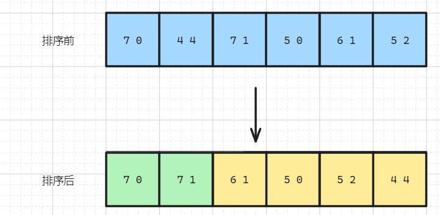

将排序后需要移动的节点用黄色标识出来。 

此时将某个节点 **向后** 移动不会影响它的 `k`，比如说 [ 7 1 ] 节点，即使将其移动到最后它的位置仍然是正确的，所以此时要做的是 **前移** 位置不对的节点，通过不断的前移来修正后续节点的位置。

新建一个队列，从前向后遍历数组

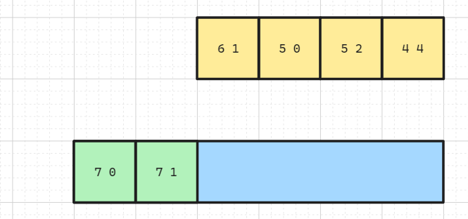

将 [ 6 1 ] 插入到下标为 1 的位置

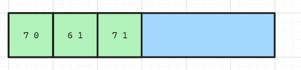

将 [5 0] 插入到下表为 0 的位置

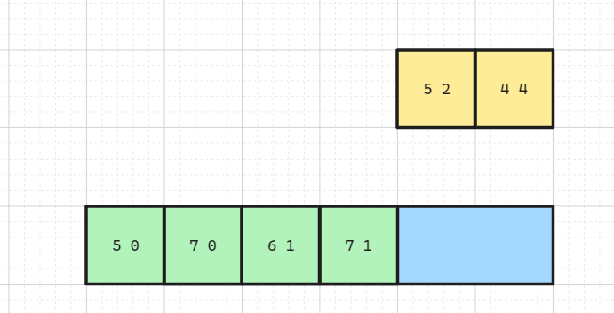

同理，将后面的节点逐次插入

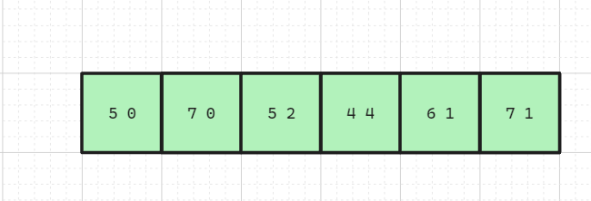

最终就形成了结果。

这个思路的关键就在于 **后移** 节点不会改变其位置的准确性

接下来看一下代码的实现，首先使用比较器来实现根据身高和 `k` 排序

```java
		Arrays.sort(people, new Comparator<int[]>() {
            @Override
            public int compare(final int[] entry1, final int[] entry2) {
                // 对身高进行降序排列，如果身高相同， k 大的排在后面
                if (entry1[0] == entry2[0]) {
                    return entry1[1] - entry2[1]; // 升序排列
                } 
                return entry2[0] - entry1[0]; // 降序排列    
            }
        });
```

接下来就是插入操作了，这里使用链表的 `add()` 方法，使用这个方法能够将节点插入到指定的下标。

```java
		LinkedList<int[]> que = new LinkedList<>();
        for (int[] p : people) {
            que.add(p[1],p); // 将 p 插入到 p[1]
        }
```

将链表转换为数组直接返回即可。

#### 2.3 代码

```java
class Solution {
    public int[][] reconstructQueue(int[][] people) {

        Arrays.sort(people, new Comparator<int[]>() {
            @Override
            public int compare(final int[] entry1, final int[] entry2) {
                // 对身高进行降序排列，如果身高相同， k 大的排在后面
                if (entry1[0] == entry2[0]) {
                    return entry1[1] - entry2[1]; // 升序排列
                } 
                return entry2[0] - entry1[0]; // 降序排列    
            }
        });

        LinkedList<int[]> que = new LinkedList<>();

        for (int[] p : people) {
            que.add(p[1],p); // 将 p 插入到 p[1]
        }

        return que.toArray(new int[people.length][]);
    }
}
```


### 03. 用最少的箭引爆气球（No. 452）

[题目链接](https://leetcode.cn/problems/minimum-number-of-arrows-to-burst-balloons/description/)

[代码随想录题解](https://programmercarl.com/0452.%E7%94%A8%E6%9C%80%E5%B0%91%E6%95%B0%E9%87%8F%E7%9A%84%E7%AE%AD%E5%BC%95%E7%88%86%E6%B0%94%E7%90%83.html#%E7%AE%97%E6%B3%95%E5%85%AC%E5%BC%80%E8%AF%BE)

#### 3.1 题目

有一些球形气球贴在一堵用 XY 平面表示的墙面上。墙面上的气球记录在整数数组 `points` ，其中`points[i] = [xstart, xend]` 表示水平直径在 `xstart` 和 `xend`之间的气球。你不知道气球的确切 y 坐标。

一支弓箭可以沿着 x 轴从不同点 **完全垂直** 地射出。在坐标 `x` 处射出一支箭，若有一个气球的直径的开始和结束坐标为 `x``start`，`x``end`， 且满足  `xstart ≤ x ≤ x``end`，则该气球会被 **引爆** 。可以射出的弓箭的数量 **没有限制** 。 弓箭一旦被射出之后，可以无限地前进。

给你一个数组 `points` ，*返回引爆所有气球所必须射出的 **最小** 弓箭数* 。

 

**示例 1：**

> 输入：points = [[10,16],[2,8],[1,6],[7,12]]
> 输出：2
> 解释：气球可以用2支箭来爆破:
> -在x = 6处射出箭，击破气球[2,8]和[1,6]。
> -在x = 11处发射箭，击破气球[10,16]和[7,12]。

**示例 2：**

> 输入：points = [[1,2],[3,4],[5,6],[7,8]]
> 输出：4
> 解释：每个气球需要射出一支箭，总共需要4支箭。

**示例 3：**

> 输入：points = [[1,2],[2,3],[3,4],[4,5]]
> 输出：2
> 解释：气球可以用2支箭来爆破:
> - 在x = 2处发射箭，击破气球[1,2]和[2,3]。
> - 在x = 4处射出箭，击破气球[3,4]和[4,5]。

 


**提示:**

- `1 <= points.length <= 105`
- `points[i].length == 2`
- `-231 <= xstart < xend <= 231 - 1`

#### 3.2 笔记

本题的思路很好想，关键是用什么方式去实现它。

既然是用最少的数量去引爆气球，那肯定是朝着 **气球最密集** 的地方射箭，那如何将气球聚集起来呢？

这里先将气球按照其 **起始位置** 排序，这样起始位置相近的气球就挨在一起了

比如题目中的案例 1，排序

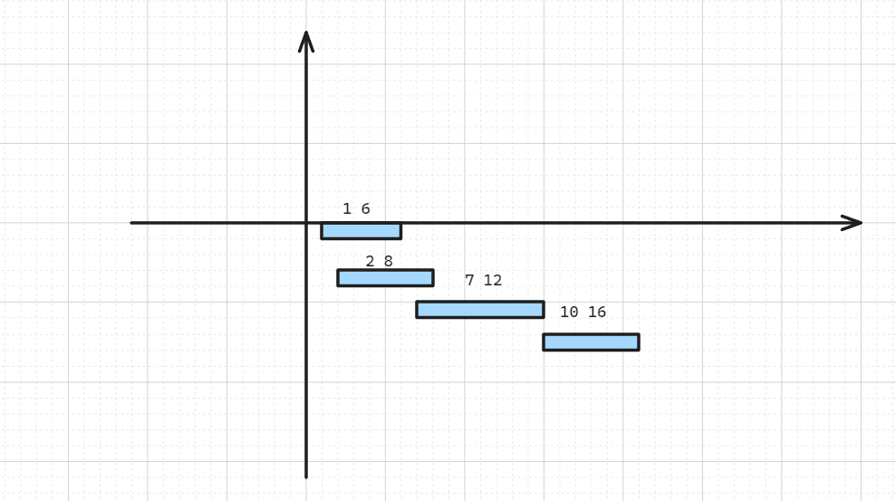

从头开始去遍历，如何判断下一个是否能和上一个一起被打爆呢？

因为此时进行了排序，所以上一个的起始位置一定是在下一个的前面的，所以只需要判断终止位置是否包含下一个的起始位置即可。

比如第一个和第二个节点就是判断 `6` 是否是大于 `2`，如果大于就说明可以同时将这两个气球打爆。

那如何保证下一个和前面的一组可以一起呢？

和上面的思路一样，只要保证最右边的最小值大于即可，举一个更明显的例子

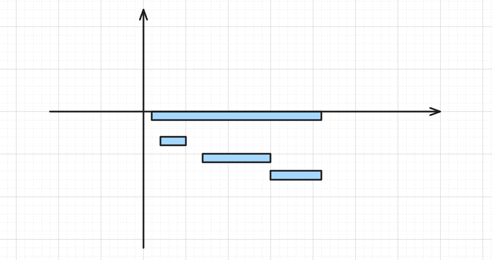

这样即使第一个气球包含后两个气球，但是因为遍历到第二个的时候 `right` 应该更新为第二个气球的 `right`，此时就不会包含后两个节点了。

这时候有朋友会疑惑：可以同时打爆三个气球，这样不是更优吗？

其实最后的结果是相同的，同时打爆 1 3 4 后 2 会空出来，最终的结果仍然是 2

其实这就是遍历顺序的问题，可以按照起始位置进行排序，同时也可以按照终止位置进行排序，如果按照终止位置进行排序，那对于这一组的策略就是同时解决 1 3 4，这两种结果是等价的。

首先，按照起始位置排序

```java
		Arrays.sort(points, new Comparator<int[]>() {
            @Override
            public int compare(int[] o1, int[] o2) {
                return Integer.compare(o1[0], o2[0]); // 按照起始位置升序排列
            }
        });
```

遍历数组不断更新 `res`

```java
        int res = 1;
        int right = points[0][1];
        for (int[] i : points) {
            if (i[0] > right) {
                res++;
                right = i[1];
            } else {
                right = Math.min(right, i[1]); // 更新最小有边界
            }
        }
        return res;
```


#### 3.3 代码

```java
class Solution {
    public int findMinArrowShots(int[][] points) {
        Arrays.sort(points, new Comparator<int[]>() {
            @Override
            public int compare(int[] o1, int[] o2) {
                return Integer.compare(o1[0], o2[0]); // 按照起始位置升序排列
            }
        });
        int res = 1;
        int right = points[0][1];
        for (int[] i : points) {
            if (i[0] > right) {
                res++;
                right = i[1];
            } else {
                right = Math.min(right, i[1]); // 更新最小有边界
            }
        }
        return res;
    }
}
```

