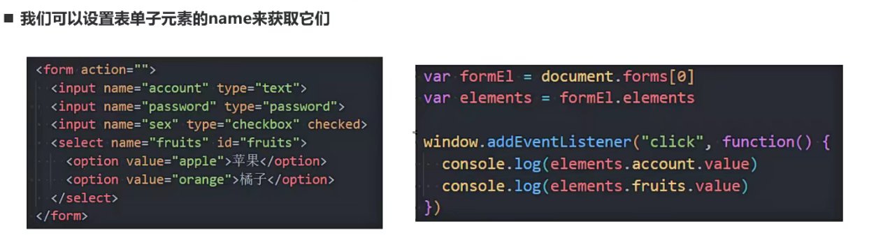

# coderwhy-js基础-DOM和BOM

ECMAScript为js语法部分

documentElement:HTML

## DOM

DOM-Document Object Model 文档对象模型

将页面所有的内容表示为可修改的对象

```
const xx = document.body.children[0];
xx.style.color = "red";
```

DOM Tree

### API	

应用程序接口-application programming interface

### 类之间的继承关系

类-构造函数

​	继承同一个父类不代表两者互为兄弟


```
class Person {
	属性 = 属性值;
	行为(方法);
}

class Student extends Person {
	studying() {
		....
	}
	//除继承外,可以增加自己的方法
}
```

<https://babeljs.io>	将es6转换成es5

comment:注释

### Document和Element元素之间的关系

- document对象

  - 网页的对象模型

  - 

  - 两种方法

    - 获取节点的导航后,获取对应的节点

      

      ```
      const body = document.body;
      const bodyElFirstChild = bodyEl.firstChild;
      ```

    - 根据某个元素获取另一个元素

      

      

**前端的两种开发模式:**

​	声明式编程利用框架创造虚拟DOM

​	命令式编程写原生DOM(几乎不用)


### table之间的导航

```
const tableEl = document.body.xxxxx;
根据导航获取其他元素
```


练习


### `form之间的导航



```
const formEl = document.body.xxxx;//通过元素获取
const elements = formEl.elements;
//如上可以直接对表单数据操作
```

```
const formEl = document.forms[n];//可以通过forms直接获取
```


### DOM获取任意的元素对象

 直接获取keyword

```
const keyword = doucument.getElementsByCLassName("classname");

```

类似的

​	document.getElementById(idname)


//最常用的是前两个


### 节点Node常见的属性

全局属性

- nodeType

  - 数值型值

  - ```
    const bodyChildNodes = document.body.childNodes;
    for(const node of bodeChildNides) {
    	if(node.nodeType === Node.DOCUMENT_NODE){
    		...
    	}else if(...) {
    		...
    	}....
    }
    ```

    

  - 

  - 使用场景:利用其值不同,if或者switch判断对某种类型操作

  - ```
    //可以用常量代替值,便于记忆
    //写在node的常量,故而可以使用
    ```


- nodeName
  - 针对节点


- tagName
  - 针对元素,获取元素的标签名词


- data(nodeValue)/innerHTML/outerHTML/textContent
  - data:针对非元素的节点获取数据,元素的数据为undefined
  - innerHTML:获取元素的所有,对应的html元素也会获取
  - outerHTML:包含了元素的完整HTML 
  - textContent:获取元素中的文本内容,不带标签


- hidden
  - 隐藏节点
  - 是布尔值,默认为false


### 元素的属性和特性

attribute:元素中的属性(特性)

property:对象中的属性

分类:

1. HTML标准指定的attribute,成为标准的attribute

   标准的attribute在对应的对象模型中都有对应的property

   能获取到对应的值跟类型

   

   注:property不能操作input在浏览器部分已经更改,推荐使用

   

2. 自定义的成为非标准的attribute

   非标准的在操作其对应的对象模型中的property时为undefined

   

操作:


大小写不敏感,获取到的是字符串

class(attributte)对应的className(property)


### js动态修改样式:

- 修改style

  - ```
    const boxEl = document.querySelector(".box");
    boxEl.style.color = "";
    //设置为空的字符串时为class的默认样式
    
    //设置多个样式,使用cssText,不推荐使用,因为会替换整个字符串
    boxEl.style.cssText = "font-size: 30px; color: red;";
    ```

    

- 修改class(将其更换为另一个classname)

  ```
  const boxEl = document.querySelector;
  boxEl.className = "active";
  ```

  

注:class的classList


实战:

 


style元素的读取:

- 对于内联样式是可以通过Elem.style.xxxx读取的
- 对于style,css文件中的样式,是读取不到的
- 

自定义属性的读取:

```
box.dataset.自定义属性
//返回的是自定义的属性值
//小程序开发的时候常用
```


### DOM节点的创建插入克隆删除

- 创建元素()

  - document.write（早期基本不使用，被DOM代替）

  - 通过innerHTML不推荐

    ```
    const boxEl = document.querySelector(".box");
    boxEl.innerHTML = '<h2>title</h2>';
    //缺点是js操作需要重新获取节点，然后才能进行操作
    setTimeout(function(){
    	const titleEl = document.querySeletor(".title");
    	titleEl.classList.add("active");
    },2000);
    ```

    

  - 真实创建一个DOM对象

    ```
    const h2EL = document.createElement("h2");
    h2El.className = "title";
    h2El.classList("active");
    h2El.textContent = "我是标题";
    
    //将元素插入boxEL
    boxEl.append(h2El)
    ```

    

- 插入元素

  - 先创建一个元素`ducument.creatElement(tag)`
  - 然后将其插入,如下

  

- 移除元素
  - `boxEl.remove()`
  - 移除元素会将其子代元素也全部移出去

- 克隆元素
  - `boxEl.clone(boolean)`


#### 计数器案例:


#### 动态计时器案例


#### 动态倒计时案例


### DOM节点的样式,类


### DOM元素/window的大小,滚动,坐标

1. 获取样式(局限性很强)

   ```
   const boxStyle = getComfutedStyle(boxEL);
   //boxStyle.width就可以获取其宽度,但是获取不到其他更多的信息
   ```

   

2. 

3. 

   

   

#### 显示顶部按钮案例


#### 动态创建按钮的案例


​	**继承的好处**

1. 增加代码复用
2. 继承是多态的前提


### 事件处理

​	事件(Event)

#### 事件处理的方案

1. 直接在html中编写代码:在script中直接监听

2. 获取元素对象,将函数操作赋值给属性

   DOM属性,通过元素的on来监听事件

   //弊端:不能执行多个函数,后面函数会将前面函数覆盖掉,只有一个函数生效

   ```
   bt2El.onclick = handleClick01;
   bt2El.onclick = handleClick02;
   ```

3.  addEventListener

   通过EventTarget中的addEventListener来监听

   ```
   btn3El.addEventListener("click",function(){
   	....;
   })
   ```

   

#### 冒泡捕获

**事件冒泡和事件捕获**

监听事件流:

事件冒泡(Event Bubble):事件从最内层往外依次传递的顺序(IE浏览器)

事件捕获(Event Capture):事件从外层到内层,传入第三个参数为ture(Netscape浏览器)


都监听会按照如下顺序进行:**捕获阶段,目标阶段,冒泡阶段**


#### 事件对象Event

​	event对象会在传入的事件处理函数回调时,被系统传入;


监听完之后会执行元素默认行为

**取消事件默认行为:Element.preventDefalut()**

**阻止事件进一步传递(冒泡/捕获):Element.stoprpapagation()** 


#### 事件处理函数中this

```
function(){
	cosnole.log(this);
}
//函数(event handler)绑定到谁身上this就指向谁
//如下都指向div.El
```


#### EventTarget使用

window也继承自EventTarget

DOM接口,用于添加删除派发Event事件

##### 常见方法:

```
btnEl.addEventListener();
btnEl.removeEventListener();
//移除函数时需要先封装函数
```


派发自定义事件后监听


#### 事件委托(event delegation)模式


#### 常见的事件

##### 鼠标事件,键盘事件,表单元素事件,Document事件ia,css事件


## BOM

BOM-Browser Object Model  浏览器对象模型

由浏览器提供的用于处理文档(document)之外的所有内容的其他对象

例如navigator,location,history等对象;

 