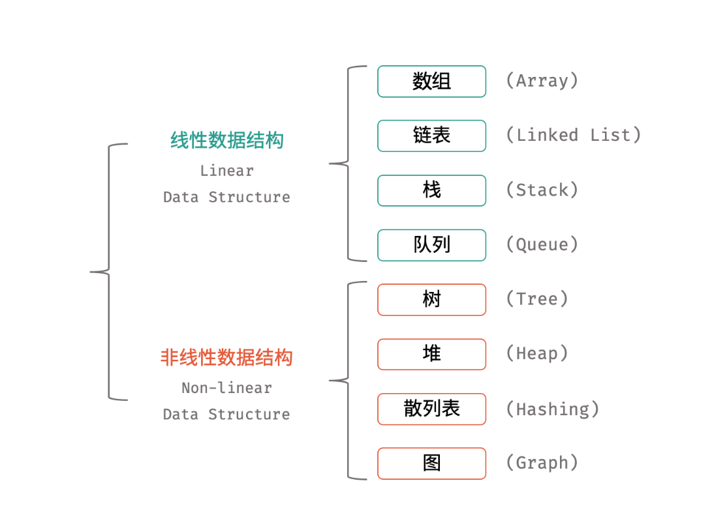

# 数据结构

为贯彻数据结构日常化学习跟刷塔，我决定假期期间重新梳理我这半吊子笔记，第一次正式写下来提交（我好像经常重新返工学习）




### 链表

​		链表是一种通过指针串联在一起的线性结构，每一个节点由两部分组成，一个是数据域一个是指针域（存放指向下一个节点的指针），最后一个节点的指针域指向null（空指针的意思）。链表的入口节点称为链表的头结点也就是head。

​		单链表，双链表，循环链表。

```javascript
class ListNode {
  val;
  next = null;
  constructor(value) {
    this.val = value;
    this.next = null;
  }
}
```


#### [LCR 123. 图书整理 I - 力扣（LeetCode）](https://leetcode.cn/problems/cong-wei-dao-tou-da-yin-lian-biao-lcof/description/)

##### 栈方法

```javascript
var reversePrint = function(head) {
    if(!head) return []；
    let arr = [];
    while(head){
        arr.push(head.val);
        head = head.next;
    }
    return arr.reverse()；
};
```

##### 递归方法

```javascript
var reversePrint = function (head) {
    if(!head) return []；
    let result = reversePrint(head.next)；
    result.push(head.val);
    return result
};
```

注：`if(!head) return []；`

#### [LCR 136. 删除链表的节点 - 力扣（LeetCode）](https://leetcode.cn/problems/shan-chu-lian-biao-de-jie-dian-lcof/description/)

在学习这块的时候我发现我的函数递归学的很差劲

##### 递归（知识）

​		一种计算过程，如果其中每一步都要用到前一步或前几步的结果，称为递归。用递归过程定义的函数，称为递归函数，例如连加、连乘及阶乘等。


递归的两个必要条件：

**1.**存在限制条件，当满足这个限制条件的时候，递归便不再继续。

**2.**每次递归调用之后越来越接近这个限制条件。


//草还是有点迷。感觉自己写题用递归方法就不流畅，如果理解别人的代码递归多了就很难理解返回多层的细化，必须反应很久，有时候还需要画图，希望之后的我能有更多的进步吧，目前还是太菜了，笔记上留念感慨一下。

##### 迭代（知识）

​		迭代是函数利用自身已有的变量来推算需要的新变量，和递归直接调用自身存在一定差异，二者在某些情况下是可以相互转换的，同种情况下，这两种方法优先考虑迭代，因为递归很容易造成栈溢出。


//递归是一个函数调用自己，重复某个带有上下文的过程。

//迭代是一种遍历,重复某种不依赖上下文的计算。

递归方法

```
#include<stdio.h>
//递归实现求第n个斐波那契数
int fib(int n)
{
	if (n <= 2)
		return 1;
	else
		return fib(n - 2) + fib(n - 1);
}
 
 
 
int main()
{
	int n = 0;
	scanf("%d", &n);
	printf("%d", fib(n));
	return 0;
}
```

迭代

```
#include<stdio.h>
int count = 0;
int fib(int n)
{
//这里计算的是第三个斐波那契数被重复计算多少次
	if (n == 3)
		count++;
	if (n <= 2)
		return 1;
	else
		return fib(n - 2) + fib(n - 1);
}
 
 
 
int main()
{
	int n = 0;
	scanf("%d", &n);
	/*printf("%d\n", fib(n));*/
	printf("%d", count);
	return 0;
}
```

##### 双指针迭代（题解）

```
var deleteNode = function(head, val) {
    let pre = head
    let cur = head.next
    if(pre.val === val) return cur
    while(pre !== null && pre.next !== null) {
    if(cur.val === val) {
        pre.next = cur.next
    }
    pre = pre.next
    cur = cur.next
    }
    return head
};
```

##### 递归（题解）

```
var deleteNode = function(head, val) {
     if(head.val == val)  return head.next
    head.next = deleteNode(head.next,val);
    return head
};
```

